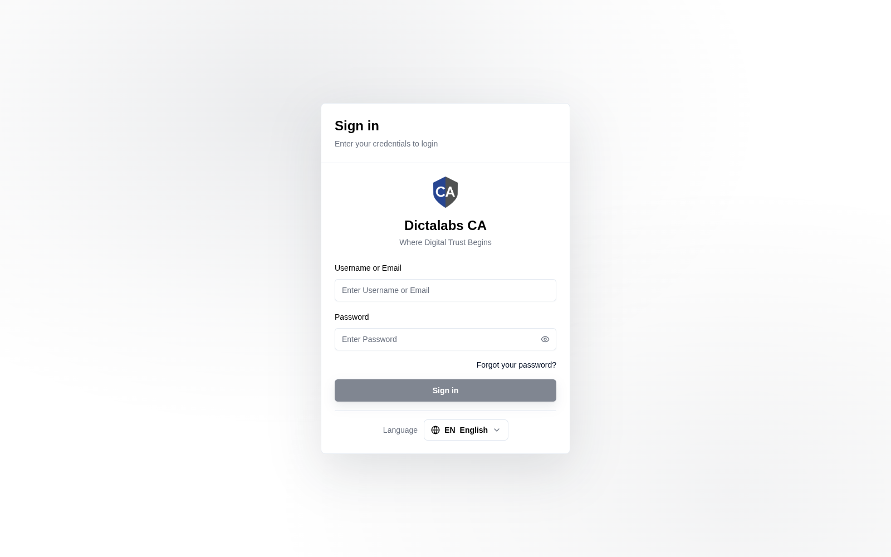

# Sign in to the Super Admin Portal & Multi-Tenancy

> **Platform Setup.** This is the first step of the end-to-end configuration flow.

## Purpose

The CA system is **multi-tenant**: one deployment hosts many isolated customer workspaces
("tenants"). The **Tenant Super Admin portal** is the control plane where you provision and
govern those tenants — before any PKI configuration can happen, a tenant must exist here.

**Who should use it:** platform operators who run the CA service for multiple tenants.

## Navigation

Open `https://admin.<your-domain>` and sign in with a **Super Admin** account. On success you
land on **Administration → Tenants**.

## Tenant Isolation Model

| Aspect | Behaviour |
| ------ | --------- |
| Data isolation | Each tenant's data lives in its own database schema (`t_<subdomain>`). Tenants never see each other's CAs, certificates, operators, or logs. |
| Routing | Each tenant is reached at its own **subdomain** — `https://<subdomain>.<your-domain>`. |
| Identity | Super Admins authenticate against a global account store (no tenant binding). Tenant operators are scoped to one tenant. |
| Provisioning | Creating a tenant provisions its schema, seeds an admin role + permissions, and creates the first tenant administrator in one transaction. |

## The configuration flow at a glance

**Sign in** (this page) → [Verify license](02_license.md) → [Create a tenant](03_create_tenant.md)
→ [Super admins](04_super_admins.md) → [Sign in to the tenant](05_tenant_sign_in.md) → …
→ build access control, cryptographic foundation, templates, CA hierarchy, validation, and
issuance. Follow the workflow pages in order.

!!! note "Important Notes"
    - Module availability (CA, VA) and the multi-tenant capability are controlled by the installed license — see [License Management](02_license.md).
