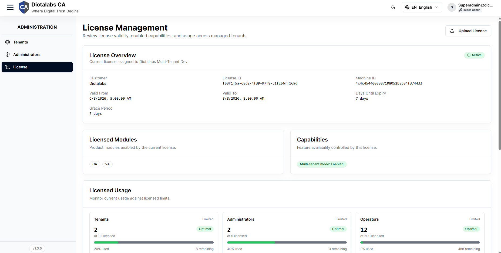

# Verify License & Modules

> **Platform Setup.** **Prerequisite:** signed in to the [Super Admin portal](01_super_admin_overview.md).

## Purpose

Before provisioning tenants, confirm which product **modules** (CA, VA) and **capabilities**
(e.g. multi-tenant mode) the license enables, and check usage against limits. Modules that the
license does not enable are hidden from tenants.

## Navigation

`Administration → License`

## Overview

- **License Overview** — Customer, License ID, Machine ID, Valid From/To, Days Until Expiry,
  Grace Period, and a status badge.
- **Licensed Modules** — enabled modules (e.g. **CA**, **VA**).
- **Capabilities** — feature flags such as *Multi-tenant mode: Enabled*.
- **Licensed Usage** — current vs limit for Tenants, Administrators, Operators, Certificate
  Authorities, Active Certificates, Roles, API Keys.
- **Tenant Usage** — per-tenant resource breakdown.

## Actions

- **Upload License** — install a new license file (opens the operating-system file picker).

## Step-by-Step

1. Open **Administration → License**.
2. Confirm **Licensed Modules** include the modules you need (CA and/or VA).
3. Check **Capabilities** shows *Multi-tenant mode: Enabled*.
4. If updating entitlements, click **Upload License** and choose the vendor file.

!!! note "Important Notes"
    - **Capability gating:** the tenant portal hides modules the license does not enable — absence of a menu item may mean "not licensed", not "removed".

!!! warning "Warning"
    Uploading an invalid/expired license can disable modules system-wide. Verify the file and validity window before uploading in production.
