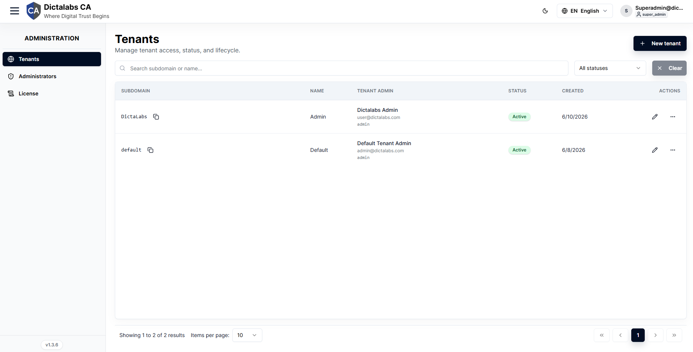
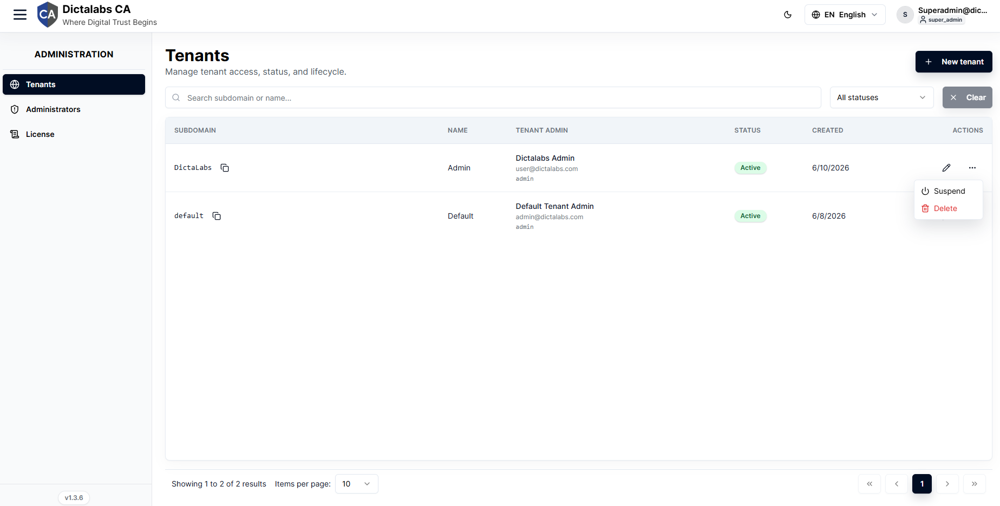
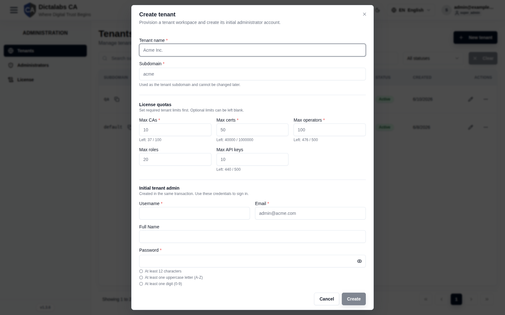
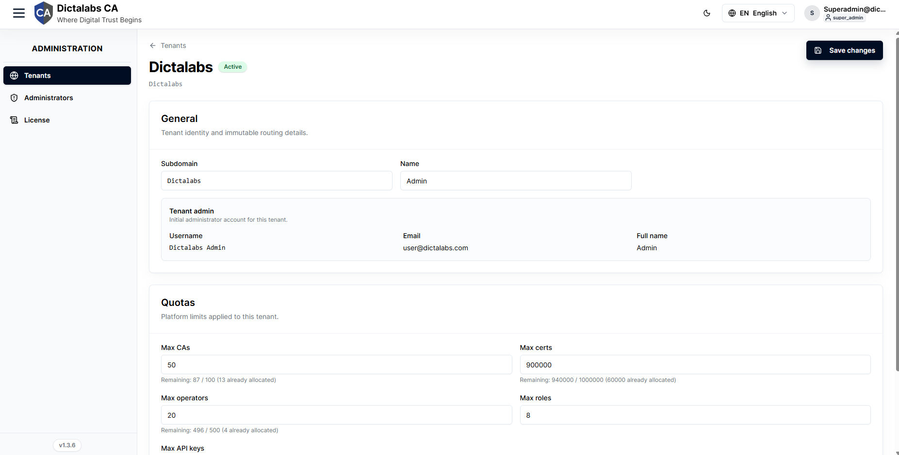

# Create a Tenant

> **Multi-Tenancy & Tenants (optional).** **Prerequisite:** a valid [license](02_license.md) with
> **multi-tenant mode** enabled. New to tenants? Read [About Multi-Tenancy](multi_tenancy.md) first.

## Purpose

Provision an isolated **tenant** workspace and its initial administrator. A tenant has its own CAs,
certificates, operators, roles, branding, and logs, fully isolated from other tenants.

**Why tenants exist:** to run PKI for multiple customers, business units, or trust domains from one
deployment without any data or trust sharing between them. Each tenant is reached at its own
subdomain and configured independently.

**Benefits:** strong data isolation, per-workspace branding and access control, and independent
quotas — while sharing a single installation to operate and patch.

!!! note "Single (default) tenant?"
    If you run **one** workspace you do **not** create tenants here — you configure the PKI directly
    in the default tenant. This page applies only when **multi-tenant mode** is licensed and you need
    additional isolated workspaces.

## Navigation

`Administration → Tenants`

## Overview

- **New tenant** button, search, status filter, pagination.
- **Table** — Subdomain, Name, Tenant admin, Status, Created, Actions (Edit, and a row **Actions**
  menu). Each subdomain has a **Copy tenant URL** button.

### Row actions

For an active tenant the actions menu offers **Suspend** and **Delete** (a suspended tenant shows
**Reactivate**). Deleted tenants are read-only.

## Fields — Create Tenant dialog

| Field | Description | Required | Notes |
| ----- | ----------- | -------- | ----- |
| Tenant name | Human-readable name | Yes | — |
| Subdomain | Tenant subdomain / slug | Yes | **Cannot be changed later.** Lowercase letters, digits, hyphens. |
| Max CAs / Max certs / Max operators / Max API keys | License quotas | Yes | Blank = Unlimited. |
| Max roles | License quota | No | Optional. |
| Username / Email | Initial tenant admin | Yes | Created in the same transaction. |
| Full name | Initial tenant admin name | No | — |
| Password / Confirm password | Admin password | Yes | ≥12 chars, 1 uppercase, 1 digit, 1 special character. |

## Tenant Detail (quotas & limits)

Open a tenant's **Edit** link to adjust name, quotas, and the per-tenant **request rate limit**;
the subdomain is read-only.

## Step-by-Step — Create a tenant

1. Open **Administration → Tenants**.
2. Click **New tenant**.
3. Enter **Tenant name** and **Subdomain** (permanent).
4. Set the required **quotas** (blank = Unlimited).
5. Fill the **initial tenant admin** username, email, and a compliant password.
6. Click **Create**.

!!! note "Important Notes"
    - **Best practice:** choose subdomains carefully — they are immutable.
    - Blank quota means *Unlimited*, not a default.

!!! warning "Warning"
    Delete is tenant-wide; use Suspend for temporary lockouts.
