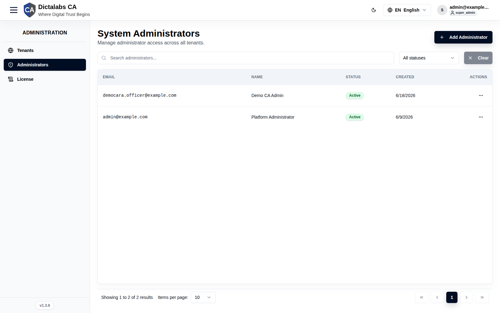
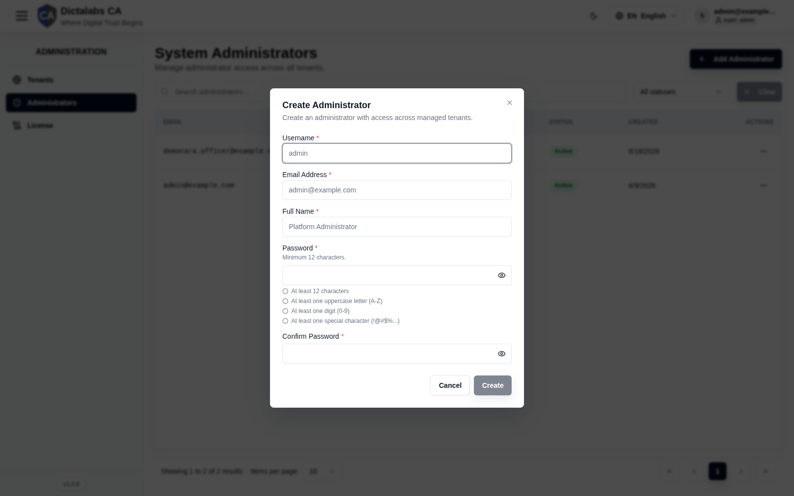

# Manage Super Admins

> **Platform Setup.** **Prerequisite:** signed in to the [Super Admin portal](01_super_admin_overview.md).

## Purpose

Super Admins are **system-level accounts** that administer the Dictalabs CA service itself — not the
PKI inside any one tenant. This page manages who holds that privileged access.

**Scope & responsibilities.** A Super Admin operates the *control plane*: verifying the
[license](02_license.md), provisioning and governing [tenants](multi_tenancy.md) (create, suspend,
delete, adjust quotas), and managing other super-admin accounts. They authenticate against a global
account store and are **not** bound to any tenant.

**Separation from operators.** Super Admins are distinct from tenant **operators**, who work *inside*
a single tenant (issuing certificates, managing CAs, etc.) with permissions granted through
[roles](07_roles.md). A Super Admin does not automatically have operator access to a tenant's PKI,
and an operator cannot administer the platform — keeping platform administration and PKI operations
cleanly separated.

**Least privilege.** Because these accounts can affect every tenant, grant the role sparingly and
only to platform operators who genuinely need it.

## Navigation

`Administration → Administrators`

## Overview

- **Add Administrator** button, search, status filter, pagination.
- **Table** — Email, Name, Status, Created, Actions.

The per-row actions menu offers **Delete**.

## Fields — Create Administrator dialog

| Field | Description | Required | Notes |
| ----- | ----------- | -------- | ----- |
| Username | Login username | Yes | — |
| Email Address | Administrator email | Yes | — |
| Full Name | Display name | Yes | — |
| Password / Confirm Password | Account password | Yes | Minimum 12 characters; ≥1 uppercase, digit, special character. |

## Step-by-Step

1. Open **Administration → Administrators**.
2. Click **Add Administrator**.
3. Enter username, email, full name, and a compliant password.
4. Click **Create**.

!!! note "Important Notes"
    - **Best practice:** keep at least two active administrators to avoid lockout.

!!! warning "Security Warning"
    Super Admins have system-wide privileges across every tenant. Grant sparingly.
