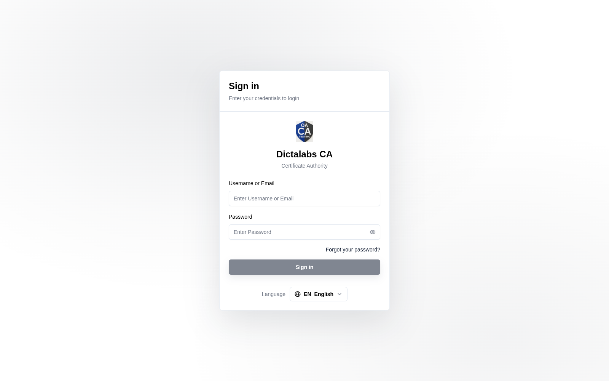

# Sign in to the Tenant

> **Access the Tenant.** **Prerequisite:** the platform is [installed](install.md) and you have a
> tenant operator account.

## Purpose

Everything from here on happens inside a tenant. Sign in with a tenant operator account to begin
configuring the PKI.

!!! note "Default tenant vs. multiple tenants"
    On a **single (default) tenant** deployment this is simply the portal you configure the PKI in —
    no separate tenant needs to be created. If you run **multiple tenants**, each has its own
    subdomain and must be [provisioned first](03_create_tenant.md); see
    [About Multi-Tenancy](multi_tenancy.md).

## Navigation

Open the tenant URL — `https://<subdomain>.<your-domain>` (e.g. `https://tenant.example.com`). On a
default-tenant deployment, use the tenant portal URL configured during [installation](install.md).

## Fields

| Field | Description | Required |
| ----- | ----------- | -------- |
| Username or Email | Operator login | Yes |
| Password | Operator password | Yes |

Operator accounts sign in with a username/email and password (plus **MFA** if enabled on the
account — see [User Profile & MFA](26_user_profile.md)).

## Step-by-Step

1. Open the tenant subdomain URL.
2. Enter your **Username or Email** and **Password**.
3. Click **Sign in** → you land on the [Dashboard](06_dashboard.md).

!!! note "Important Notes"
    - Each tenant displays its own **branding** (logo, name, theme) on the sign-in screen — see [Branding](25_settings_branding.md).
    - The top bar offers a theme toggle, language selector, and the account menu (Profile, Logout).
