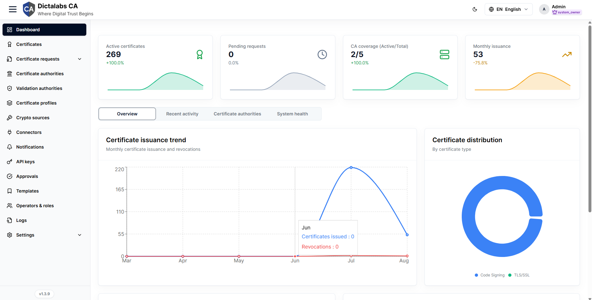
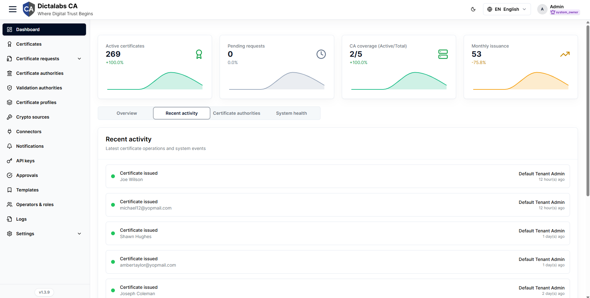
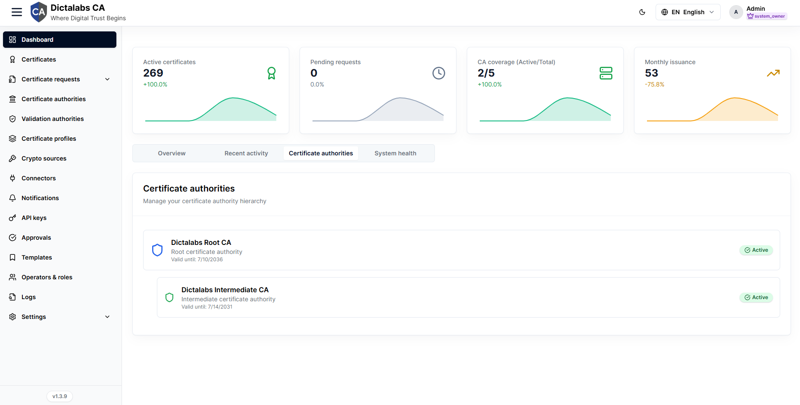
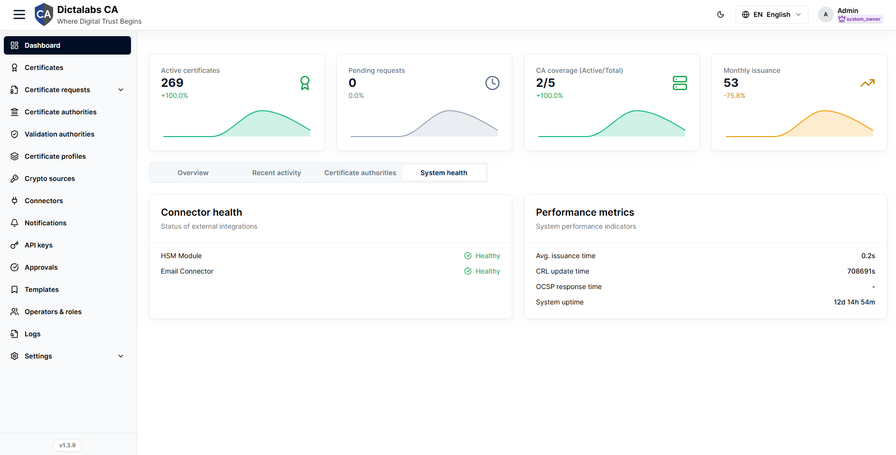

# Dashboard Overview

> **Access the Tenant.** **Prerequisite:** [signed in to the tenant](05_tenant_sign_in.md).

## Purpose

The Dashboard is the tenant landing page — a quick read on certificate operations, alerts, and
system health before you start configuring.

## Navigation

`Dashboard` — the default page after login.

## Layout

Every view shares two fixed elements at the top of the page, followed by four tabs. All figures are
tenant-scoped and refresh whenever the page is loaded.

### Critical alerts banner

Shown only when the tenant has open critical issues; a healthy tenant hides the banner entirely.

| Widget / metric | What it shows | How to read it |
| --------------- | ------------- | -------------- |
| Alert row | A short message for each active issue (for example an expiring root CA, HSM connectivity problems, or a scheduled CRL update). | Each row is one condition that needs attention. |
| Severity badge | Priority of the alert — **Critical**, **High**, or **Info**. | Critical (red) needs action now; High is important but not immediate; Info is advisory. Work top severities first. |
| Time | How long ago the alert was raised (for example "5 min ago"). | Recent, repeating alerts point to an active/ongoing problem. |

### Stat cards

A row of four summary cards with a small trend sparkline under each value. The percentage under the
value is the change versus the prior period; its colour reflects status (green positive, amber
warning, red negative).

| Widget / metric | What it shows | How to read it |
| --------------- | ------------- | -------------- |
| Active certificates | Count of currently valid, issued certificates. | Your live certificate footprint. A sharp drop can indicate mass expiry or revocation. |
| Pending requests | Certificate requests awaiting approval or action. | A growing number means requests are queuing — review them under Certificate Requests. |
| CA coverage (Active/Total) | Active certificate authorities against the total configured. | Active should equal total; a gap means one or more CAs are inactive, revoked, or suspended. |
| Monthly issuance | Certificates issued in the current month. | Tracks issuance volume; compare the change percentage against expected demand. |

## Tabs

### Overview

Operational snapshot combining issuance trends, certificate mix, live system load, and shortcuts
into common workflows.

| Widget / metric | What it shows | How to read it |
| --------------- | ------------- | -------------- |
| Certificate issuance trend | Line chart of monthly **Certificates issued** (blue) and **Revocations** (red) over the reporting range. | Rising issuance with flat revocations is healthy growth; a revocation spike warrants investigation. |
| Certificate distribution | Donut chart of certificates broken down by certificate type, with a colour-coded legend. | Shows where certificates are concentrated by type. Reads "No certificate distribution data" when the tenant has none. |
| System performance | Area chart of **CPU %**, **Memory %**, and **HSM %** utilization over time. | Watch for sustained high utilization or upward trends that signal capacity pressure. Click a legend entry to hide/show that series. CPU utilization now reports a real value (earlier it showed 0). |
| Quick actions | Buttons linking to common certificate authority operations. | Shortcut launchpad — see the list below. |

Actions:

- **Issue new certificate** → opens the certificate request form.
- **Create template** → opens certificate templates.
- **Configure certificate authority** → opens the CA certificate-data configuration.
- **Review requests** → opens the certificate requests queue.

### Recent activity

Chronological feed of the latest certificate operations and system events for the tenant.

| Widget / metric | What it shows | How to read it |
| --------------- | ------------- | -------------- |
| Status dot | Colour-coded outcome of each event — green completed, yellow pending, red failed. | Scan for red or yellow dots to spot failed or in-progress operations. |
| Action / subject | The operation performed and the object it acted on (for example the certificate or CA). | Identifies what happened and to what. |
| User | The account that performed the action. | Attributes the event for audit and follow-up. |
| Time | How long ago the event occurred. | Orders the feed newest-first; recent clusters indicate active work. |

### Certificate authorities

Read-only view of the tenant's CA hierarchy, showing each authority's role, validity, and status.

| Widget / metric | What it shows | How to read it |
| --------------- | ------------- | -------------- |
| CA node | Each authority by name, indented to show parent/child nesting. | Root CAs sit at the top level; intermediates are indented beneath their issuer. |
| Type | Whether the node is a **Root certificate authority** or an **Intermediate certificate authority**. | Confirms the trust role of each CA in the chain. |
| Valid until | The CA certificate's expiry date. | Plan renewal/rotation before this date; an approaching root expiry also surfaces in Critical alerts. |
| Status badge | Lifecycle state — **Active**, **Inactive**, **Revoked**, or **Suspended**. | Only Active CAs can issue; any other state on an expected-active CA needs attention. Reads "No certificate authorities available." when none exist. |

### System health

Health of external integrations plus key service-level performance indicators.

| Widget / metric | What it shows | How to read it |
| --------------- | ------------- | -------------- |
| Connector health | Status of each external integration (for example HSM module, email connector) as **Healthy**, **Warning**, or **Down**. | Green healthy, amber warning, red down. Any non-healthy connector can block issuance or notifications. Reads "No health checks available." when nothing is configured. |
| Avg. issuance time | Average time to issue a certificate, in seconds. | Rising values suggest CA or HSM load; compare against your baseline. |
| CRL update time | Time taken for the last CRL update, in seconds. | Longer times can delay revocation propagation. |
| OCSP response time | Latency of OCSP responses, in milliseconds. | Low, stable latency keeps validation fast for relying parties. |
| System uptime | How long the service has been running (days/hours/minutes). | A recently reset uptime indicates a restart or outage. |

## Notes

!!! note "Important Notes"
    - Metrics are tenant-scoped; empty environments show zero/empty series.
    - On a fresh tenant, continue with [Roles & Permissions](07_roles.md) to set up access.
