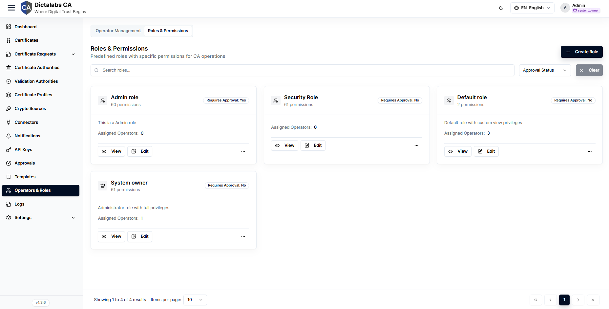
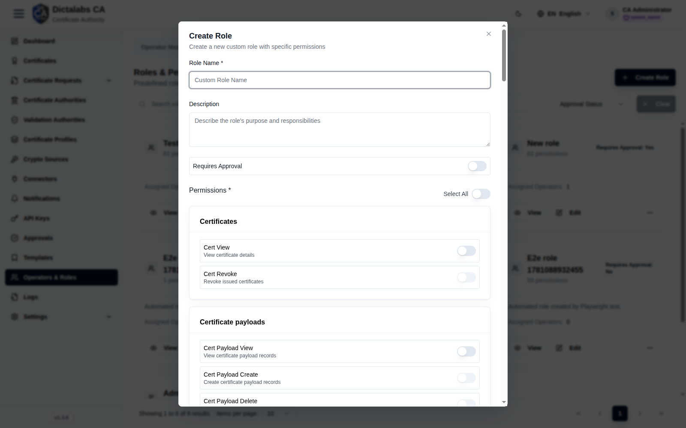

# Roles & Permissions

> **Access Control.** **Prerequisite:** [signed in to the tenant](05_tenant_sign_in.md).
> Set up roles before creating operators, so each operator can be assigned the right role.

## Purpose

Roles bundle fine-grained permissions and (optionally) require approval for protected actions.
They are the foundation of the tenant's role-based access control (RBAC): every operator is
assigned a role, and that role decides exactly what they can see and do.

## Navigation

`Operators & Roles` → **Roles & permissions** tab.

## Overview

### Roles & permissions

Lists every role in the tenant as a card and is the entry point for creating, viewing, editing,
and deleting roles. This tab is only visible with the `role.view` permission.

Each role card shows the role name, its permission count, a **Requires approval: Yes/No** badge,
the number of **Assigned operators**, and the role description. A predefined **system_owner** role
(full privileges) is seeded per tenant.

Controls on this tab:

- **Create role** — opens the Create role dialog (requires the `role.manage` permission).
- **Search roles…** — filters the list by role name as you type.
- **Approval status** filter — narrows the list to **Approval required** or **No approval required**.
- **Clear** — resets the search box and approval filter.
- **View / Edit / Delete** (per card) — inspect a role, change it, or remove it. Edit and Delete
  require the `role.manage` permission.

## Fields — Create role dialog

| Field | What to enter | Why it matters |
| ----- | ------------- | -------------- |
| Role name | A unique, descriptive name, 3–50 characters (e.g. `Certificate operator`). | Required. Identifies the role wherever operators are assigned and in audit logs. |
| Description | A short summary of the role's purpose and responsibilities. | Optional. Helps other admins understand what the role is for before assigning it. |
| Requires approval | Toggle on to route this role's protected writes into [Approvals](19_approvals.md). | When on, holders' protected actions become pending approvals instead of taking effect immediately (dual control). |
| Permissions | Toggle on each permission the role should grant, grouped by resource. | Required. At least one permission must be selected; these are the only actions the role can perform. Grant the minimum each role needs. |

Notes on the **Permissions** section:

- **Select all** — a shortcut toggle that grants or clears every permission at once.
- Permissions are grouped into cards by resource category; each switch has its own name and
  description explaining the action it unlocks.
- **View gating** — within most categories the other permissions stay disabled until you enable
  that category's **view** permission first, since an operator must be able to see a resource
  before acting on it. (Certificate request permissions are exempt from this gating.)
- See the full list of permissions and what each one allows on the
  [API Keys](21_api_keys.md#permission-catalog) page.

## Fields — Edit role dialog

The Edit role dialog exposes the same fields — role name, description, **Requires approval**, and
the grouped permission switches — pre-filled with the role's current values. Adjust any field and
save. As in Create, a name (3–50 characters) and at least one permission are required.

## Step-by-Step

1. Open **Operators & Roles → Roles & permissions**.
2. Click **Create role**.
3. Enter a **Role name** and, optionally, a **Description**; set **Requires approval** if dual control is needed.
4. Toggle the required **Permissions** (enable a category's view permission first to unlock its other switches).
5. Click **Create role**.

!!! note "Important Notes"
    - A role with **Requires approval** turns its holders' protected writes into pending approvals.
    - Grant the minimum permissions each role needs.
    - If **Requires approval** is enabled, creating, editing, or deleting the role may itself be
      submitted for approval rather than applied immediately.
