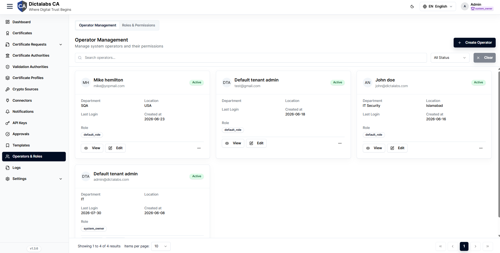
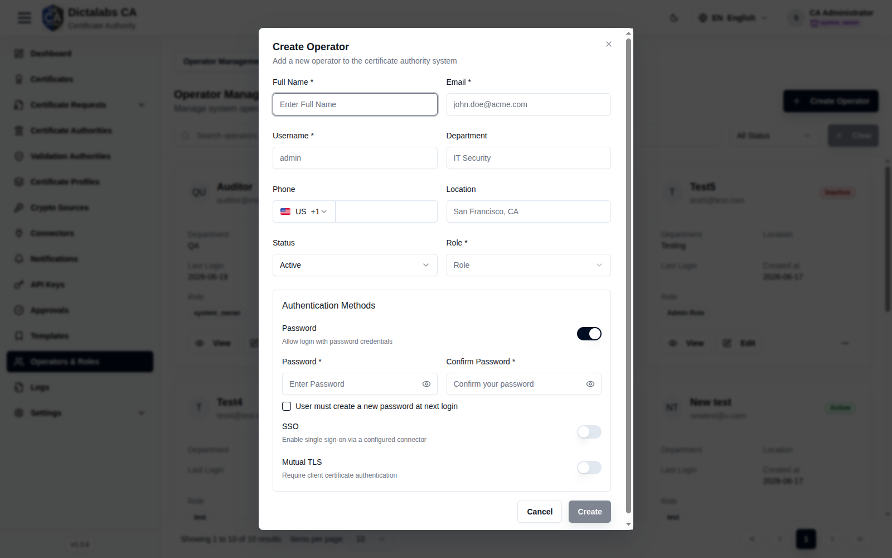

# Operators

> **Access Control.** **Prerequisite:** at least one [role](07_roles.md) exists.

## Purpose

Operators are the tenant's user accounts. Here you create them, assign a role, and choose their
authentication methods (password, SSO, mutual TLS).

## Navigation

`Operators & Roles` → **Operator Management** tab.

## Overview

- **Create Operator** button, search, status filter.
- **Operator cards** — name, email, status, department, location, last login, created, assigned
  **role**, plus **View / Edit / Delete**.

## Fields — Create Operator dialog

| Field | Description | Required | Notes |
| ----- | ----------- | -------- | ----- |
| Full Name / Email / Username | Identity | Yes | — |
| Department / Phone / Location | Optional details | No | — |
| Status | Active / Inactive | No | Defaults to Active |
| Role | Assigned role | Yes | From [Roles](07_roles.md) |
| Password (toggle) | Allow password login | — | When on: Password + Confirm required |
| User must create a new password at next login | Force reset | No | Checkbox |
| SSO (toggle) | Single sign-on via a configured connector | No | — |
| Mutual TLS (toggle) | Require client-certificate authentication | No | — |

## Step-by-Step

1. Open **Operators & Roles → Operator Management**.
2. Click **Create Operator**.
3. Fill Full Name, Email, Username; choose **Role** and **Status**.
4. Configure **Authentication Methods** (Password and/or SSO / Mutual TLS).
5. Click **Create**.

!!! note "Important Notes"
    - **SSO** and **Mutual TLS** are per-operator options enabled here.
    - The last active admin cannot be removed or deactivated (lockout guard).
