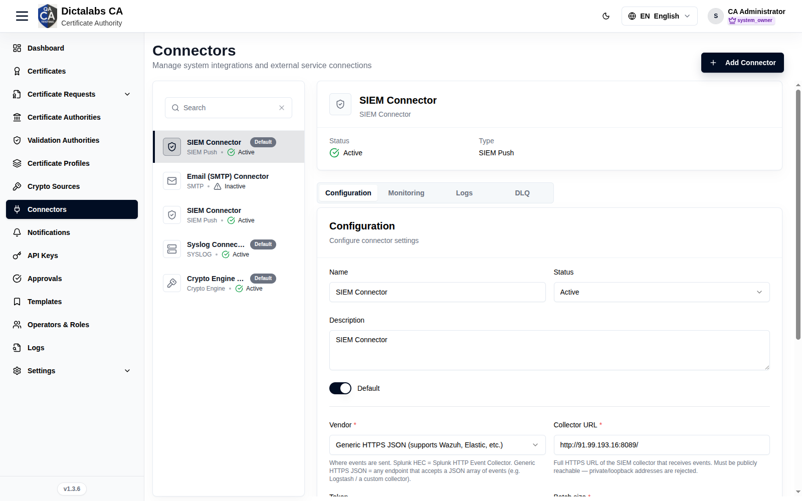
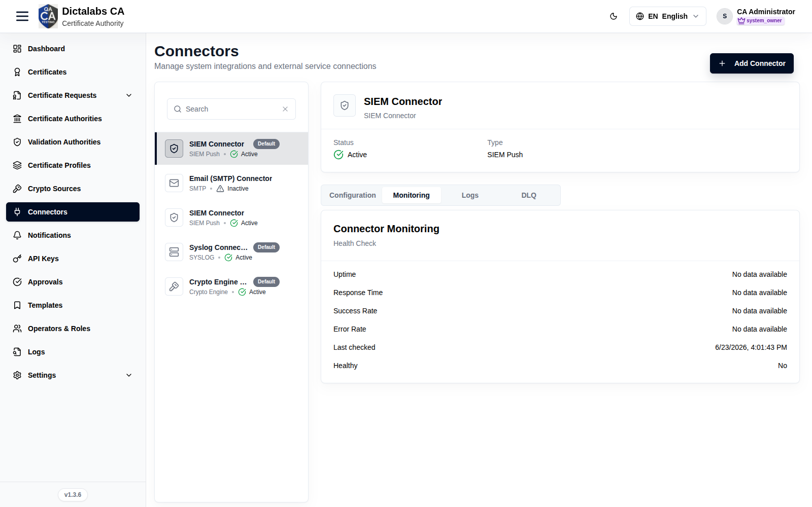
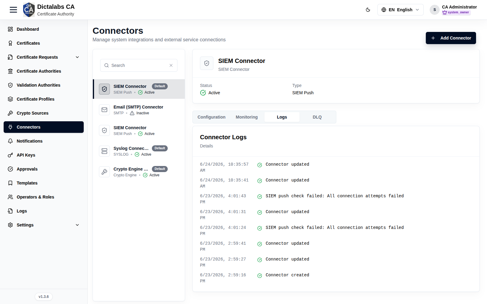
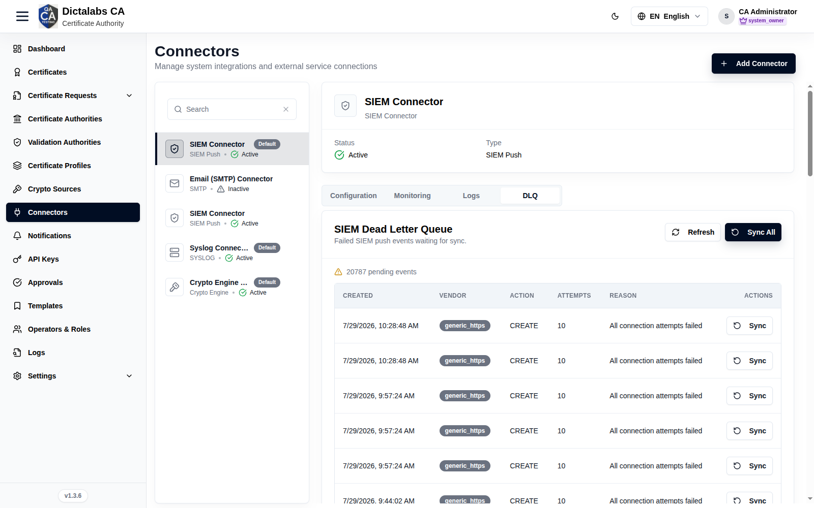
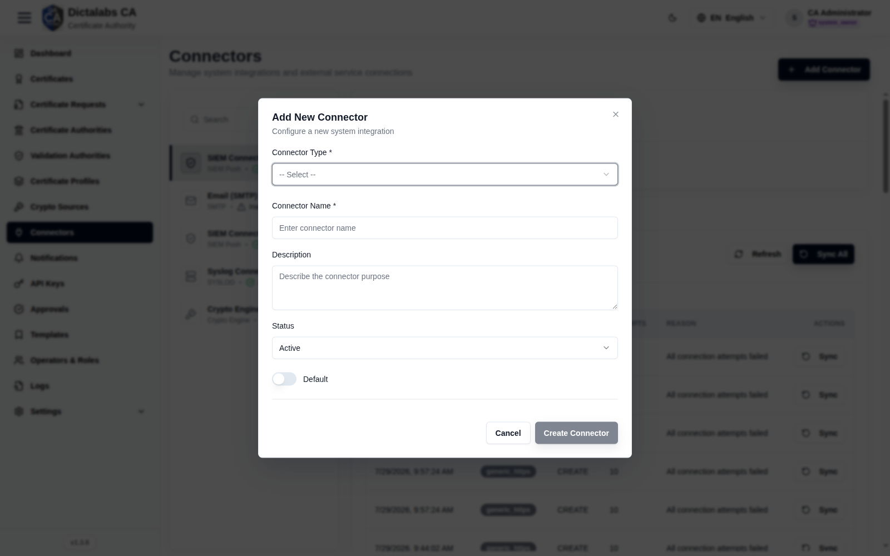

# Create Connectors

> **Cryptographic Foundation.** **Prerequisite:** [signed in to the tenant](05_tenant_sign_in.md).
> Create the **Crypto Engine Connector** here first — the next step (Crypto Sources) depends on it.

## Purpose

Connectors are integrations to external services — **Crypto Engine** (for key storage),
**Email (SMTP)**, **Syslog**, and **SIEM** — used by crypto sources, notifications, and log
export.

## Navigation

`Connectors`

## Overview

- **Add Connector** button.
- **Left panel:** connector list with type badge (Crypto Engine / SIEM / Email (SMTP) / Syslog),
  a **Default** marker, and Active/Inactive status; each has a **Delete** control.
- **Right panel:** selected connector with tabs.

### Detail tabs

| Tab | Contents |
| --- | -------- |
| Configuration | Type-specific connection settings |
| Monitoring | Health/status |
| Logs | Activity log |
| DLQ | Dead-letter queue (e.g. failed SIEM pushes) |

**Monitoring**

**Logs**

**DLQ**

## Fields — Add New Connector dialog

| Field | Description | Required | Notes |
| ----- | ----------- | -------- | ----- |
| Connector Type | Crypto Engine / SIEM / Email (SMTP) / Syslog | Yes | Selecting a type reveals its config fields |
| Connector Name | Display name | Yes | — |
| Description | Purpose | No | — |
| Status | Active / Inactive | No | Defaults to Active |
| Default | Mark as default for its type | No | Toggle |

## Step-by-Step — Create the Crypto Engine connector

1. Open **Connectors**.
2. Click **Add Connector**.
3. Choose **Connector Type = Crypto Engine**, name it, fill the connection settings.
4. Click **Create Connector**.

!!! note "Important Notes"
    - Configuration fields differ per type (SMTP host/port, syslog target, SIEM endpoint, crypto engine settings).
    - Use the **DLQ** tab to replay failed SIEM/event pushes.
