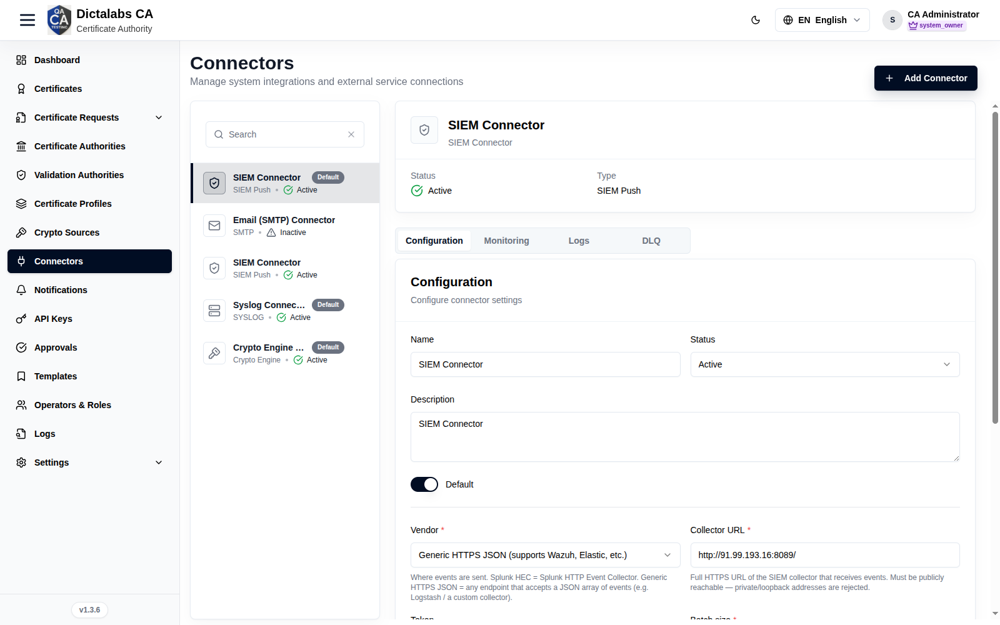
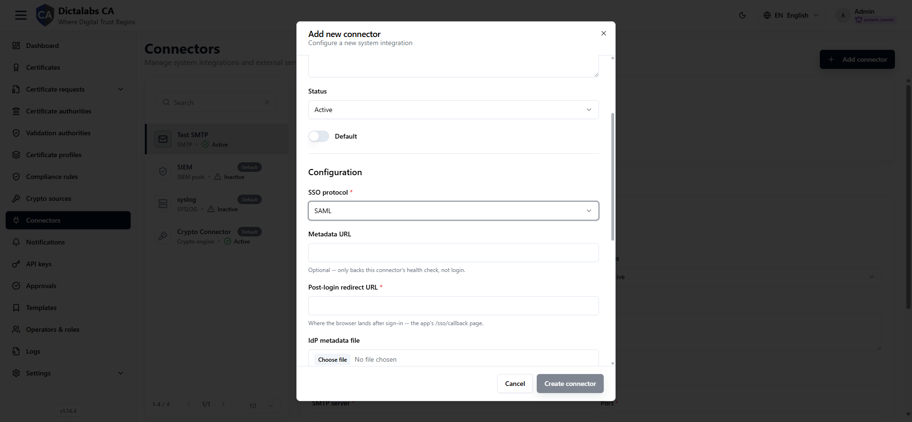
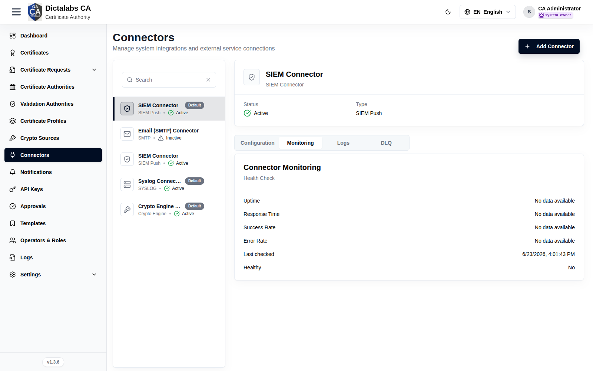
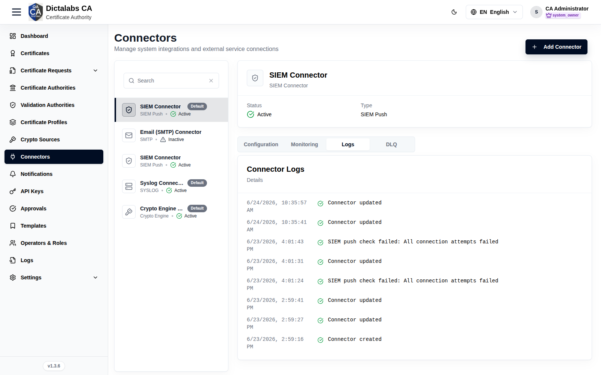
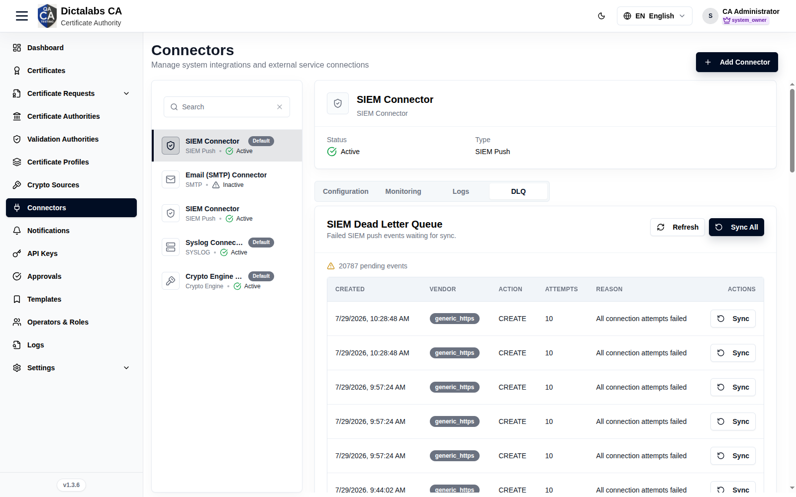
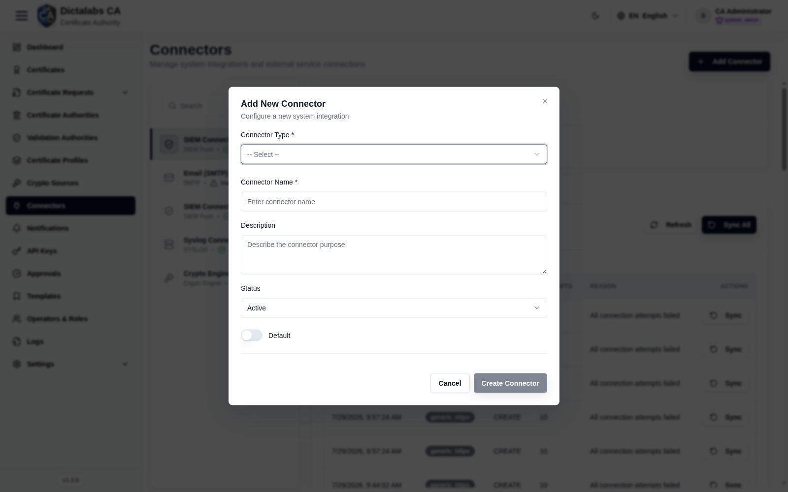

# Create Connectors

> **Cryptographic Foundation.** **Prerequisite:** [signed in to the tenant](05_tenant_sign_in.md).
> Create the **Crypto Engine Connector** here first — the next step (Crypto Sources) depends on it.

## Purpose

Connectors are integrations to external services — **Crypto Engine** (for key storage),
**Email (SMTP)**, **Syslog**, **SIEM**, and **Single Sign-On** — used by crypto sources,
notifications, log export, and operator authentication.

## Navigation

`Connectors`

## Overview

- **Add Connector** button.
- **Left panel:** connector list with type badge (Crypto Engine / SIEM / Email (SMTP) / Syslog /
  Single Sign-On), a **Default** marker, and Active/Inactive status; each has a **Delete** control.
- **Right panel:** selected connector with tabs.

## Detail tabs

Selecting a connector opens its detail panel. The tabs available depend on the
connector type: **Configuration**, **Monitoring**, and **Logs** appear for every
connector, while **DLQ** appears only for **SIEM** (SIEM push) connectors.

### Configuration

Edit the selected connector's identity and its type-specific connection
settings, then save or test the connection. These fields are shared by every
connector type and appear at the top of the tab.

| Field | What to enter | Why it matters |
| ----- | ------------- | -------------- |
| Name | A clear display name for the connector. | Identifies the connector in the list and in pickers elsewhere (crypto sources, notifications). Saving is blocked until it is filled. |
| Status | Active or Inactive. | Only Active connectors are used by the platform; set Inactive to keep the definition but stop it being used. |
| Description | Optional note on the connector's purpose or scope. | Helps other admins understand what the connector is for; not functional. |
| Default | On to mark this the default connector for its type. | The default is used when a feature needs a connector of that type and none is explicitly chosen (e.g. the default Crypto Engine or SMTP). |

Below the shared fields, the tab shows the connection settings for the
connector's type (documented per type in the following subsections).

- **Test connection** — sends the current settings to the server to verify they work before saving. Shown for Crypto Engine, Email (SMTP), Syslog, and SIEM connectors (not confirmed for Single Sign-On — see the note under Single Sign-On settings). Stored secrets are reused, so you need not re-enter a password just to test.
- **Save changes** — persists the edits. Disabled until the name and all required fields are valid (and, for Syslog, at least one stream is selected).

#### Crypto Engine settings

Connection to the external crypto engine / HSM that stores key material.

| Field | What to enter | Why it matters |
| ----- | ------------- | -------------- |
| Engine URL | The engine endpoint or HSM library path (e.g. `/usr/lib/softhsm/libsofthsm2.so`). Required. | Tells the platform where to reach the key store; wrong values break all key operations that depend on this engine. |
| Client ID | The client identifier issued by the crypto engine. Required. | Identifies this CA to the engine for authentication. |
| Client secret | The secret paired with the Client ID. Required. | Authenticates the CA to the engine; stored encrypted and shown as a masked placeholder once saved. |

#### Email (SMTP) settings

Outbound mail server used for certificate and system notifications.

| Field | What to enter | Why it matters |
| ----- | ------------- | -------------- |
| SMTP server | Hostname of the mail server (e.g. `smtp.acme.com`). Required. | Destination host for outbound mail; must be reachable from the CA. |
| Port | SMTP port (e.g. `587` for STARTTLS, `465` for SSL/TLS, `25` for plain). Required. | Must match the server's listening port and the chosen transport security. |
| Username | The SMTP account username. Required. | Used to authenticate to the mail server. |
| Password | The SMTP account password. Required. | Authenticates the account; stored encrypted and masked after saving. |
| Enable TLS | On to use STARTTLS for the connection. | Encrypts the SMTP session so credentials and mail are not sent in clear text. |

#### Syslog settings

Forwards platform logs to a remote syslog server, with selectable log streams.

| Field | What to enter | Why it matters |
| ----- | ------------- | -------------- |
| Server URL | Hostname or URL of the syslog server (e.g. `https://syslog.example.com`). Required. | Destination the logs are sent to. |
| Port | Syslog port (e.g. `514`). Required. | Must match the port the syslog server listens on. |
| Transport | UDP, TCP, or TLS. Required. | Governs delivery reliability and encryption; use TLS to encrypt log traffic in transit. |
| Verify TLS certificate | On to validate the server's certificate. Shown only when Transport is TLS. | Prevents sending logs to an impostor server; recommended whenever TLS is used. |
| Facility override | Optional syslog facility number (e.g. `16`). | Overrides the default facility so logs can be routed/filtered on the syslog side. |

Log streams (select at least one, or the connector cannot be saved):

- **Access log stream** — request/access activity.
- **Audit log stream** — security-relevant audit events.
- **Application log stream** — general application logs.
- **CRL generation stream** — CRL generation events.

#### SIEM settings

Pushes canonical SIEM events to a Splunk HEC or a generic HTTPS JSON collector.

| Field | What to enter | Why it matters |
| ----- | ------------- | -------------- |
| Vendor | Splunk HEC, or Generic HTTPS JSON (supports Wazuh, Elastic, etc.). Required. | Selects how events are formatted and delivered to the collector. |
| Collector URL | Full HTTPS URL of the SIEM collector (e.g. `https://collector.example.com:8088/services/collector`). Required. | Where events are sent; must be publicly reachable — private/loopback addresses are rejected. |
| Token | HEC token (Splunk) or bearer token (Generic HTTPS). Optional. | Sent in the Authorization header to authenticate to the collector; stored encrypted and masked after saving. |
| Batch size | Max events per request (default `500`, max `1000`). Required. | Higher values mean fewer, larger requests; tune to the collector's limits. |
| Batch interval (ms) | How often a batch is flushed, in milliseconds (default `5000` = 5s). Required. | Lower values deliver events sooner but generate more requests. |
| Timeout (seconds) | Seconds to wait for the collector before a send is treated as failed (default `10`). Optional. | Failed sends are retried with backoff; too low a value can cause needless retries. |
| Allow plain HTTP (no TLS) | Off = HTTPS required (recommended). On only for testing an `http://` collector. | Keeps event traffic encrypted in production; private/loopback addresses stay blocked either way. |

#### Single Sign-On settings

Lets operators sign in via an external identity provider instead of (or alongside) a password.
Choosing a **connector type = Single Sign-On** first asks for the protocol, which determines the
rest of the fields.

| Field | What to enter | Why it matters |
| ----- | ------------- | -------------- |
| SSO protocol | **SAML**, **OAuth2**, or **OpenID connect**. Required. | Selects which fields below apply and how the platform talks to the identity provider (IdP). |
| Metadata URL | The IdP's metadata endpoint. Optional, shared by all three protocols. | Only backs this connector's health check — it does not drive login. |
| Post-login redirect URL | Where the browser lands after a successful sign-in — the app's `/sso/callback` page. Required, shared by all three protocols. | Completes the login flow by returning the operator to the application. |

**SAML** fields:

| Field | What to enter | Why it matters |
| ----- | ------------- | -------------- |
| IdP metadata file | Upload the IdP's metadata XML. Optional. | Auto-fills the IdP entity ID, IdP SSO URL, and IdP certificate fields below from the file. |
| IdP entity ID | The identity provider's issuer identifier — not this application's. Required. | Identifies which IdP issued the assertions. |
| IdP SSO URL | Where the browser is sent to authenticate. Required. | The IdP's SAML sign-in endpoint. |
| IdP certificate | Upload the certificate. Required. | SAML assertions must be signed with this certificate to be trusted. |
| SP entity ID | Must match the Client ID configured on the IdP side exactly. Required. | Identifies this application (the service provider) to the IdP. |
| ACS URL | Where the IdP sends the browser back — must exactly match what is registered on the IdP side. Required. | The Assertion Consumer Service endpoint that receives the SAML response. |

**OAuth2** fields:

| Field | What to enter | Why it matters |
| ----- | ------------- | -------------- |
| Authorization URL | Where the browser is sent to authenticate. Required. | The IdP's authorization endpoint. |
| Token URL | Exchanges the authorization code for an access token. Required. | Backend-to-IdP token exchange endpoint. |
| User info URL | Returns the signed-in user's profile. Required. | Used to fetch the operator's identity after authentication. |
| Introspection URL | Confirms the token was issued to this connector. Required. | Validates tokens presented back to the platform. |
| Client ID | The client ID as registered with the IdP. Required. | Identifies this connector to the IdP. |
| Client secret | From the IdP client's Credentials tab. Required. | Authenticates this connector to the IdP; stored encrypted and masked after saving. |
| Redirect URI | Where the IdP sends the browser back — must exactly match what is registered there. Required. | The OAuth2 callback endpoint. |
| Scopes | Multi-select: **OpenID**, **Profile**, **Email**, **Offline access**. Required. | Determines what the token grants access to; include "openid" — some IdPs require it even for bare OAuth2. |

**OpenID Connect** fields:

| Field | What to enter | Why it matters |
| ----- | ------------- | -------------- |
| Client ID | The client ID as registered with the IdP. Required. | Identifies this connector to the IdP. |
| Client secret | From the IdP client's Credentials tab. Required. | Authenticates this connector to the IdP; stored encrypted and masked after saving. |
| Redirect URI | Where the IdP sends the browser back — must exactly match what is registered there. Required. | The OIDC callback endpoint. |
| Issuer URL | The IdP's issuer. Required. | The other endpoints (authorization, token, JWKS, etc.) are read automatically from this issuer's discovery document. |
| JWKS URI | Overrides the signing keys read from the issuer's discovery document. Optional. | Use only if the discovery document's keys are wrong or unreachable. |
| Scopes | Multi-select: **OpenID**, **Profile**, **Email**, **Offline access**. Required. | Same as OAuth2 above. |

!!! note "Not independently verified"
    No live SSO connector existed to inspect its saved detail/edit form, Monitoring, or Logs tabs —
    the fields above come from the Add Connector dialog only. Confirm the edit-form behavior (e.g.
    whether **Test connection** appears for this type) before relying on it.

### Monitoring

Read-only health snapshot for the selected connector, fetched from its health
endpoint. There are no inputs on this tab.

| Reading | Meaning |
| ------- | ------- |
| Uptime | Reported availability of the connector. |
| Response time | Average response time of health checks, in milliseconds. |
| Success rate | Percentage of recent operations that succeeded. |
| Error rate | Percentage of recent operations that failed. |
| Last checked | Timestamp of the most recent health check. |
| Healthy | Whether the connector is currently considered healthy (Yes/No). |

Values show as "no data" until the connector has been exercised. Use this tab to
confirm a connector is reachable and performing before relying on it.

### Logs

Read-only activity log for the selected connector, newest entries first. Each row
shows a timestamp, a severity icon (info, warning, error, or debug), the log
message, and any structured metadata. There are no inputs on this tab; use it to
troubleshoot failed operations or confirm recent activity.

### DLQ

Dead-letter queue of SIEM push events that failed to reach the collector and are
waiting to be re-sent. This tab appears only for SIEM connectors. The table lists
each pending event's Created time, Vendor, Action, Attempts, and failure Reason.
There are no inputs on this tab — only the actions below.

- **Refresh** — reloads the pending queue so you can watch the count change.
- **Sync all** — schedules a background drain that re-sends the whole queue in batches; returns immediately, so refresh to watch the pending count drop.
- **Sync** (per row) — re-sends a single failed event immediately.

## Fields — Add New Connector dialog

| Field | Description | Required | Notes |
| ----- | ----------- | -------- | ----- |
| Connector Type | Crypto Engine / SIEM / Email (SMTP) / Syslog / Single Sign-On | Yes | Selecting a type reveals its config fields; Single Sign-On also asks for a protocol (SAML/OAuth2/OpenID connect) first |
| Connector Name | Display name | Yes | — |
| Description | Purpose | No | — |
| Status | Active / Inactive | No | Defaults to Active |
| Default | Mark as default for its type | No | Toggle |

## Step-by-Step — Create the Crypto Engine connector

1. Open **Connectors**.
2. Click **Add Connector**.
3. Choose **Connector Type = Crypto Engine**, name it, fill the connection settings.
4. Click **Create Connector**.

!!! note "Important Notes"
    - Configuration fields differ per type (SMTP host/port, syslog target, SIEM endpoint, crypto engine settings, SSO protocol/IdP settings).
    - Use the **DLQ** tab to replay failed SIEM/event pushes.
    - A Single Sign-On connector configures how operators authenticate; it is unrelated to the
      Crypto Engine connector used for key storage.
