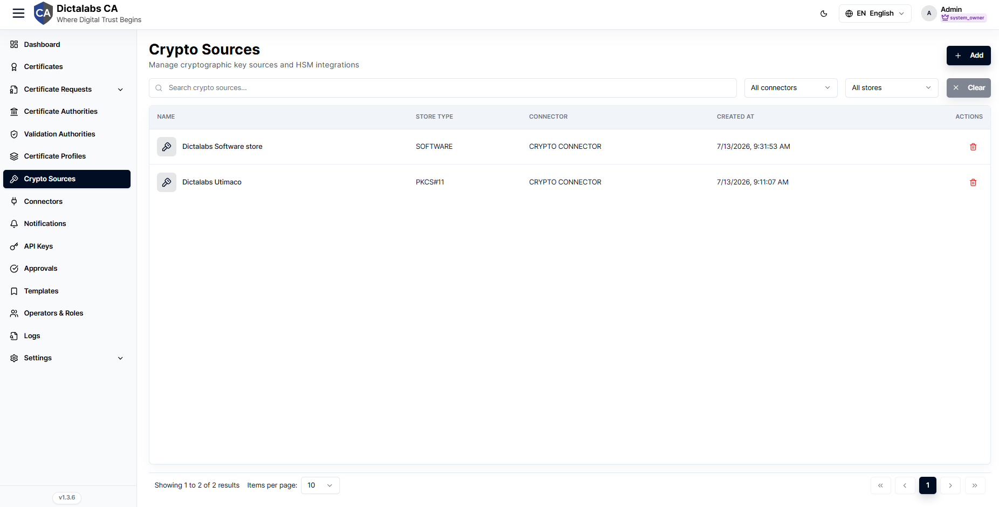
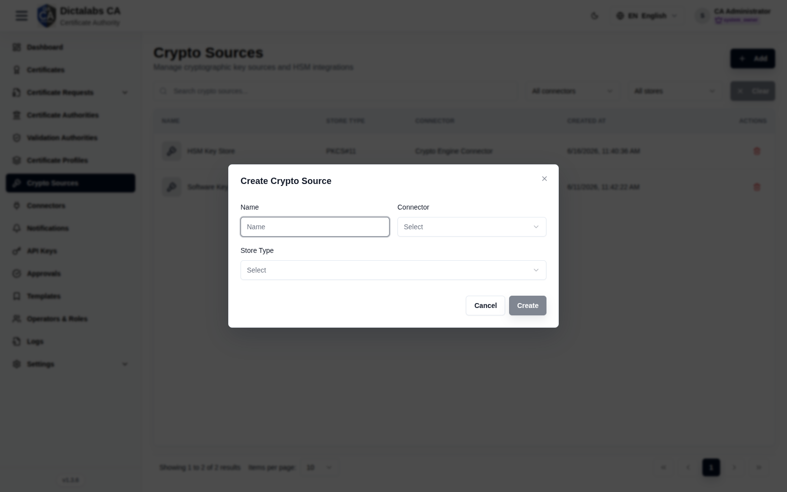

# Configure Crypto Sources

> **Cryptographic Foundation.** **Prerequisite:** a **Crypto Engine**
> [connector](09_connectors.md) exists.

## Purpose

Crypto Sources define where cryptographic keys live — an HSM via PKCS#11 or a software key
store — backed by a crypto connector. CAs and certificate requests reference a crypto source
when generating or using keys.

## Navigation

`Crypto Sources`

## Overview

- **Add** button, search, connector filter, store filter.
- **Table** — Name, Store Type (PKCS#11 / SOFTWARE), Connector, Created at, Actions.

## Fields — Create Crypto Source dialog

| Field | Description | Required | Notes |
| ----- | ----------- | -------- | ----- |
| Name | Display name | Yes | — |
| Connector | Backing crypto connector | Yes | The **Crypto Engine Connector** created previously |
| Store Type | PKCS#11 / SOFTWARE | Yes | PKCS#11 = HSM-backed; SOFTWARE = software store |

## Step-by-Step

1. Open **Crypto Sources**.
2. Click **Add**.
3. Enter **Name**, select the **Connector** and **Store Type**.
4. Click **Create**.

!!! note "Important Notes"
    - A crypto source requires a configured **Crypto Engine** connector.
    - Choose **PKCS#11** for HSM-backed keys; **SOFTWARE** keeps keys in the software store.
