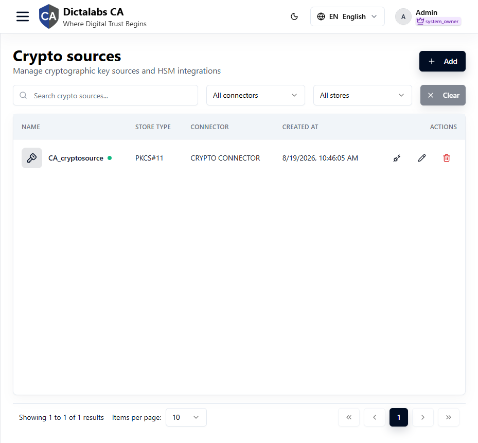
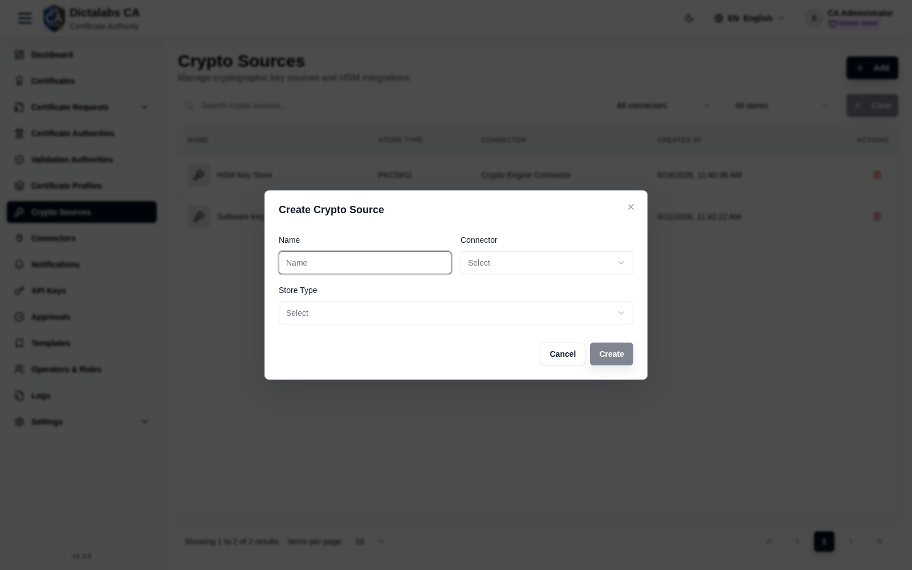
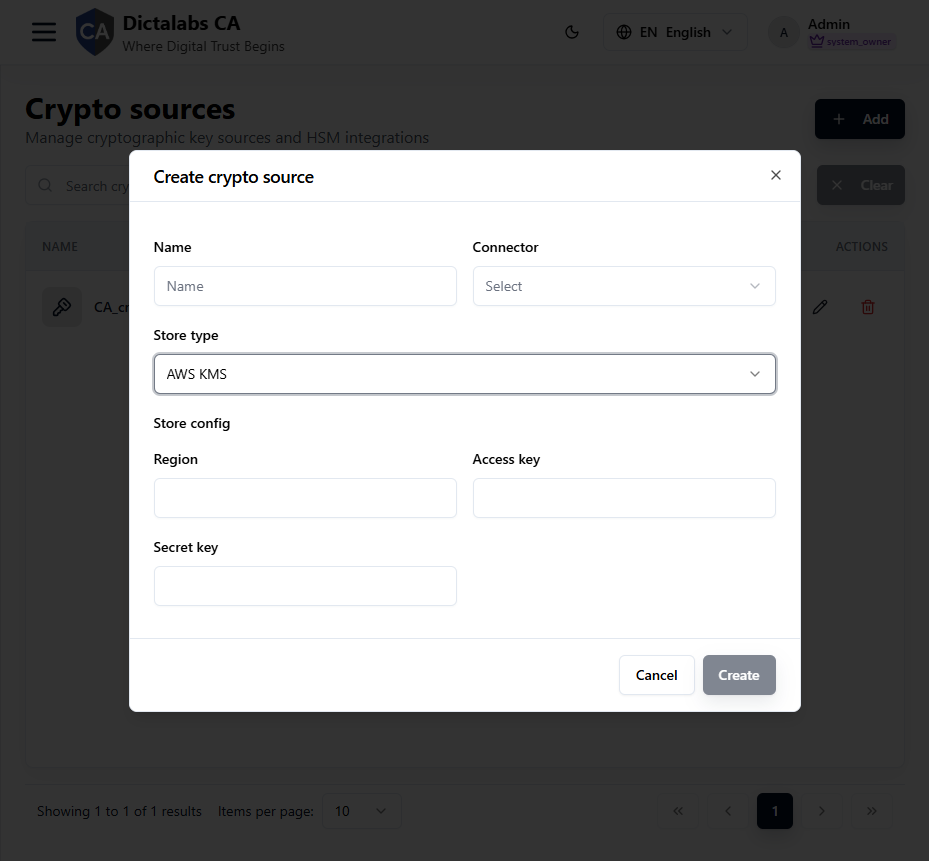
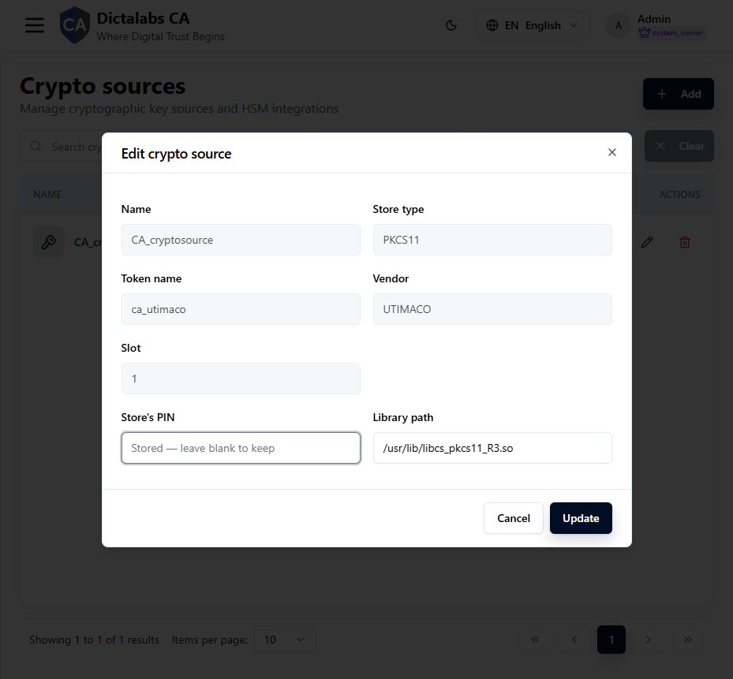

# Configure Crypto Sources

> **Cryptographic Foundation.** **Prerequisite:** a **Crypto Engine**
> [connector](09_connectors.md) exists.

## Purpose

Crypto Sources define where cryptographic keys live — an HSM via PKCS#11 or a software key
store — backed by a crypto connector. CAs and certificate requests reference a crypto source
when generating or using keys.

## Navigation

`Crypto Sources`

## Overview

- **Add** button, search, connector filter, store filter.
- **Table** — Name, Store Type, Connector, Created at, Actions.
- **Actions** (per row) — **Test connection**, **Edit**, **Delete**. **Test connection** pings the
  backing store and shows an inline result (e.g. "Test connection passed. Crypto source is
  reachable.") next to the row's Name, without opening a dialog.

## Fields — Create Crypto Source dialog

| Field | Description | Required | Notes |
| ----- | ----------- | -------- | ----- |
| Name | Display name | Yes | — |
| Connector | Backing crypto connector | Yes | The **Crypto Engine Connector** created previously |
| Store Type | **SOFTWARE**, **PKCS11**, **AWS KMS**, or **Azure key Vault** | Yes | PKCS11 = HSM-backed; SOFTWARE = software store; AWS KMS and Azure key Vault are cloud-managed key stores. Choosing a cloud store type reveals a **Store config** section below with store-specific fields (see below). |

### Store config — AWS KMS

Shown only when **Store Type = AWS KMS**.

| Field | Description | Why it matters |
| ----- | ----------- | -------------- |
| Region | The AWS region hosting the KMS keys (e.g. `us-east-1`). | KMS keys and API calls are region-scoped; must match where the keys live. |
| Access key | The AWS access key ID used to authenticate to KMS. | Identifies the IAM credential used for signing/key operations. |
| Secret key | The AWS secret access key paired with the access key. | Authenticates the access key; treat as sensitive credential material. |

### Store config — Azure key Vault

Shown only when **Store Type = Azure key Vault**.

| Field | Description | Why it matters |
| ----- | ----------- | -------------- |
| Key Vault URL | The vault's DNS URL (e.g. `https://<vault-name>.vault.azure.net/`). | Points the platform at the specific Key Vault instance holding the keys. |

## Fields — Edit Crypto Source dialog

Opened via **Edit** on a row. For a **PKCS11** source it shows read-only identity fields plus two
editable fields:

| Field | Description | Editable |
| ----- | ----------- | -------- |
| Name | Display name. | No |
| Store type | The store type (e.g. `PKCS11`). | No |
| Token name | The HSM token's name (e.g. `ca_utimaco`). | No — read-only, from the token |
| Vendor | The HSM vendor (e.g. `UTIMACO`). | No — read-only, from the token |
| Slot | The HSM slot number the token occupies. | No — read-only, from the token |
| Store's PIN | The PIN/password protecting the token. | Yes — leave blank to keep the stored value |
| Library path | Path to the PKCS#11 vendor library on the server (e.g. `/usr/lib/libcs_pkcs11_R3.so`). | Yes |

- **Cancel** — discards changes. **Update** — saves the editable fields.

## Step-by-Step

1. Open **Crypto Sources**.
2. Click **Add**.
3. Enter **Name**, select the **Connector** and **Store Type**.
4. For **AWS KMS** or **Azure key Vault**, fill in the **Store config** fields that appear.
5. Click **Create**.
6. Use **Test connection** on a row to verify the store is reachable before relying on it.

!!! note "Important Notes"
    - A crypto source requires a configured **Crypto Engine** connector.
    - Choose **PKCS#11** for HSM-backed keys, **SOFTWARE** for the software store, or **AWS KMS** /
      **Azure key Vault** for a cloud-managed key store.
    - Cloud credentials (AWS access/secret key, Azure vault URL) are entered once at creation; use
      **Edit** afterwards for PKCS#11 PIN/library-path changes.
