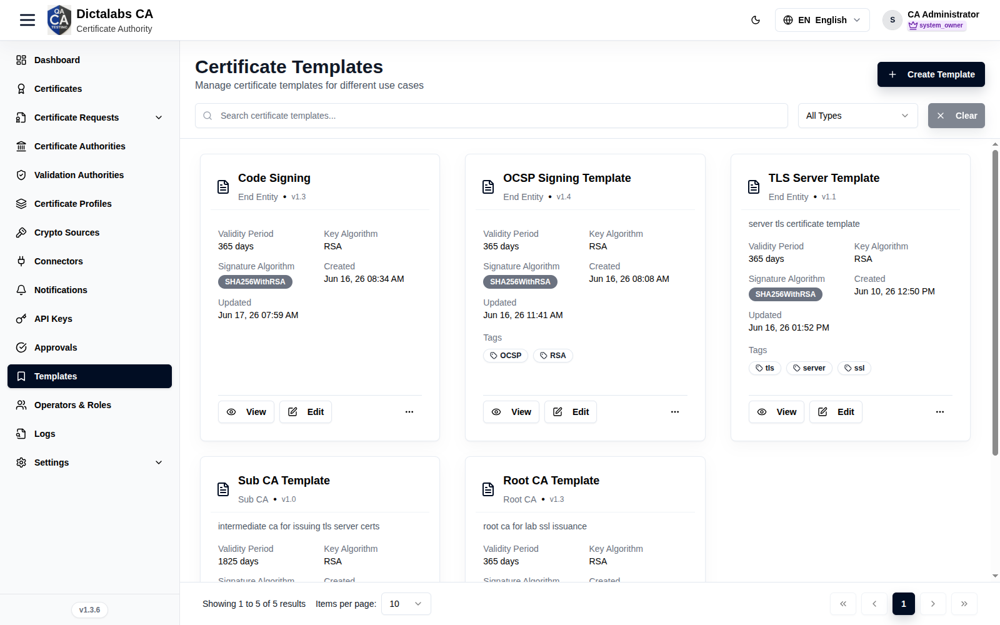
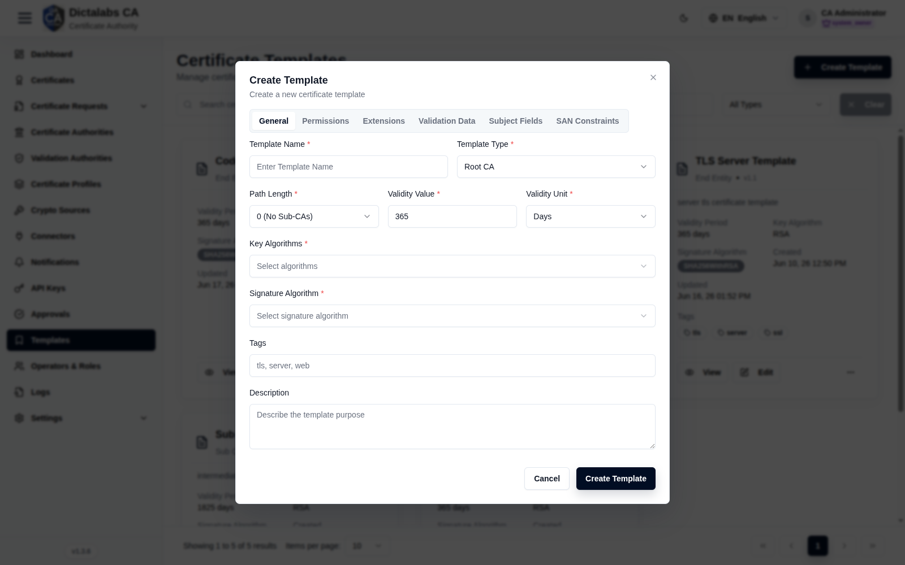
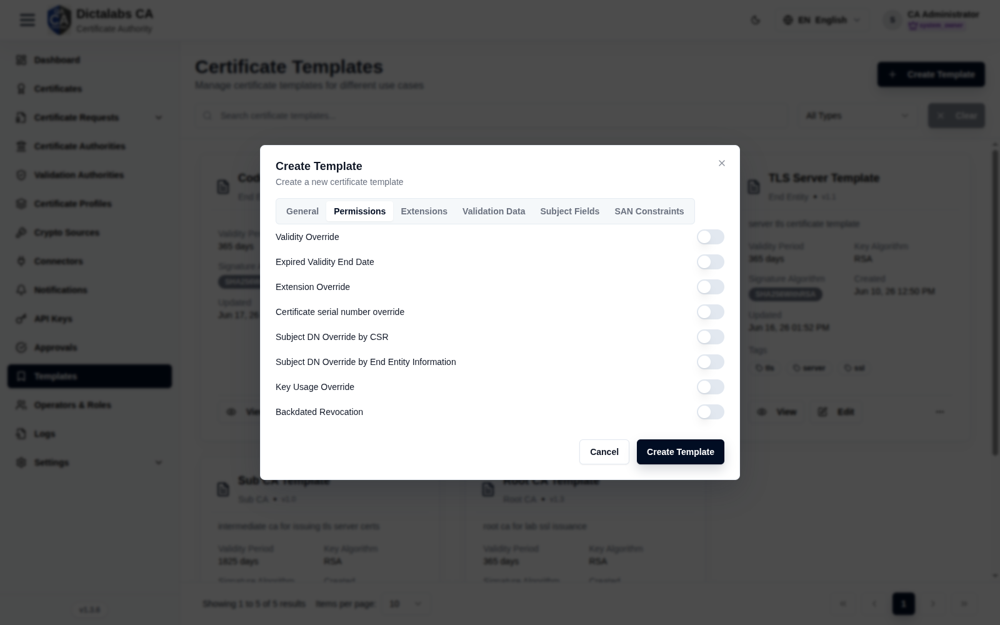
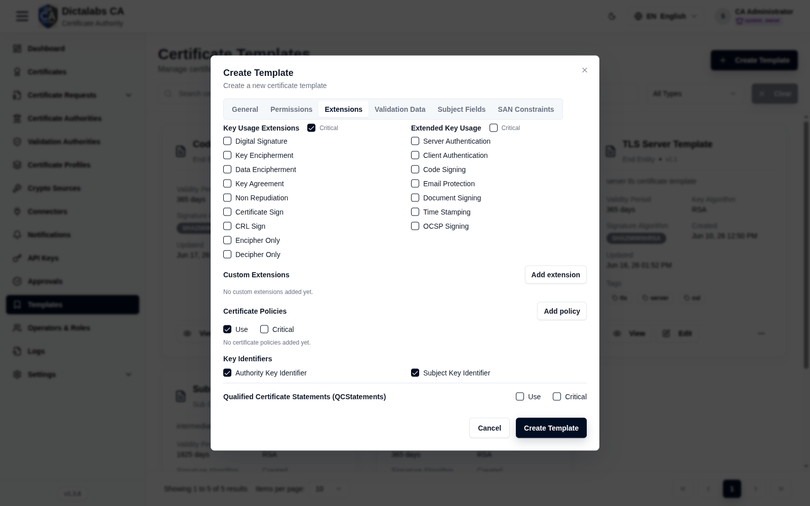
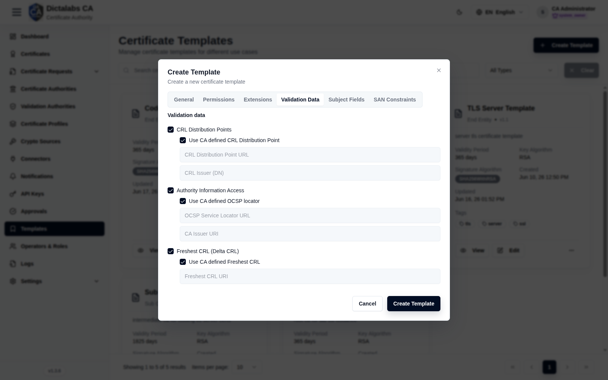
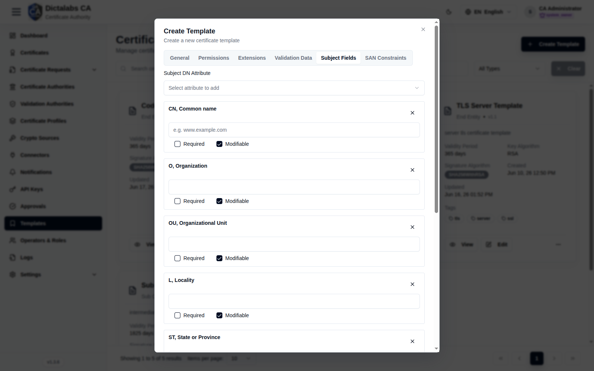
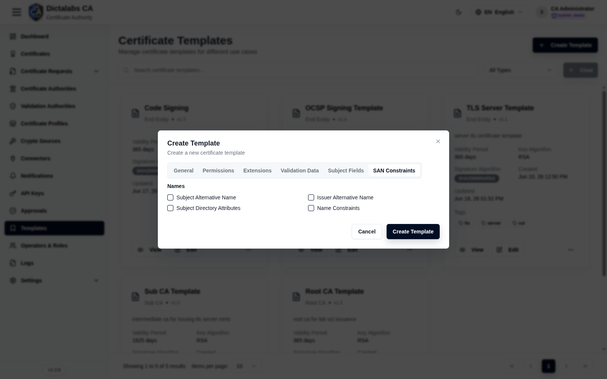

# Create Templates

> **Certificate Templates.** **Prerequisite:** [signed in to the tenant](05_tenant_sign_in.md).
> Create templates before building CAs and profiles — both reference a template.

## Purpose

Certificate Templates are reusable blueprints — type, validity, key/signature algorithms,
extensions, subject-field and SAN constraints. You typically create a **Root CA Template**, a
**Sub CA Template**, and one or more **End-Entity** templates (e.g. TLS Server, OCSP Signing).

## Navigation

`Templates`

## Overview

- **Create Template** button, search, type filter.
- **Card grid** — name, type (Root CA / Sub CA / End Entity), version, validity, key algorithm,
  signature algorithm, tags, plus **View / Edit**.

## Fields — Create Template dialog

The dialog has six tabs.

### General

| Field | Description | Required | Notes |
| ----- | ----------- | -------- | ----- |
| Template Name | Display name | Yes | — |
| Template Type | Root CA / Sub CA / End Entity | Yes | Drives path length and usage |
| Path Length | CA path length constraint | Yes | e.g. "0 (No Sub-CAs)" |
| Validity Value / Unit | Default validity | Yes | e.g. 365 Days |
| Key Algorithms | Allowed key algorithms | Yes | Multi-select |
| Signature Algorithm | Signing algorithm | Yes | e.g. SHA256WithRSA |
| Tags / Description | Labels / purpose | No | — |

### Permissions

### Extensions

### Validation Data

### Subject Fields

### SAN Constraints

## Step-by-Step

1. Open **Templates → Create Template**.
2. On **General**, set name, type (start with **Root CA Template**), path length, validity,
   algorithms.
3. Configure **Extensions**, **Subject Fields**, and **SAN Constraints** as needed.
4. Save. Repeat for a **Sub CA Template** and any **End-Entity** templates.

!!! note "Important Notes"
    - Subject Fields and SAN Constraints here drive what requesters can enter in the [request wizard](17_request_certificate.md).
    - Match template type to intended use: Root CA / Sub CA for CAs, End Entity for leaf certs.
