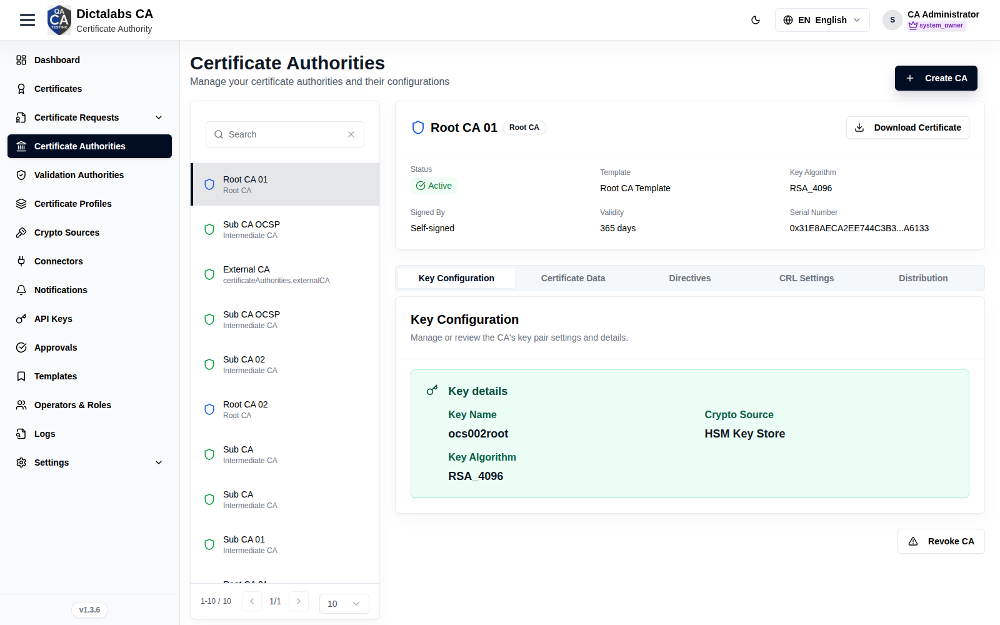

# Create the Root CA

> **Build the CA Hierarchy.** **Prerequisites:** a **Root CA Template**
> ([Templates](11_templates.md)) and a [Crypto Source](10_crypto_sources.md) for the key.

## Purpose

The Root CA is the self-signed trust anchor at the top of your hierarchy. Create it first; the
Sub CA in the next step is signed by it.

## Navigation

`Certificate Authorities`

## Overview

- **Create CA** button (top right).
- **Left panel:** searchable CA list with each CA's name and type (Root CA / Sub CA / External CA).
- **Right panel:** selected CA summary (Status, Template, Key Algorithm, Signed By, Validity,
  Serial Number) with **Download Certificate** and **Revoke CA**.

## Fields — Create CA dialog (Root)

| Field | Description | Required | Notes |
| ----- | ----------- | -------- | ----- |
| CA Name | Display name (e.g. *Root CA 01*) | Yes | — |
| CA Type | **Root** | Yes | Root = self-signed trust anchor |
| Template | CA template | Yes | Choose your **Root CA Template** |

## Step-by-Step

1. Open **Certificate Authorities → Create CA**.
2. Enter a **CA Name**, set **CA Type = Root**, choose the **Root CA Template**.
3. Click **Create CA**, then complete key generation (select the [Crypto Source](10_crypto_sources.md))
   and self-signing.

!!! note "Important Notes"
    - A Root CA signs itself (**Signed By: Self-signed**).
    - Key generation may require a **Key Ceremony** / Two-Person Control.

!!! warning "Security Warning"
    The Root CA is your trust anchor — protect its key (prefer an HSM/PKCS#11 crypto source).
