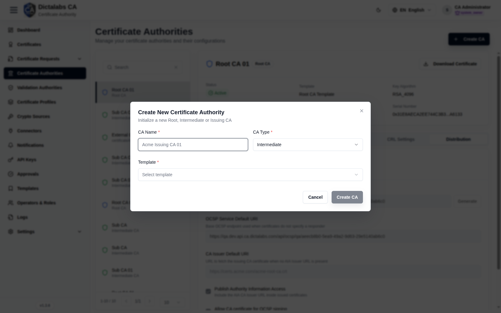

# Create the Sub CA (Issuing CA)

> **Build the CA Hierarchy.** **Prerequisites:** a [Root CA](12_create_root_ca.md), a
> **Sub CA Template** ([Templates](11_templates.md)), and a [Crypto Source](10_crypto_sources.md).

## Purpose

The Sub CA (Issuing CA) is signed by the Root CA and does the day-to-day certificate issuance —
keeping the Root offline/protected. End-entity certificates chain to it.

## Navigation

`Certificate Authorities` → **Create CA**

## Fields — Create CA dialog (Sub)

| Field | Description | Required | Notes |
| ----- | ----------- | -------- | ----- |
| CA Name | Display name (e.g. *Sub CA 01*) | Yes | — |
| CA Type | **Intermediate** (Issuing / Sub CA) | Yes | — |
| Template | CA template | Yes | Choose your **Sub CA Template** |
| Signed By | Parent CA | Yes | Select the **Root CA** created previously |

## Step-by-Step

1. Open **Certificate Authorities → Create CA**.
2. Enter a **CA Name**, set **CA Type = Intermediate**, choose the **Sub CA Template**.
3. Set **Signed By = Root CA**.
4. Click **Create CA**, then complete key generation (select a [Crypto Source](10_crypto_sources.md))
   and signing by the Root.

!!! note "Important Notes"
    - You can create multiple Sub CAs (e.g. one per certificate purpose).
    - Next: [configure the CA](14_configure_ca.md) (CRL, OCSP/AIA distribution), then set up a [Validation Authority](15_validation_authority.md).
