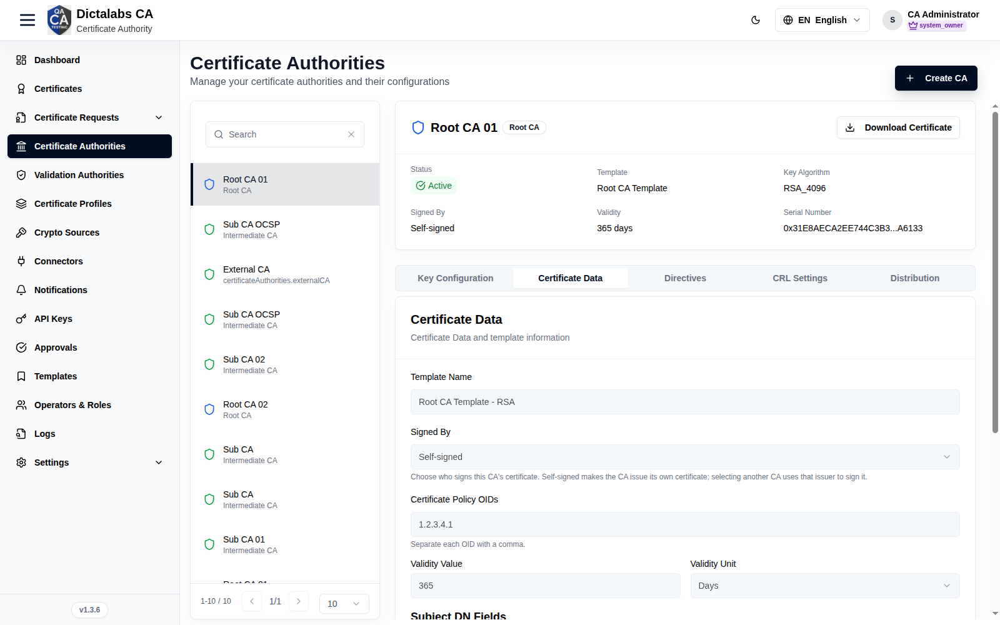
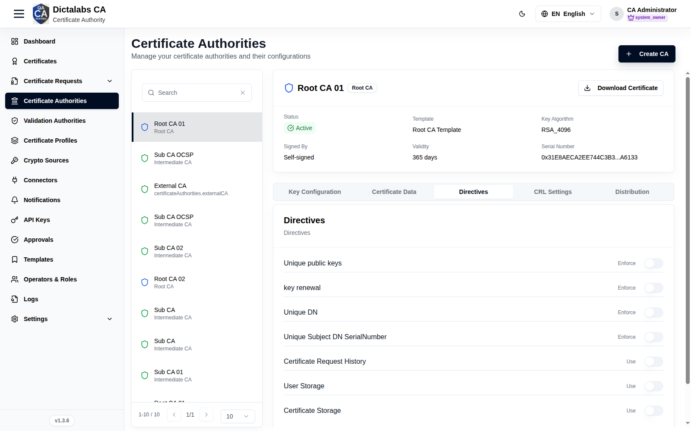
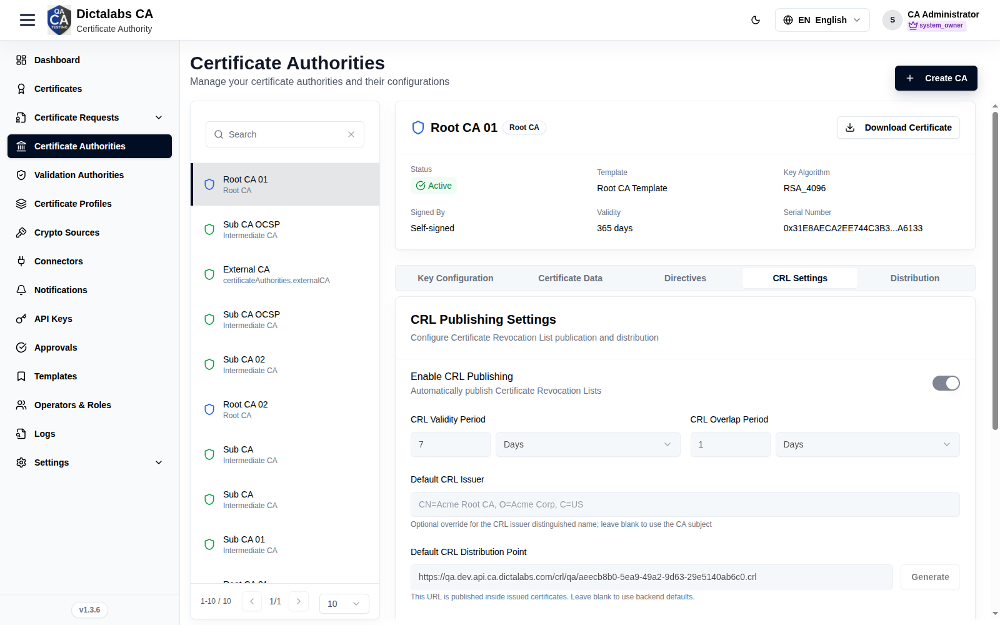
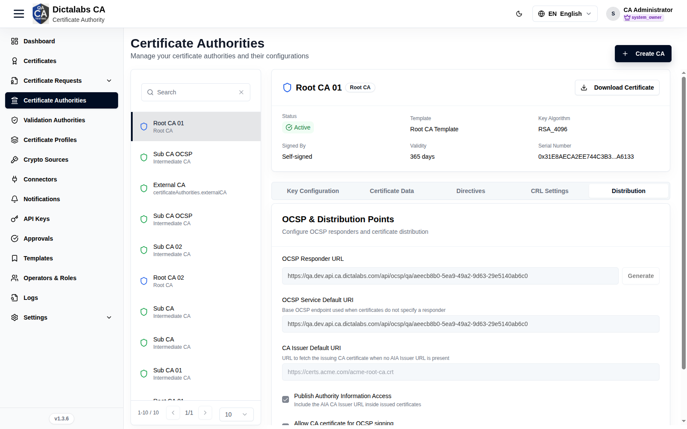

# Configure the CA (Keys, CRL, Distribution)

> **Build the CA Hierarchy.** **Prerequisite:** a [Root CA](12_create_root_ca.md) and/or
> [Sub CA](13_create_sub_ca.md) exists.

## Purpose

Once a CA exists, configure how it manages keys, publishes revocation (CRL), and advertises
validation/issuer endpoints (OCSP / AIA). Select a CA in the list to expose its configuration
tabs.

## Navigation

`Certificate Authorities` → select a CA → tabs.

## Configuration tabs

The detail pane exposes five tabs: Key Configuration, Certificate Data, Directives, CRL
Settings, and Distribution. Configuration is locked (read-only) once the CA certificate has
been issued or the CA has been revoked — plan values before signing. A single **Save
configuration** button at the bottom persists all editable tabs together.

### Key Configuration
Creates or reviews the CA's private key pair. Until a key pair exists you supply the fields
below and click **Generate Key Pair**; afterwards the tab shows the generated key's details
read-only. The available algorithms, key sizes, and curves are constrained by the CA's
certificate template.

| Field | What to enter | Why it matters |
| ----- | ------------- | -------------- |
| Key Name | A unique alias/label for the key inside the crypto source (e.g. `acme-root-ca-key`). | Identifies the private key in the HSM or software store; used to reference the key for all signing operations. |
| Crypto Source | Select the crypto source (HSM or software key store) that will hold the private key. | Determines where the private key is generated and protected. An HSM keeps the key non-exportable; choose per your security policy. |
| Key Algorithm | Select the public-key algorithm allowed by the template (e.g. RSA, ECDSA, or a PQC algorithm such as ML-DSA). | Sets the cryptographic family and, with it, signature strength and client compatibility. |
| Key Size | For RSA, select the modulus size (e.g. 2048, 3072, 4096 bits). | Larger sizes are stronger but slower; match your policy and validity period. |
| ECDSA Curve | For ECDSA, select the named curve. If the curve is "Any allowed", also select a Key Size. | The curve fixes the security level and interoperability of ECDSA keys. |
| Key Password | Enter a passphrase to protect the private key. | Encrypts/guards the private key material; required to generate the key pair. Store it securely — it cannot be recovered from the UI. |

- **Generate Key Pair** — creates the key pair in the selected crypto source. It is required before the CA can be signed, and **Save configuration** stays disabled until a key pair exists.

### Certificate Data
Defines the identity that goes into the CA certificate — its subject DN, issuer, validity,
and any policy OIDs, SANs, or directory attributes permitted by the template. The Subject DN,
SAN, and Subject Directory Attribute fields are rendered dynamically from the template;
required fields are marked and locked fields cannot be edited.

| Field | What to enter | Why it matters |
| ----- | ------------- | -------------- |
| Template Name | Read-only — shows the certificate template bound to this CA. | The template governs which subject/SAN/SDA fields appear and which are required or locked. |
| Signed By | Choose **Self-signed** (the CA signs its own certificate) or select an active parent CA to sign it. | Determines the CA's position in the hierarchy: self-signed for a Root CA, or a parent for a Sub CA. Intermediate CAs cannot be self-signed. |
| Certificate Policy OIDs | Enter one or more policy OIDs, comma-separated (e.g. `2.23.140.1.2.1`). | Declares the certificate policies this CA asserts; relying parties may enforce them during path validation. |
| Validity Value | Enter the numeric lifetime of the CA certificate. | Sets how long the CA certificate is valid. Required before signing. |
| Validity Unit | Select Days, Months, or Years. | Combined with the value, defines the exact expiry; a CA should outlive the certificates it issues. |
| Subject DN Fields | Fill the template's subject attributes (e.g. CN, O, C). Required fields are marked with `*`. | Forms the CA's distinguished name (DN) — its identity as an issuer in every certificate it signs. |
| Subject Alternative Names | Enter values for each allowed SAN type (comma-separate multiple values). | Adds additional identities (e.g. DNS, URI) to the CA certificate where the template permits. |
| Subject Directory Attributes | Enter values for allowed SDA attributes (e.g. country of citizenship). | Carries identity metadata in the certificate's subject directory attributes extension when required by the template. |

### Directives
Issuance policy switches that this CA enforces on the certificates it signs. Each control is
an on/off toggle.

| Field | What to enter | Why it matters |
| ----- | ------------- | -------------- |
| Unique public keys | Enable to reject any request reusing a public key already seen by this CA. | Prevents key reuse across certificates, limiting the blast radius if a key is compromised. |
| Key renewal | Enable to require a fresh key pair on renewal rather than reusing the existing one. | Enforces key rotation at renewal for stronger hygiene. |
| Unique DN | Enable to reject a request whose subject DN duplicates an existing certificate's DN. | Keeps subject identities unambiguous within the CA. |
| Unique Subject DN SerialNumber | Enable to require a unique serialNumber attribute within the subject DN. | Disambiguates subjects that would otherwise share a DN. |
| Certificate Request History | Enable to retain a history of certificate requests handled by this CA. | Supports auditing and traceability of issuance activity. |
| User Storage | Enable to store end-user/requester records for this CA. | Retains requester identity data for lookup and audit. |
| Certificate Storage | Enable to store issued certificates in the CA's certificate store. | Keeps a persistent record of issued certificates for reissue, lookup, and revocation. |

### CRL Settings
Configures how this CA publishes its Certificate Revocation List (CRL) — cadence, validity,
and the distribution point advertised inside issued certificates. Editing this tab requires
the CRL management permission.

| Field | What to enter | Why it matters |
| ----- | ------------- | -------------- |
| Enable CRL publishing | Toggle on to automatically publish CRLs for this CA. | When off, no CRL is published automatically and relying parties cannot check revocation via CRL. |
| CRL validity period | Enter a number and select a unit (Days/Months/Years). | Defines how long each published CRL is considered current; shorter periods give fresher revocation data but require more frequent publishing. |
| CRL overlap period | Enter a number and select a unit. | The lead time by which a new CRL is issued before the previous one expires, preventing a gap in coverage. |
| Default CRL issuer | Optional — enter an issuer distinguished name (DN) to override the default. | Overrides the CRL issuer DN; leave blank to use the CA's own subject. |
| Default CRL distribution point | Enter the URL where the CRL is published, or click **Generate**. | This URL is embedded in issued certificates so clients know where to fetch the CRL. Leave blank to use backend defaults. |
| Enable delta CRL | Toggle on, then enter the delta interval in days. | Publishes incremental (delta) CRLs so clients download only changes since the last full CRL, saving bandwidth. |
| Generate CRL on revocation | Toggle on to publish a CRL immediately whenever a certificate is revoked. | Minimizes the window during which a freshly revoked certificate still appears valid. |
| CRL number | Optional numeric counter. | A monotonic counter used for CRL versioning; each new CRL must have a higher number. |
| Publication schedule | Enter a number and select a unit (Minutes/Hours/Days/Months). | Sets the recurring cadence on which CRLs are regenerated and published. |
| Include authority key identifier | Toggle on to add the AKI extension to the CRL. | Links the CRL to the issuing CA's key, helping clients bind it to the correct issuer. |
| Keep expired certificates on CRL | Toggle on to retain revoked entries after the certificate expires. | Preserves revocation history for auditing and compatibility; off trims the CRL once entries expire. |

- **Generate** (next to Default CRL distribution point) — asks the backend to create/assign a CRL distribution point URL and returns the current CRL number.

### Distribution
Configures the validation and issuer endpoints advertised for this CA: the OCSP responder and
the Authority Information Access (AIA) URLs. The tab is labeled **Validations** in the UI.

| Field | What to enter | Why it matters |
| ----- | ------------- | -------------- |
| OCSP responder URL | Enter the OCSP responder URL for this CA, or click **Generate**. | Embedded in issued certificates so clients can check revocation status in real time via OCSP. |
| OCSP service default URI | Enter the base OCSP endpoint. | Used when a certificate does not specify its own responder URL. |
| CA issuer default URI | Enter the URL that serves the issuing CA certificate. | Used to fetch the issuer certificate for path building when no AIA issuer URL is present. |
| Publish authority information access | Check to include the AIA CA issuer URL inside issued certificates. | Lets relying parties automatically locate and download the issuing CA certificate to complete the chain. |
| Allow CA certificate for OCSP signing | Check to permit this CA certificate to sign OCSP responses directly. | Allows OCSP responses when no dedicated OCSP signing certificate is configured; uncheck to require a delegated responder. |

- **Generate** (next to OCSP responder URL) — asks the backend for the OCSP responder URL (and service default URI) for this CA.

## Actions

- Per-tab **Save** — persist configuration.
- **Download Certificate** — export the CA certificate.
- **Revoke CA** — revoke the CA (invalidates everything it issued; irreversible).

## Step-by-Step

1. Open **Certificate Authorities** and select the CA.
2. Review **Key Configuration** (confirm the crypto source/key).
3. Configure **CRL Settings** (publication) and **Distribution** (OCSP/AIA URLs, Publish AIA).
4. **Save** each tab.

!!! note "Important Notes"
    - OCSP responses are served by a [Validation Authority](15_validation_authority.md).

!!! warning "Critical Warning"
    Revoking a CA cascades to all certificates that CA issued — use with extreme care.
