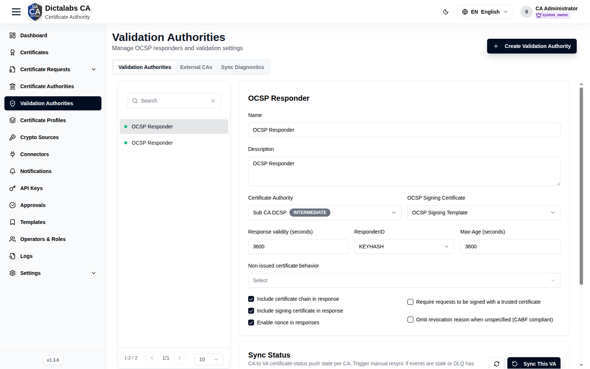
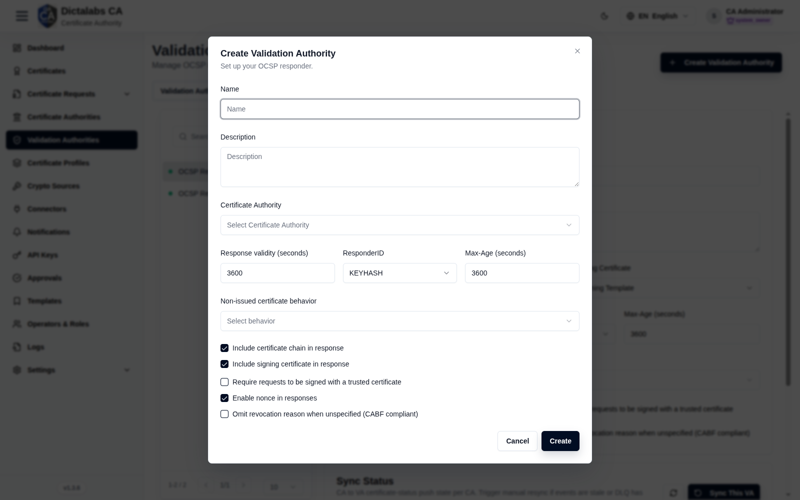
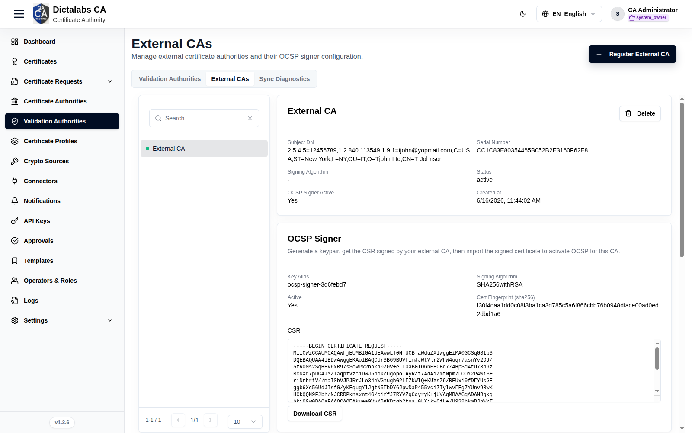
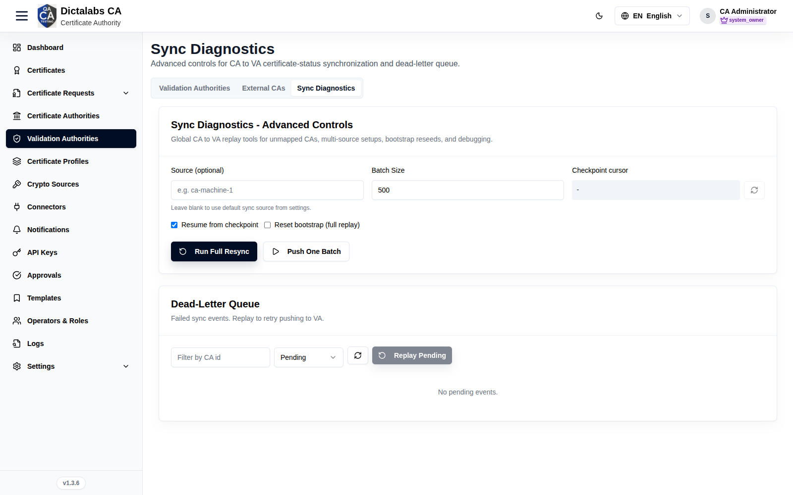

# Configure a Validation Authority (OCSP)

> **Validation.** **Prerequisites:** a [CA](13_create_sub_ca.md) and an OCSP signing
> certificate. Requires the **VA** license module.

## Purpose

A **Validation Authority (VA)** is an RFC 6960-compliant OCSP responder that provides real-time certificate-status validation for one or more Certification Authorities (CAs). It maintains and synchronizes certificate revocation and status information with the corresponding CA(s), enabling relying parties and applications to determine whether a certificate is currently valid, revoked, or otherwise unavailable for validation.

The Dictalabs CA Validation Authority can be deployed in different configurations to meet varying PKI architecture and operational requirements. It can be deployed **on the same platform as Dictalabs CA**, providing an integrated CA and validation service, or it can be deployed as a **separate, dedicated Validation Authority**. In the latter configuration, the VA can serve certificates issued by Dictalabs CA or act as an independent validation service for **PKI deployments from other CA vendors**, subject to the supported certificate-status and revocation information interfaces.

This flexible deployment model allows organizations to centralize certificate validation services, scale OCSP services independently from CA infrastructure, and integrate the Validation Authority into existing or heterogeneous PKI environments.  

## Navigation

`Validation Authorities`

## Overview

The page has three tabs — **Validation authorities**, **External CAs**, and **Sync diagnostics** —
plus a context button in the header (**Create validation authority** on the first tab,
**Register external CA** on the second). Both create actions and every write control require the
`va.configure` permission; without it the tabs are read-only.

### Validation authorities

The primary tab. A searchable, paginated list of VAs on the left; selecting one opens its **OCSP
Responder** configuration form and a per-CA **Sync status** card on the right. This is where you tie
a responder to a CA, choose its OCSP signing certificate, and tune how responses are produced.

OCSP Responder form:

| Field | What to enter | Why it matters |
| ----- | ------------- | -------------- |
| Name | A short, unique label for the responder (for example, "Issuing CA 1 OCSP"). | Identifies the VA in the list and in logs; it is not published to clients. |
| Description | Optional free text describing scope or ownership. | Helps operators tell responders apart; purely informational. |
| Certificate authority | The issuing CA whose certificate status this responder answers for. | Binds the VA to one CA. Changing it reloads the signing-certificate list and resets the selected signer. Required. |
| OCSP signing certificate | The certificate used to sign OCSP responses, chosen from certificates issued under the selected CA. | The private key behind this certificate signs every response; clients validate it against the CA. The list is empty until a CA is selected, and only appears once a CA is chosen. |
| Response validity (seconds) | How long a response stays valid — the `nextUpdate` window (for example, 3600 for one hour). | Longer values ease responder load and allow caching but delay propagation of new revocations; shorter values are fresher but costlier. |
| ResponderID | `KEYHASH` (hash of the responder public key) or `NAME` (the responder's subject name). | Tells clients how the responder identifies itself in the response. `KEYHASH` is the common default; use `NAME` only if a relying client requires it. |
| Max-Age (seconds) | The value advertised in the HTTP `Cache-Control: max-age` header. | Governs how long HTTP caches and CDNs may hold a response. Keep it at or below the response validity so caches never serve a response past its `nextUpdate`. |
| Non-issued certificate behavior | Choose Good, Revoked, or Unauthorized for serials this CA never issued. | Controls the answer for unknown serials. "Revoked" (or "Unauthorized") is the safe, CA/Browser-Forum-aligned choice; "Good" can mask forged serials and should be used with care. |

Response option checkboxes:

| Control | What it does | Why it matters |
| ------- | ------------ | -------------- |
| Include certificate chain in response | Embeds the responder's certificate chain in each response. | Lets clients that lack the chain build a path to the CA; adds a little response size. |
| Include signing certificate in response | Embeds the OCSP signing certificate itself. | Required by most clients so they can verify the response signature without out-of-band setup. |
| Enable nonce in responses | Echoes the client's nonce extension back in the response. | Prevents replay of cached responses; enable it for high-assurance clients, but note it defeats response caching. |
| Require requests to be signed with a trusted certificate | Rejects unsigned OCSP requests. | Restricts the responder to authenticated requesters; only enable when your relying parties sign their requests. |
| Omit revocation reason when unspecified (CABF compliant) | Suppresses the reason code when the revocation reason is "unspecified". | Keeps responses aligned with CA/Browser-Forum baseline requirements, which disallow an "unspecified" reason code. |

Actions on this tab:

- **Reset** — discards unsaved edits and reloads the stored configuration.
- **Save** — persists the responder configuration (POST/PUT to the VA).
- **Create validation authority** (header button) — opens the create dialog (see below).

Sync status card (shown under the form for the selected VA): a per-CA table with a health dot,
**CA**, **Last push**, **DLQ pending**, and **Cursor** columns. Controls:

- Refresh — reloads the sync status.
- **Sync this VA** — pushes pending certificate-status events for all CAs mapped to this VA.
- Per-CA resync (row action) — runs a full resync for that single CA, resuming from its checkpoint.

### Create/Edit validation authority dialog

Opened by the header **Create validation authority** button, or by editing an existing VA. It
collects the same responder settings as the OCSP Responder form above so a VA can be provisioned in
one step.

| Field | What to enter | Why it matters |
| ----- | ------------- | -------------- |
| Name | A short, unique label for the responder. | Required; identifies the VA. |
| Description | Optional description of the responder. | Informational only. |
| Certificate authority | The issuing CA this responder answers for. | Required; selecting it loads the eligible OCSP signing certificates. |
| OCSP signing certificate | The certificate that signs responses (appears after a CA is chosen). | Sets the signer key; leave blank to configure it later on the detail form. |
| Response validity (seconds) | The `nextUpdate` window in seconds. | Trade-off between freshness and responder/cache load. |
| ResponderID | `KEYHASH` or `NAME`. | How the responder identifies itself to clients. |
| Max-Age (seconds) | HTTP `max-age` for caching responses. | Keep at or below response validity. |
| Non-issued certificate behavior | Good, Revoked, or Unauthorized for unknown serials. | Prefer Revoked/Unauthorized for safety. |
| Include certificate chain / Include signing certificate / Enable nonce / Require signed requests / Omit revocation reason (CABF) | Same response toggles as the detail form. | See the OCSP Responder option table above. |

- **Cancel** — closes the dialog without saving.
- **Create** / **Save** — creates the VA (create mode) or applies the edits (edit mode).

### External CAs

Registers certificate authorities issued outside this platform so the VA can answer OCSP for them.
The left list is searchable and paginated; selecting a CA opens three cards — read-only **overview**,
**OCSP signer** setup, and **Ingest API key** management. Use the header **Register external CA**
button to add one.

Register external CA dialog:

| Field | What to enter | Why it matters |
| ----- | ------------- | -------------- |
| Name | A unique display name for the external CA. | Required; identifies the CA throughout this tab. |
| Signing algorithm | The algorithm the OCSP signer will use (for example, `SHA256withRSA`, `SHA256withECDSA`). | Should match the key type you will generate for the signer; determines the response signature algorithm. |
| Description | Optional description. | Informational only. |
| CA certificate PEM | Paste, or upload, the external issuer's certificate in PEM (`-----BEGIN CERTIFICATE-----`). | Required. This is the CA whose issued certificates the responder will report status for. |
| Certificate chain PEM (optional) | Paste or upload intermediate/root certificates that complete the chain. | Lets the responder build and validate the full path when the issuer is not self-signed. |

Overview card (read-only) shows: Subject DN, Serial number, Signing algorithm, Status, OCSP signer
active (Yes/No), and Created at. A **Delete** action removes the CA together with its OCSP runtime
rows, signer config, and ingest API key (irreversible).

OCSP signer card — generate a keypair, get its CSR signed by the external CA, then import the signed
certificate to activate OCSP:

| Field | What to enter | Why it matters |
| ----- | ------------- | -------------- |
| Crypto source | The crypto source (software or HSM token) that will hold the signer private key. | Determines where the key is generated and stored; required. |
| Signing algorithm | The signature algorithm for the signer (for example, `SHA256withRSA`). | Must be compatible with the chosen key spec. |
| Key spec | The key type and size (`RSA_2048`, `RSA_3072`, `RSA_4096`, `EC_P256`, `EC_P384`). | Sets the strength and algorithm family of the signer key. |
| Key alias | A label/handle for the key inside the crypto source. | Identifies the key in the token; pre-filled but editable. Required. |
| Key password | The password protecting the generated key. | Protects the private key material; required. |
| CSR common name | The CN for the generated CSR (defaults to `OCSP Signer <CA name>`). | Names the signing certificate the external CA will issue. |

OCSP signer actions:

- **Generate keypair + CSR** — creates the key in the crypto source and produces a CSR.
- **Download CSR** — saves the CSR (PEM) to send to the external CA for signing.
- **Import signed OCSP signer certificate** — paste or upload the signed certificate, then
  **Import & activate** to enable OCSP for this CA. The import area appears once a CSR exists and the
  signer is not yet active.

Ingest API key card — manages the bearer token the external CA's system uses to push certificate
status. It shows Key ID, Status, Total requests, and Last used (read-only), plus:

- **Rotate key** — issues a new key and reveals it once (store it immediately; it is not shown again).
- The card also displays the ingest endpoint (`POST /api/ocsp/external/ingest/<id>`) with a sample
  JSON payload and cURL example. Each item needs `serial_number` (hex) and `status`
  (good/revoked/unknown); `revoked_at`, `revoke_reason`, `issued_at`, and `expires_at` are optional
  ISO 8601 fields. Maximum 5000 items per request.

### Sync diagnostics

Advanced, global CA-to-VA replay tools for unmapped CAs, multi-source setups, bootstrap reseeds, and
debugging. Use it when the per-VA **Sync status** shows stale events or the dead-letter queue has
pending items. Two cards: **advanced controls** and the **dead-letter queue**.

Advanced controls:

| Field | What to enter | Why it matters |
| ----- | ------------- | -------------- |
| Source (optional) | A sync source identifier (for example, `ca-machine-1`). Leave blank to use the default source from settings. | Scopes the resync/checkpoint operations to one source in multi-source deployments. |
| Batch size | Number of events per push (1–5000, default 500). | Larger batches are faster but heavier; tune to responder/network limits. |
| Checkpoint cursor | Read-only; use the lookup button to fetch the current cursor for the entered source. | Shows how far the last push progressed; useful before deciding to resume or reset. |
| Resume from checkpoint | Checkbox — continue from the last saved cursor. | Avoids re-pushing already-synced events; leave on for incremental catch-up. |
| Reset bootstrap (full replay) | Checkbox — reseed and replay everything from the start. | Forces a complete re-push; use only when the VA state is corrupt or being rebuilt, as it is expensive. |

Advanced-control actions:

- Checkpoint lookup (refresh icon) — fetches the current cursor for the entered source.
- **Run full resync** — runs a full resync honoring the resume/reset options above.
- **Push one batch** — pushes a single batch (of the configured size) for step-by-step debugging.
- The **Last result** panel shows the raw JSON response of the most recent run.

Dead-Letter queue — failed sync events that can be replayed to retry pushing to the VA:

| Control | What to enter | Why it matters |
| ------- | ------------- | -------------- |
| Filter by CA id | Optional CA id to narrow the list. | Isolates failures for one CA. |
| Status | Pending, Replayed, or Failed. | Filters the queue; only **Pending** events can be replayed. |

- Refresh — reloads the queue for the current filters.
- **Replay pending** — retries pushing the pending events (respects the source/CA/limit filters).
  Enabled only when the status filter is **Pending** and at least one event is listed.
- The table lists Source, CA, Event, Attempts, Status, Created at, and Last error per event.

## Step-by-Step

1. Open **Validation Authorities → Create Validation Authority** and complete the dialog.
2. Select the VA, set **Certificate Authority**, **OCSP Signing Certificate**, validity, and
   response options.
3. Click **Save**. Use **Sync This VA** / **Sync Diagnostics** if status is stale.

!!! note "Important Notes"
    - A VA depends on a response CA and an OCSP signing certificate.
    - Use **Sync Diagnostics** when events are stale or the DLQ has pending items.
