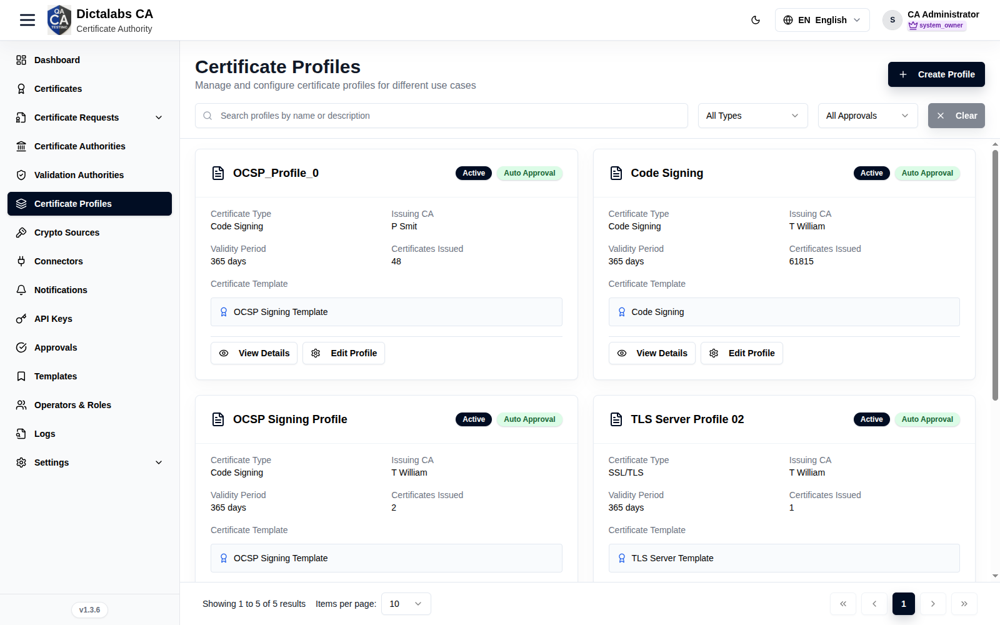
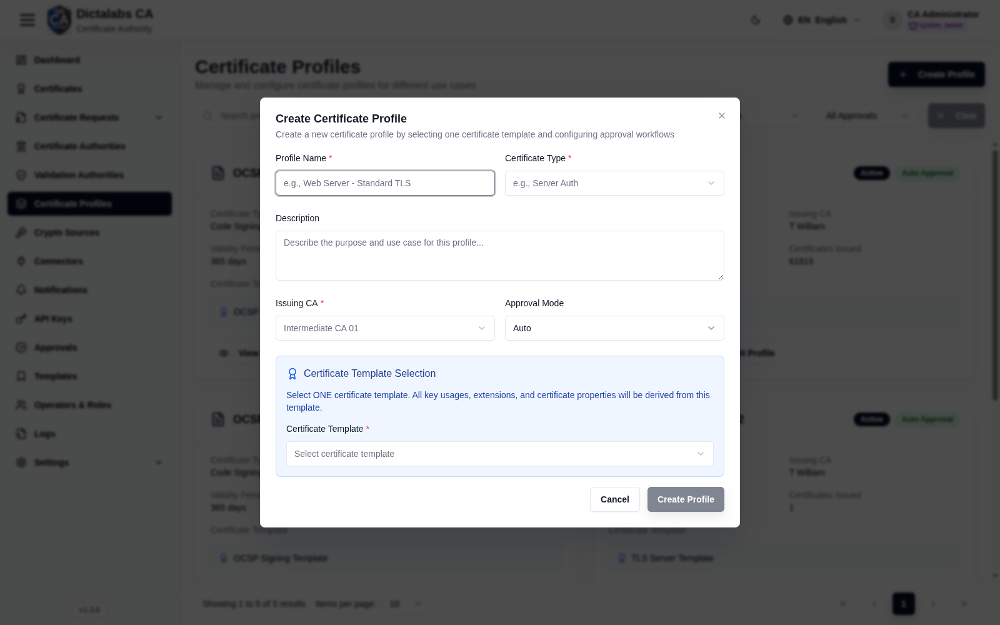

# Create Certificate Profiles

> **Issuance.** **Prerequisites:** a [Sub CA](13_create_sub_ca.md) (issuing CA) and a
> [Template](11_templates.md).

## Purpose

A profile combines a **template** with an **issuing CA** and an **approval mode**. Profiles are
what requesters choose when [requesting a certificate](17_request_certificate.md); they define
issuance policy.

## Navigation

`Certificate Profiles`

## Overview

- **Create Profile** button, search, type/approval filters.
- **Card grid** — name, status, approval mode, Certificate Type, Issuing CA, Validity,
  Certificates Issued, Template, plus **View Details / Edit Profile**.

## Fields — Create Profile dialog

| Field | Description | Required | Notes |
| ----- | ----------- | -------- | ----- |
| Profile Name | Display name | Yes | — |
| Certificate Type | e.g. Server Auth / Code Signing | Yes | — |
| Description | Purpose | No | — |
| Issuing CA | CA that signs certificates from this profile | Yes | Your [Sub CA](13_create_sub_ca.md) |
| Approval Mode | Auto / Manual | No | Manual → routes to [Approvals](19_approvals.md) |
| Certificate Template | The single template defining key usages/extensions | Yes | From [Templates](11_templates.md) |

## Step-by-Step

1. Open **Certificate Profiles → Create Profile**.
2. Enter **Profile Name** and **Certificate Type**.
3. Choose **Issuing CA** (Sub CA), **Approval Mode**, and one **Certificate Template**.
4. Click **Create Profile**.

!!! note "Important Notes"
    - All key usages/extensions derive from the chosen **template**.
    - **Approval Mode = Manual** sends requests to [Approvals](19_approvals.md).
