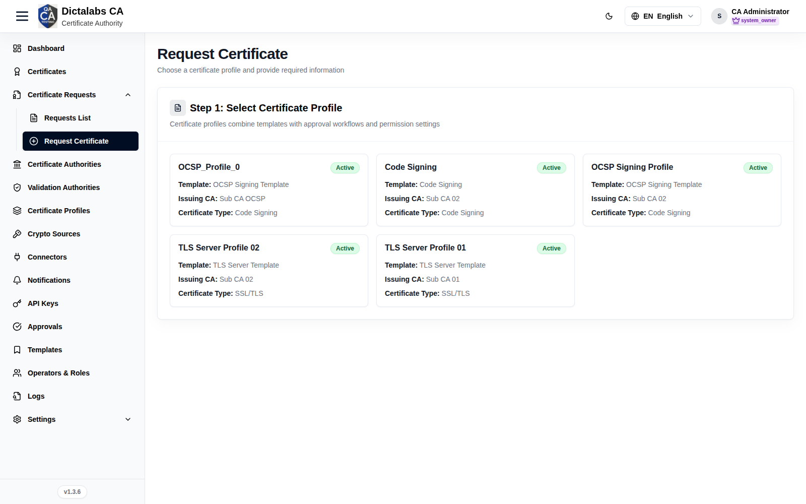
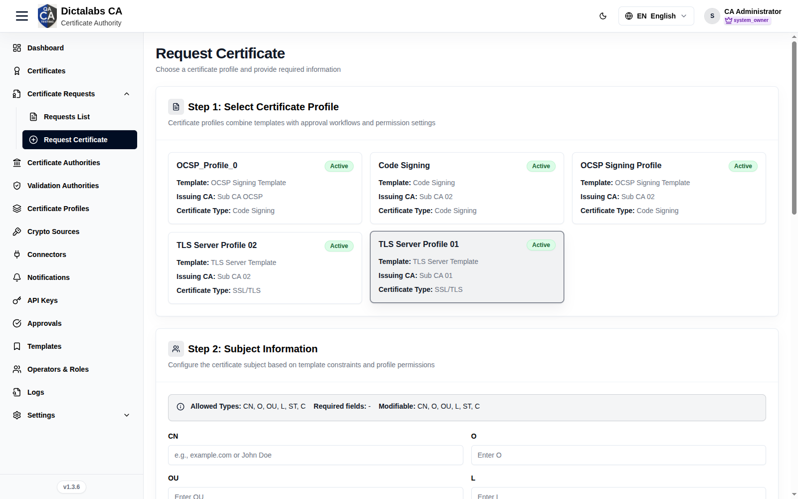
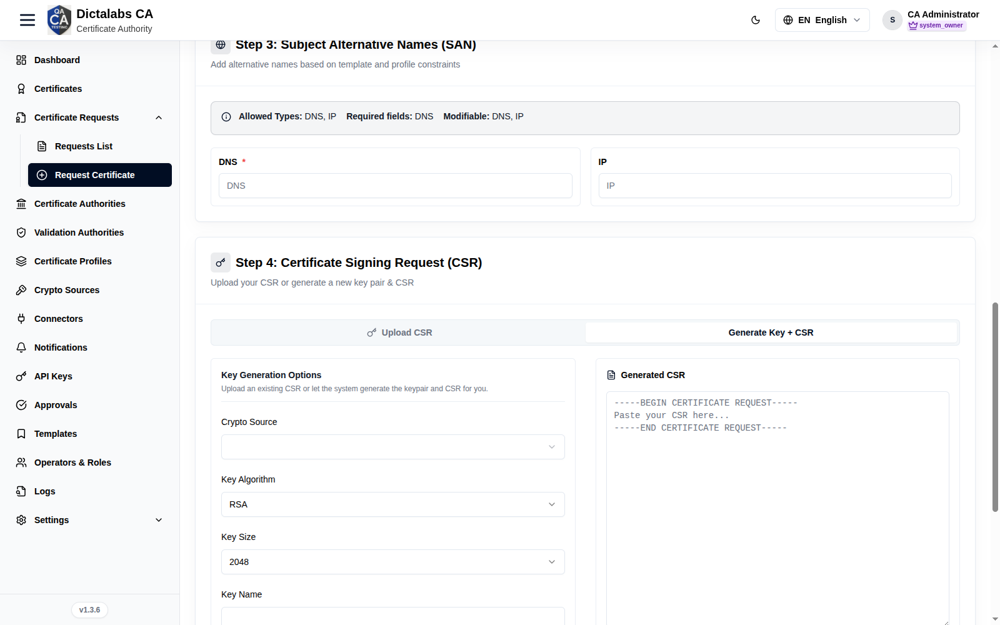
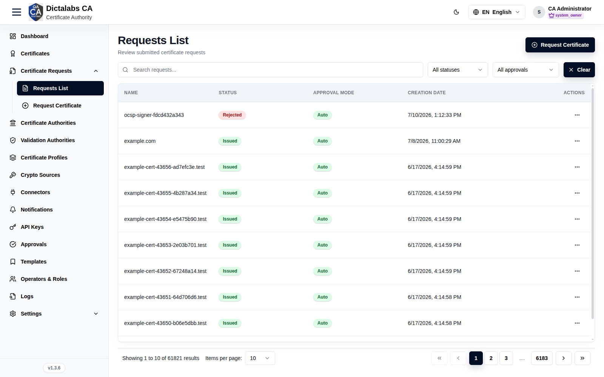
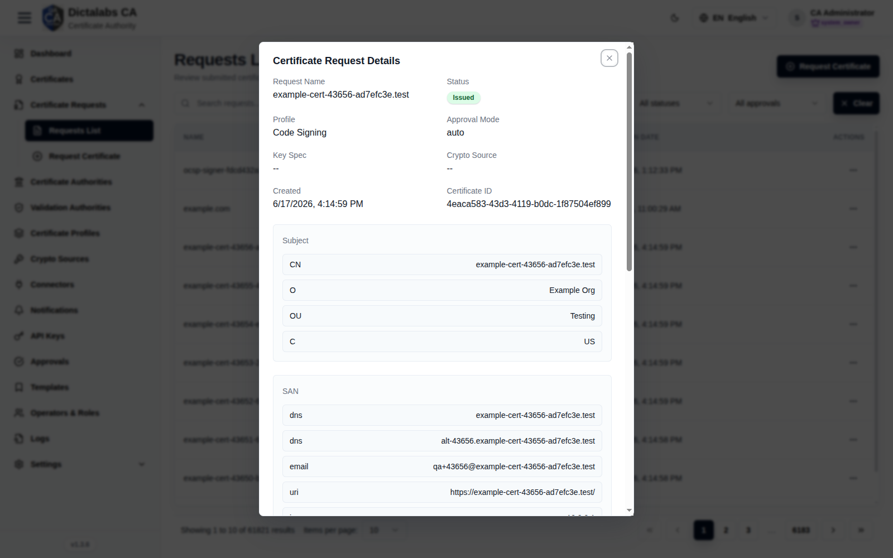

# Request & Issue a Certificate

> **Issuance.** **Prerequisite:** a [Certificate Profile](16_certificate_profiles.md).

## Purpose

Request (and, when auto-approved, issue) a certificate through a guided wizard that enforces the
selected profile's template constraints. This is the payoff of the configuration flow.

## Navigation

`Certificate Requests → Request Certificate`

## Overview — the wizard

The page is a single scrolling form. Selecting a profile (step 1) reveals the remaining steps,
each of which is constrained by that profile's template: the profile decides which subject fields
and SAN types you may enter, which are required, and which are locked to a fixed value.

### Step 1 — Select certificate profile

Pick the profile that governs this certificate. Each card shows the profile's template, issuing CA,
and certificate type, so you can confirm you are requesting against the right policy before filling
anything in.

Profiles are presented as selectable cards rather than form fields:

- **Profile card** — click to select. The card carries the profile name, an **Active**/**Inactive**
  status badge, and an **Approval required** badge when issuance is not automatic. Selecting a card
  loads its template constraints into the steps below.
- **Template / Issuing CA / Certificate type** — read-only details on each card; use them to tell
  similar profiles apart and verify the CA that will sign the certificate.
- **Pagination controls** — previous/next arrows and page dots appear when there are more than six
  profiles; use them to browse the full list.

### Step 2 — Subject information

Provide the certificate's distinguished name (DN). Only the subject fields the profile allows are
shown; a lock icon marks fields fixed by the profile, and a red asterisk marks required fields. The
info banner at the top of the step restates the allowed, required, and modifiable fields for the
selected profile.

The fields rendered here depend on the profile. The standard DN components are:

| Field | What to enter | Why it matters |
| ----- | ------------- | -------------- |
| CN (Common Name) | The primary identity of the certificate — e.g. a hostname such as `example.com` for a server certificate, or a person's name for a user certificate. | The CN is the certificate's main subject identifier; for TLS it is the fallback identity when no matching SAN is present. |
| O (Organization) | The legal organization name that owns the certificate. | Ties the certificate to an accountable entity and is often mandated by the profile. |
| OU (Organizational Unit) | The department or team within the organization (e.g. `Engineering`). | Adds organizational context; useful for sorting and attribution. |
| L (Locality) | The city or locality of the organization. | Part of a fully qualified DN where location is required by policy. |
| ST (State/Province) | The state or province. | Completes the geographic portion of the DN when the profile requires it. |
| C (Country) | The two-letter ISO 3166 country code (e.g. `US`). | Standard DN component; many CAs validate that it is a valid country code. |
| emailAddress | The subject's e-mail address. | Included in the DN for certificates that identify a person or mailbox. |

- **Locked fields** — a field shown with a lock icon and a *Locked by profile permission level* note is
  pre-filled by the profile and cannot be edited; leave it as-is.

### Step 3 — Subject alternative names (SAN)

Add the alternative identities the certificate should assert. As with the subject, the profile
controls which SAN types are allowed, required, or locked; the info banner lists them. Each allowed
type is rendered as its own input.

| Field | What to enter | Why it matters |
| ----- | ------------- | -------------- |
| DNS Name | A fully qualified domain name (e.g. `api.example.com`). | The primary way modern TLS clients validate a server certificate; add every hostname the certificate must cover. |
| RFC 822 Name (e-mail address) | An e-mail address. | Binds the certificate to a mailbox for S/MIME or client authentication. |
| IP Address | An IPv4 or IPv6 address. | Lets the certificate be validated when connecting by IP rather than hostname. |
| Directory Name (Distinguished Name) | A full X.500 distinguished name. | Asserts a directory identity in addition to the subject DN. |
| Uniform Resource Identifier (URI) | A URI. | Identifies the subject by a resource identifier (common in service/SPIFFE-style identities). |
| Registered Identifier (OID) | An object identifier. | Encodes an identity registered as an OID. |
| MS UPN (User Principal Name) | A Windows user principal name (e.g. `user@domain`). | Required for smart-card logon and Active Directory authentication. |

- **Locked / required markers** — a red asterisk means the type must be filled before you can submit; a
  lock icon means the value is fixed by the profile.

**Subject directory attributes (SDA)** — this sub-section appears only when the profile defines
directory attributes. Each attribute is a separate input with the same required/locked markers:

| Field | What to enter | Why it matters |
| ----- | ------------- | -------------- |
| Date of birth | Date in `YYYYMMDD` format. | Carries verified personal identity data in the certificate. |
| Place of birth | The subject's place of birth. | Supports identity certificates that must record birthplace. |
| Gender | `M` or `F`. | Included where identity certificates require a gender attribute. |
| Country of citizenship | Two-letter ISO 3166 country code. | Records nationality for identity/eID certificates. |
| Country of residence | Two-letter ISO 3166 country code. | Records the subject's country of residence. |

### Step 4 — Certificate signing request (CSR)

Provide the CSR the certificate will be issued from. A two-way toggle selects the method: bring your
own CSR, or have the platform generate the key pair and CSR for you. (The **Generate key + CSR** tab
only appears if you hold the key-pair generation permission.)

**Upload CSR** — use this when the key pair already exists and you only want a certificate for it:

| Field | What to enter | Why it matters |
| ----- | ------------- | -------------- |
| CSR (paste) | Paste the PEM-encoded certificate signing request (the `-----BEGIN CERTIFICATE REQUEST-----` block). | This is the request the CA signs; the private key never leaves your system. Pasting a certificate instead of a CSR is rejected. |

- **Upload CSR** (file) — load a `.csr`, `.pem`, `.der`, or `.txt` file instead of pasting; it is
  converted to PEM automatically.
- **Clear** — empties the file selection and the pasted text so you can start over.

**Generate key + CSR** — use this to have the platform create the key pair and CSR for you:

| Field | What to enter | Why it matters |
| ----- | ------------- | -------------- |
| Crypto source | Select where the key is generated and stored (the configured crypto engine / HSM). | Determines the security boundary and custody of the private key. |
| Key algorithm | Choose the key type allowed by the profile (e.g. RSA, ECDSA, or an ML-DSA / ML-KEM post-quantum algorithm). | Sets the cryptographic family of the key pair; must be compatible with the profile and its intended use. |
| Key size | For RSA, choose the modulus size in bits (e.g. 2048, 3072, 4096). | Larger keys are stronger but slower; pick per your security policy. Shown only for RSA. |
| ECDSA curve | For ECDSA, choose the named curve. | Selects the elliptic curve; determines strength and interoperability. Shown only for ECDSA. (When the curve is "any allowed by bit lengths", an additional key-size selector appears.) |
| Key name | A unique alias/identifier for the generated key. | Labels the key in the crypto source so it can be referenced and managed later. |
| Key password | Optional passphrase protecting the private key. | Adds a second factor guarding the key material; leave blank if not required. |

- **Generate key pair & CSR** — creates the key pair on the chosen crypto source and populates the
  read-only **Generated CSR** panel. Generation can take 1–5 minutes; a notice appears if it runs long.
- **Download CSR** — appears after generation so you can save the CSR PEM for your records.

### Approval required

This panel appears only when the selected profile does not auto-approve. It is informational: it warns
that the request will be submitted for manual approval and that you will be notified by e-mail when it
is approved or rejected.

### Ready to generate certificate

The final panel submits the request. Review the details above, then submit.

- **Submit & Generate Certificate** — sends the request to the CA. It stays disabled until a profile is
  selected, a CSR is present, and all required subject, SAN, and SDA fields are filled; a red summary
  box lists exactly what is still missing.

## Reviewing requests

`Certificate Requests → Requests List` lists every request with Status
and Approval Mode.

A row's **View** shows full request details (subject, SAN, CSR PEM with Download).

## Step-by-Step

1. Open **Request Certificate** and pick a **profile**.
2. Fill the allowed **Subject** fields and required **SAN** entries.
3. **Upload CSR** or **Generate Key + CSR**.
4. Click **Submit & Generate Certificate**.

!!! note "Important Notes"
    - The profile/template controls which subject and SAN fields you may set.
