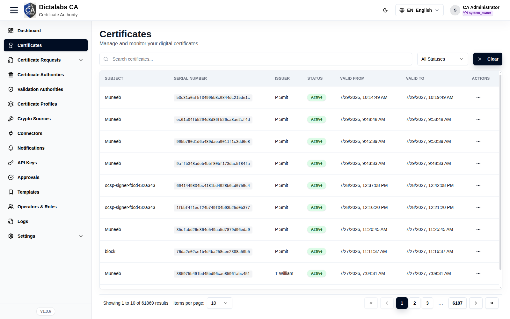

# Manage Certificates

> **Issuance.** **Prerequisite:** certificates have been [issued](17_request_certificate.md).

## Purpose

The Certificates module is the inventory of issued certificates — search, inspect, download, and
revoke them across the tenant's CAs.

## Navigation

`Certificates`

## Overview

- Search, status filter (All / Active / Revoked / Expired), Clear.
- **Table** — Subject, Serial Number, Issuer, Status, Valid From, Valid To, Actions.

## Actions

- **View** — full certificate details (chain, extensions, key usage).
- **Download** — export the certificate.
- **Revoke** — revoke an active certificate (requires `cert.revoke`; may route through
  [Approvals](19_approvals.md)).

## Step-by-Step — Revoke a certificate

1. Open **Certificates**, search for the certificate.
2. Open its row **Actions → Revoke**.
3. Select a reason and confirm.

!!! note "Important Notes"
    - New certificates are created via [Request Certificate](17_request_certificate.md), not here.

!!! warning "Warning"
    Revocation is irreversible for trust purposes — confirm the correct certificate first.
