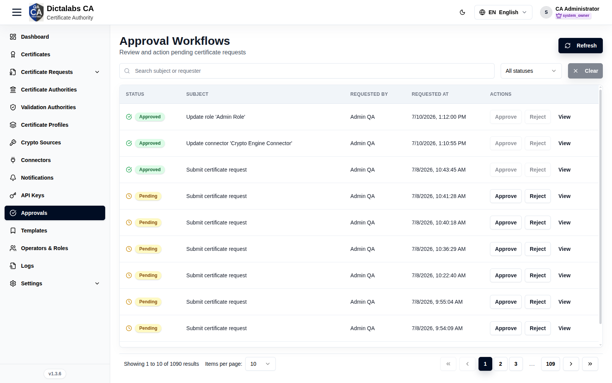

# Approvals

> **Operations & Governance.** **Prerequisite:** a [role](07_roles.md) with **Requires
> Approval** enabled (otherwise the queue stays empty).

## Purpose

The Approvals queue is where protected actions submitted by approval-required roles are reviewed.
Approvers accept or reject them, giving dual-control over sensitive operations.

## Navigation

`Approvals`

## Overview

- **Refresh** button, search, status filter.
- **Requests** list of pending and historical approvals (empty when nothing is waiting).

## How approvals are created

When an operator whose **role requires approval** performs a protected write, it is not applied
immediately — it becomes a pending approval here. An approver then **Approves** (applies it) or
**Rejects** (discards it).

## Actions

- **Refresh** — reload the queue.
- **View** — inspect a request and its before/after change.
- **Approve** — apply the action (requires `approval.approve`).
- **Reject** — discard it (requires `approval.reject`).

## Step-by-Step

1. Open **Approvals** and filter to **Pending**.
2. Open a request and review the proposed change.
3. Click **Approve** or **Reject**.

!!! note "Important Notes"
    - Which roles require approval is set per role in [Roles & Permissions](07_roles.md).
