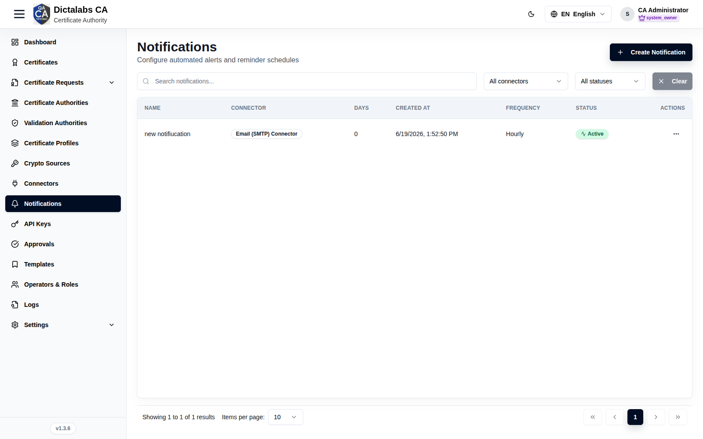
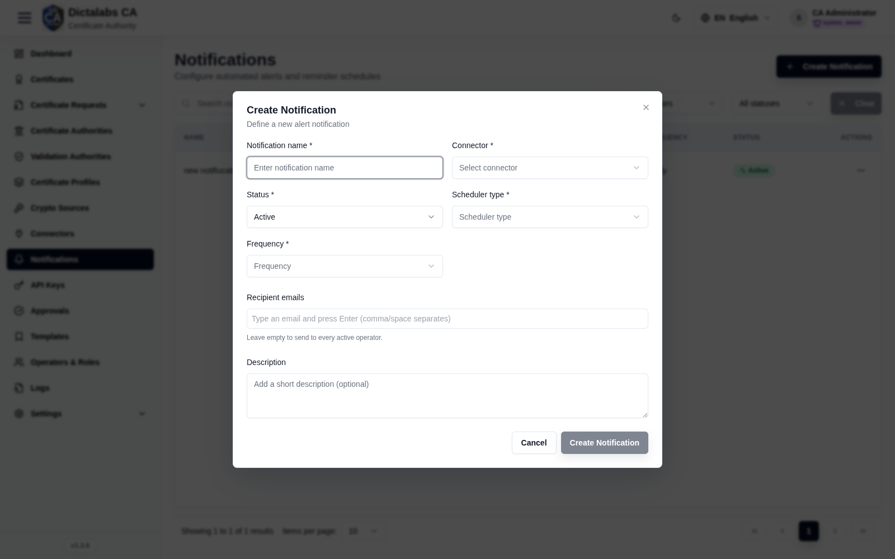

# Notifications

> **Operations & Governance.** **Prerequisite:** a delivery [connector](09_connectors.md)
> (e.g. Email (SMTP)).

## Purpose

Configure automated alerts and reminder schedules (e.g. expiry reminders) delivered through a
connector to chosen recipients.

## Navigation

`Notifications`

## Overview

- **Create Notification** button, search, connector/status filters.
- **Table** — Name, Connector, Days, Created at, Frequency, Status, Actions.

## Fields — Create Notification dialog

| Field | Description | Required | Notes |
| ----- | ----------- | -------- | ----- |
| Notification name | Display name | Yes | — |
| Connector | Delivery channel | Yes | From [Connectors](09_connectors.md) |
| Status | Active / Inactive | Yes | — |
| Scheduler type | Schedule basis | Yes | — |
| Frequency | e.g. hourly / daily | Yes | — |
| Recipient emails | Explicit recipients | No | Empty = every active operator |
| Description | Optional note | No | — |

## Step-by-Step

1. Open **Notifications → Create Notification**.
2. Enter **Name**, choose **Connector**, **Status**, **Scheduler type**, **Frequency**.
3. Optionally add **Recipient emails**.
4. Click **Create Notification**.

!!! note "Important Notes"
    - Empty **Recipient emails** broadcasts to all active operators.
    - Delivery depends on a healthy connector — check [Connectors](09_connectors.md) → Monitoring.
