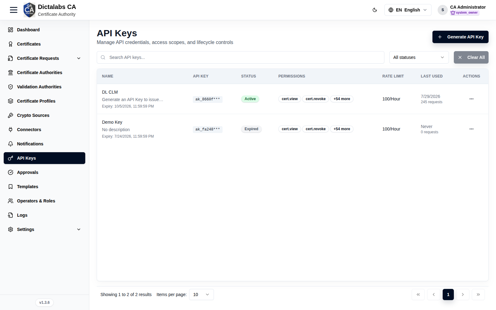
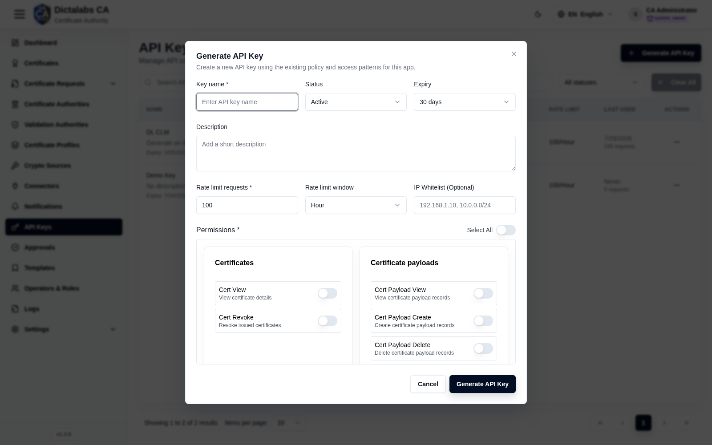

# API Keys

> **Operations & Governance.** **Prerequisite:** [signed in to the tenant](05_tenant_sign_in.md).

## Purpose

API Keys grant scoped, programmatic access to the tenant's API — with fine-grained permissions,
rate limits, optional IP allow-listing, and an expiry — for automation and integrations without
operator credentials.

## Navigation

`API Keys`

## Overview

- **Generate API Key** button, search, status filter.

## Fields — Generate API Key dialog

| Field | Description | Required | Notes |
| ----- | ----------- | -------- | ----- |
| Key name | Display name | Yes | — |
| Status | Active / Inactive | No | Defaults to Active |
| Expiry | Lifetime (e.g. 30 days) | No | — |
| Description | Optional note | No | — |
| Rate limit requests | Max requests per window | Yes | Defaults to 100 |
| Rate limit window | Minute / Hour / … | No | Defaults to Hour |
| IP Whitelist | Allowed IPs/CIDRs | No | e.g. `192.168.1.10, 10.0.0.0/24` |
| Permissions | Per-permission switches grouped by resource (+ **Select All**) | Yes | See catalog below |

### Permission catalog

The assignable scopes (also used by [Roles](07_roles.md)), grouped by resource:

- **Certificates:** Cert View, Cert Revoke
- **Certificate payloads:** View, Create, Delete
- **Certificate authorities:** Ca View, Ca Configure, Ca Key Ceremony, Ca Crl Manage
- **Validation authorities:** Va View, Va Configure
- **Crypto tokens:** Token View, Token Manage, Token Delete
- **Crypto sources:** View, Create, Delete
- **Templates:** View, Create, Edit, Delete
- **Profiles:** View, Create, Edit, Delete
- **Certificate requests:** View, Create, Issue, Keypair
- **Connectors:** View, Create, Edit, Delete
- **Notifications:** View, Create, Edit, Delete
- **Approvals:** View, Approve, Reject
- **Audit:** View, Create, Delete
- **Access logs:** View
- **SIEM:** Read, Manage
- **General settings:** View, Edit
- **Roles:** Role View, Role Manage, Role Member View, Role Member Manage
- **Operators:** View, Create, Edit, Delete

## Step-by-Step

1. Open **API Keys → Generate API Key**.
2. Enter **Key name**, set **Expiry**, **Rate limit**, optional **IP Whitelist**.
3. Toggle the required **Permissions** (or **Select All**).
4. Click **Generate API Key** and copy the secret immediately.

!!! note "Important Notes"
    - Grant minimum permissions; use **IP Whitelist** and short **Expiry** for tighter control.

!!! warning "Security Warning"
    The API Key secret is shown **only once** upon creation — store it securely.
