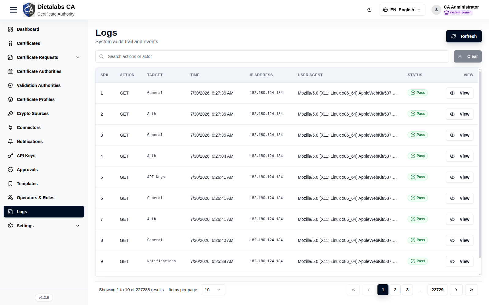
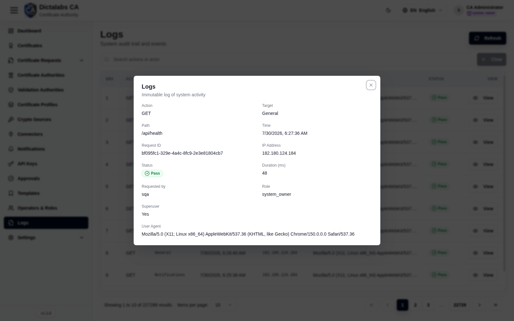

# Logs (Audit Trail)

> **Operations & Governance.** **Prerequisite:** [signed in to the tenant](05_tenant_sign_in.md).

## Purpose

The Logs module is the immutable record of system activity — every request and protected action
with actor, target, source IP, and outcome — for security review and compliance.

## Navigation

`Logs`

## Overview

- **Refresh** button, search, Clear.
- **Table** — Sr#, Action, Target, Time, IP Address, User Agent, Status (Pass/Fail), View.

## Detail (View)

A row's **View** opens the full entry — request/response detail, payload, and error trace on
failures.

## Actions

- **Refresh** — reload entries.
- **Search** — filter by action or actor.
- **View** — open a single entry's full detail.

## Step-by-Step

1. Open **Logs** and search for the action or actor.
2. Click **View** to see full request/response and any error trace.

!!! note "Important Notes"
    - Retention/rotation is governed by [Log Rotation](24_settings_log_rotation.md).
    - Programmatic SIEM export uses a SIEM [connector](09_connectors.md) + SIEM permissions.
