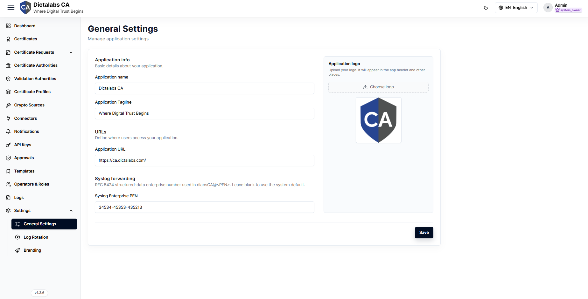

# General Settings

> **System Settings & Profile.** **Prerequisite:** [signed in to the tenant](05_tenant_sign_in.md).

## Purpose

Tenant-level application settings — identity, URLs, logo, and syslog enterprise number — that
shape how the tenant presents itself and integrates with logging.

## Navigation

`Settings → General Settings`

## Overview

Typical settings: application name, company name, application/admin URLs, logo upload, and the
syslog Enterprise PEN (RFC 5424 Private Enterprise Number).

## Actions

- Update fields and **Save**; upload a logo where supported.

## Step-by-Step

1. Open **Settings → General Settings**.
2. Update the desired fields.
3. Save.

!!! note "Important Notes"
    - Tenant-scoped; they do not affect other tenants.
    - Theme/colors are on [Branding](25_settings_branding.md); log behavior on [Log Rotation](24_settings_log_rotation.md).
