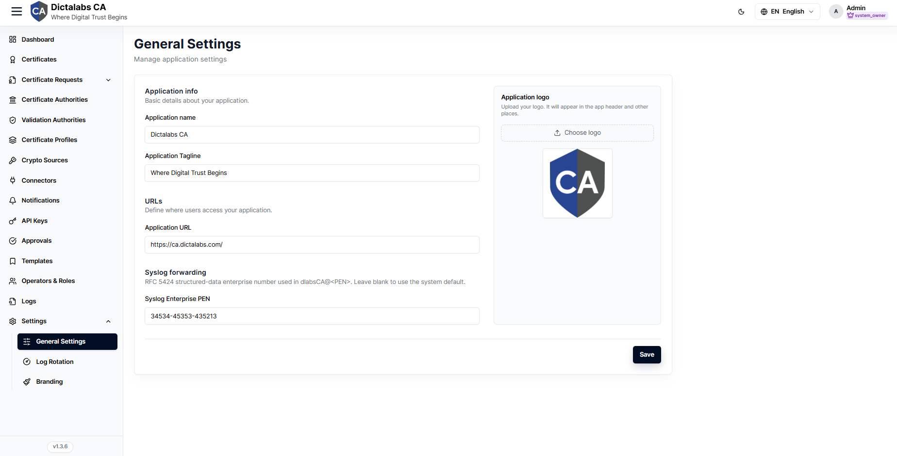
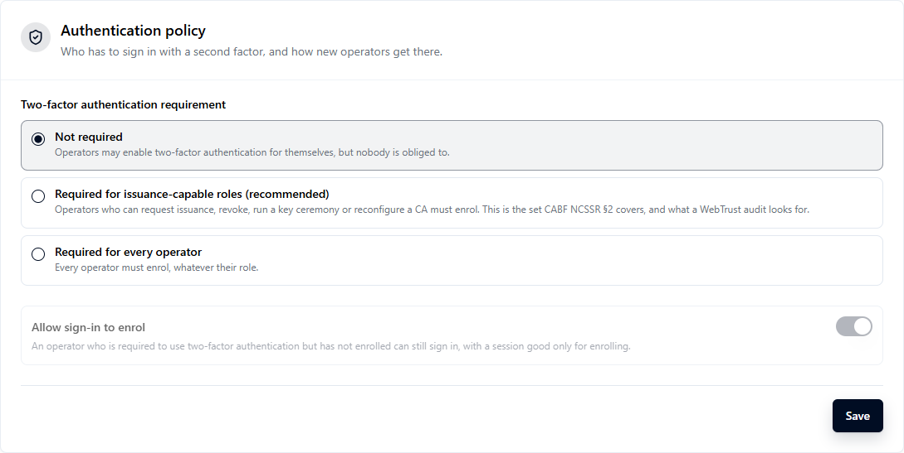

# General Settings

> **System Settings & Profile.** **Prerequisite:** [signed in to the tenant](05_tenant_sign_in.md).

## Purpose

Tenant-level application settings — identity, URLs, logo, and syslog enterprise number — that
shape how the tenant presents itself and integrates with logging.

## Navigation

`Settings → General Settings`

## Overview

Typical settings: application name, company name, application/admin URLs, logo upload, and the
syslog Enterprise PEN (RFC 5424 Private Enterprise Number).

## Actions

- Update fields and **Save**; upload a logo where supported.

## Authentication policy

A second panel on the same page, with its own **Save** button, controls who must use two-factor
authentication and how new operators get there.

| Field | What to enter | Why it matters |
| ----- | ------------- | -------------- |
| Two-factor authentication requirement | Choose **Not required**, **Required for issuance-capable roles (recommended)**, or **Required for every operator**. | **Not required** leaves 2FA opt-in. **Required for issuance-capable roles** enforces it for operators who can request issuance, revoke, run a key ceremony, or reconfigure a CA — the set CABF NCSSR §2 covers and what a WebTrust audit looks for. **Required for every operator** enforces it tenant-wide regardless of role. |
| Allow sign-in to enrol | Toggle on/off. | When on, an operator who is required to use 2FA but has not yet enrolled can still sign in, with a session limited to completing enrolment. When off, that operator is blocked from signing in until an admin enrols them another way. |

- **Save** — persists the authentication policy independently of the fields above it.

## Step-by-Step

1. Open **Settings → General Settings**.
2. Update the desired fields.
3. Save.
4. To change 2FA requirements, update **Authentication policy** and click its own **Save**.

!!! note "Important Notes"
    - Tenant-scoped; they do not affect other tenants.
    - Theme/colors are on [Branding](25_settings_branding.md); log behavior on [Log Rotation](24_settings_log_rotation.md).
    - Authentication policy and the application-info fields above save independently — saving one
      does not save the other.
