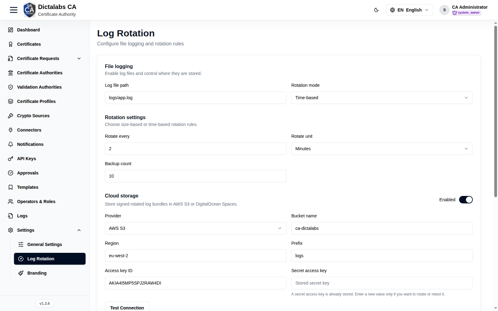

# Log Rotation & Signing

> **System Settings & Profile.** **Prerequisite:** for log signing, a
> [Crypto Source](10_crypto_sources.md).

## Purpose

Configure how audit/system logs are written, rotated, signed, and (optionally) archived to cloud
storage — supporting retention policy and log integrity.

## Navigation

`Settings → Log Rotation`

## Overview

Typical sections:

- **File logging** — enable, log path, rotation mode (size/time), max size / backup count /
  interval.
- **Log signing** — enable, algorithm, signing crypto source + key alias, verification
  certificate.
- **Cloud storage** (where available) — provider, bucket/region/prefix, credentials.

## Actions

- Update logging config and **Save**; upload a signing/verification certificate; test cloud
  storage where offered.

## Step-by-Step

1. Open **Settings → Log Rotation**.
2. Set the file-logging rotation policy.
3. Optionally enable **Log signing** and select a [Crypto Source](10_crypto_sources.md)/key.
4. Optionally configure **Cloud storage**. Save.

!!! note "Important Notes"
    - Log signing relies on a crypto source for the signing key.
    - These settings govern retention of the [Logs](22_logs.md) trail.
