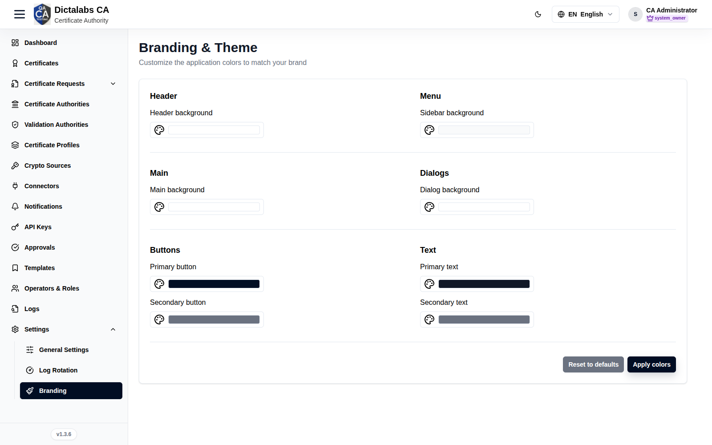

# Branding

> **System Settings & Profile.** **Prerequisite:** [signed in to the tenant](05_tenant_sign_in.md).

## Purpose

Customize the tenant's visual identity — theme colors and appearance — so the portal matches the
organization. Branding is per-tenant and shows on the sign-in screen and throughout the app.

## Navigation

`Settings → Branding`

## Overview

A theme customizer for the tenant's colors (primary/secondary/accents/text) and related
appearance options.

## Actions

- Adjust theme colors and **Save**; preview where supported.

## Step-by-Step

1. Open **Settings → Branding**.
2. Set the theme colors.
3. Save to apply across the tenant.

!!! note "Important Notes"
    - Branding is isolated per tenant; it never affects other tenants or the Super Admin portal.
    - Logo and application name are set on [General Settings](23_settings_general.md).
