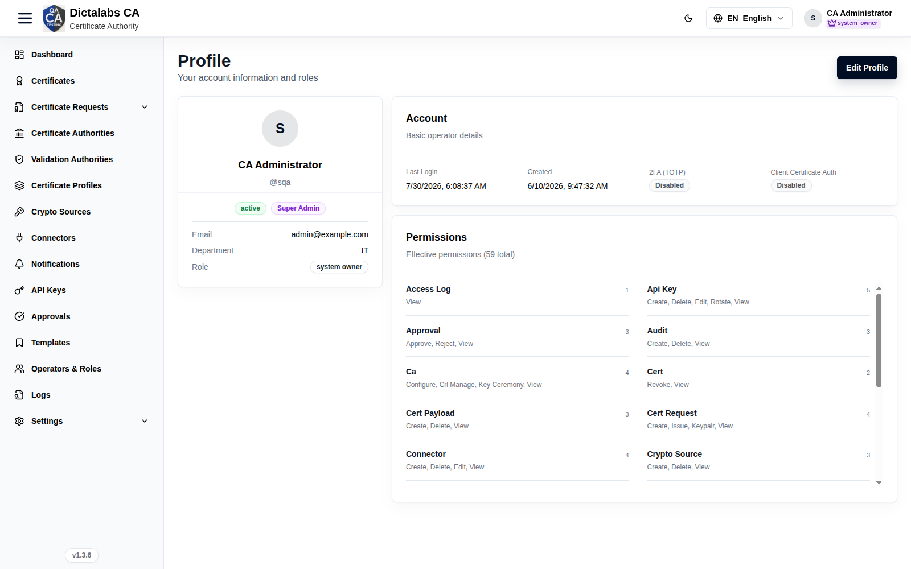
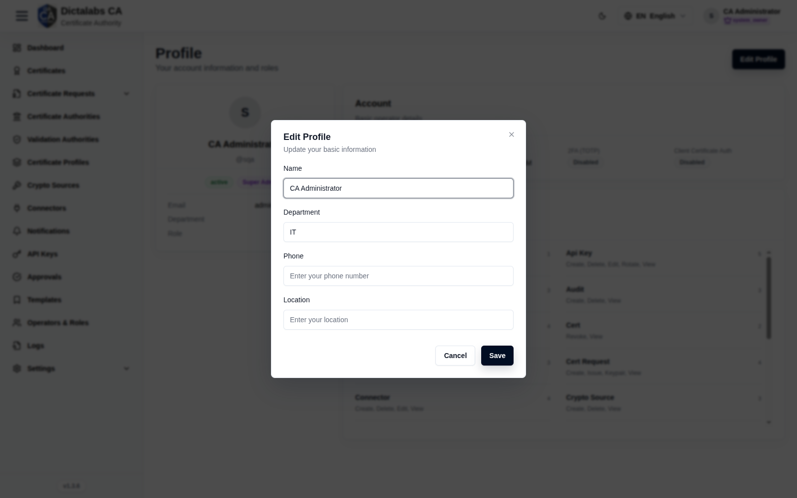

# User Profile & MFA

> **System Settings & Profile.** **Prerequisite:** [signed in to the tenant](05_tenant_sign_in.md).

## Purpose

Your personal account page — review your identity and role, see your effective permissions, and
manage security (MFA, client-certificate auth) and basic profile details.

## Navigation

`Profile`, or the account menu → **Profile**.

## Overview

- **Identity card** — name, `@username`, status, role badge, Email, Department, Role.
- **Account** — Last Login, Created, **2FA (TOTP)** state, **Client Certificate Auth** state.
- **Permissions** — your effective permissions (total), grouped by resource with counts.
- **Edit Profile** button.

## Fields — Edit Profile dialog

Editable personal details (full name, department, phone, location). Role and permissions are
managed by an administrator in [Operators & Roles](08_operators.md).

## Actions

- **Edit Profile** — update your details.
- Enable/disable **2FA (TOTP)** and **Client Certificate Auth**.

## Step-by-Step

1. Open **Profile**.
2. Check **Account** for MFA / client-cert status.
3. Review **Permissions** to confirm your effective rights.

!!! note "Important Notes"
    - 2FA (TOTP) and Client Certificate Auth are **Disabled** by default — enabling MFA is recommended.
    - To change your role/permissions, contact a tenant administrator.
