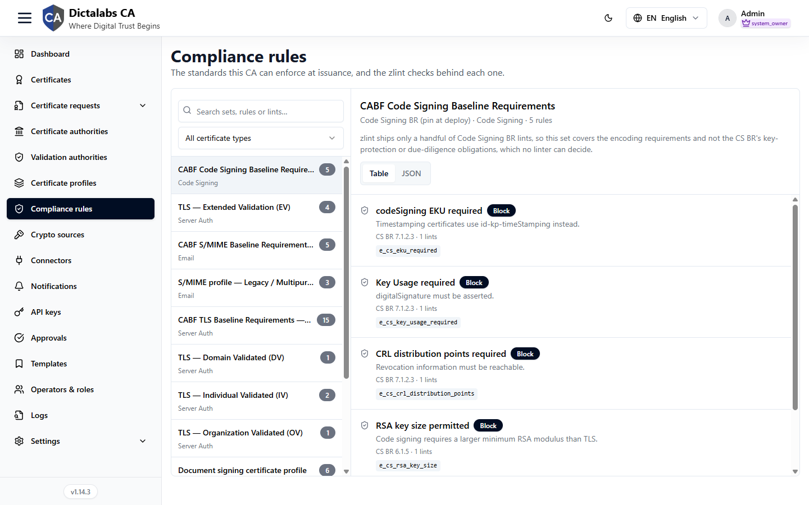

# Compliance Rules

> **Issuance.** **Prerequisite:** [signed in to the tenant](05_tenant_sign_in.md).

## Purpose

Compliance Rules is a reference and audit surface for the baseline-requirement standards this
platform can check certificates against at issuance — CA/Browser Forum (CABF) baseline
requirements, TLS validation levels, S/MIME profiles, eIDAS/ETSI qualified-certificate rules, and
more. Each standard is broken down into individual rules, and each rule is backed by one or more
[zlint](https://github.com/zmap/zlint) checks, so you can see exactly which automated check
enforces which requirement before relying on it.

## Navigation

`Compliance rules`

## Overview

The page is a two-pane browser: a list of **compliance sets** on the left, and the selected set's
**rules** on the right.

### Compliance sets list

- **Search sets, rules or lints…** — filters by set name, rule name, or lint ID as you type.
- **Certificate type filter** — narrows the list to sets scoped to one certificate type (Server
  Auth, Client Auth, Code Signing, Document Signing, Email), or **All certificate types**.
- Each set is a button showing its name, its rule count, and the certificate type(s) it applies to.

Sets observed in this build (name — rule count — certificate type):

| Set | Rules | Certificate type(s) |
| --- | ----- | -------------------- |
| CABF TLS Baseline Requirements — core profile | 15 | Server Auth |
| Base profile — RFC 5280 | 15 | Server Auth, Client Auth, Code Signing, Document Signing, Email |
| CABF Code Signing Baseline Requirements | 5 | Code Signing |
| CABF S/MIME Baseline Requirements — core | 5 | Email |
| TLS — Extended Validation (EV) | 4 | Server Auth |
| eIDAS — ETSI EN 319 412 qualified certificates | 4 | Server Auth, Client Auth, Code Signing, Document Signing, Email |
| Document signing certificate profile | 6 | Document Signing |
| Root program overlays — Mozilla, Apple, CT | 3 | Server Auth |
| S/MIME profile — Legacy / Multipurpose / Strict | 3 | Email |
| TLS — Individual Validated (IV) | 2 | Server Auth |
| TLS — Domain Validated (DV) | 1 | Server Auth |
| TLS — Organization Validated (OV) | 1 | Server Auth |

!!! note "Illustrative"
    Set names, descriptions, and rule counts reflect the sample environment audited for this guide
    and may change as the platform's rule library is updated.

### Rule set detail

Selecting a set opens its detail pane:

- Heading with the set's full name, and a subtitle line: short label, certificate type, and rule
  count (e.g. "Code Signing BR (pin at deploy) · Code Signing · 5 rules").
- A description paragraph explaining the set's scope and any caveats — for example, that zlint only
  covers a subset of a baseline requirement's obligations (encoding checks, not procedural ones
  like key protection or due diligence, which no linter can verify).
- A **Table / JSON** toggle for how the rule list below is displayed.

Each rule in the table shows:

| Field | Shows |
| ----- | ----- |
| Rule name | A short, human-readable name for the check (e.g. "codeSigning EKU required"). |
| Severity | How a failure is treated — e.g. **Block** (issuance is prevented). |
| Description | One line explaining what the rule verifies. |
| Citation · lint count | The baseline-requirement clause the rule maps to (e.g. "CS BR 7.1.2.3") and how many zlint checks back it (e.g. "1 lints"). |
| Lint ID | The underlying zlint check identifier (e.g. `e_cs_eku_required`), shown as code. |

## Step-by-Step

1. Open **Compliance rules**.
2. Use the certificate-type filter or search box to find the standard you need.
3. Select a set to see its rules, the CABF/ETSI/RFC clause each maps to, and the zlint check
   enforcing it.
4. Switch to the **JSON** tab if you need the raw rule definitions (e.g. to compare against a
   template or profile's configuration).

!!! note "Important Notes"
    - This page is a reference for what each standard requires and which automated check enforces
      it — it does not itself configure a CA, template, or profile. Use it to decide which
      [template](11_templates.md) fields, [profile](16_certificate_profiles.md) policies, and
      [CA settings](14_configure_ca.md) you need so issued certificates satisfy a given standard.
      Do not commit to what happens for a certificate that fails a rule without confirming in the
      live environment.
    - A set's description may call out gaps between what zlint can check and the full text of the
      baseline requirement — read it before assuming a set's rule count means full compliance.
