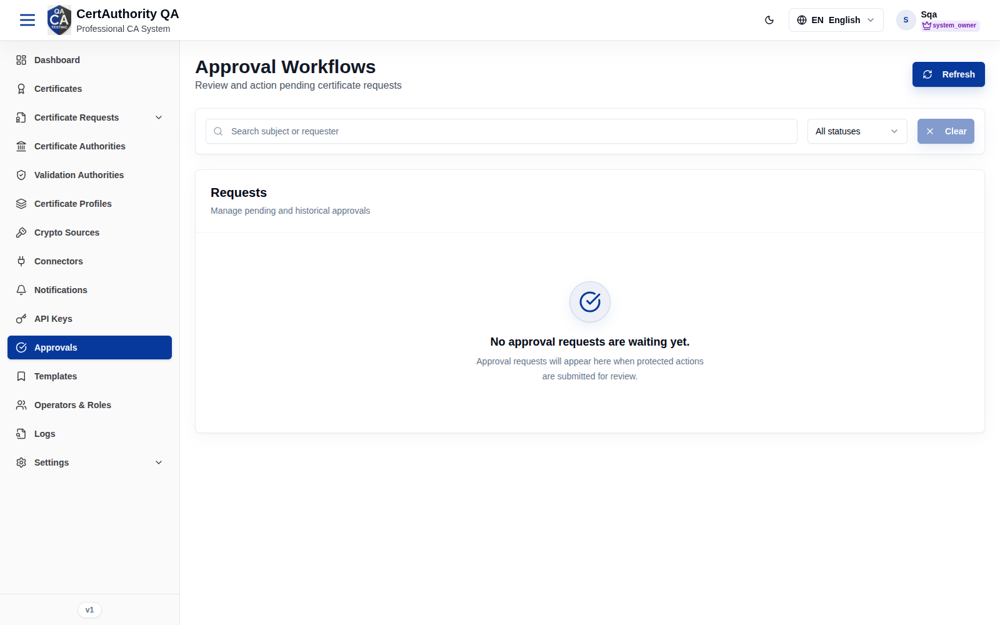

# Approvals

## Purpose

The Approvals queue is where protected actions submitted by roles that **require approval** are
reviewed. Approvers accept or reject pending requests, providing dual-control over sensitive
operations (issuance, configuration changes, etc.).

## Navigation

`Approvals` (`/approvals`)

## Overview

- **Refresh** button.
- **Search** (subject or requester) and a **status** filter (All statuses / Pending / Approved
  / Rejected).
- **Requests** list of pending and historical approvals. When empty it reads *"No approval
  requests are waiting yet."*

## How approvals are created

When an operator whose **role has "Requires Approval" enabled** performs a protected write, the
action is not applied immediately — it becomes a pending approval here. An approver with the
right permission then **Approves** (applies it) or **Rejects** (discards it).

## Actions

- **Refresh** — reload the queue.
- **View** — inspect a request's details and before/after change.
- **Approve** — apply the requested action (requires `approval.approve`).
- **Reject** — discard it, optionally with a reason (requires `approval.reject`).

## Step-by-Step — Action a request

1. Open **Approvals**.
2. Filter to **Pending**.
3. Open a request and review the proposed change.
4. Click **Approve** or **Reject** (add a reason if prompted).

## Expected Result

Approved requests execute the original action; rejected ones are discarded. The requester is
notified per configuration.

## Notes

- Which roles require approval is set per role in [Operators & Roles](users_roles.md).
- **Read-only audit note:** the QA queue was empty during the audit, so the decision dialog was
  not captured.
