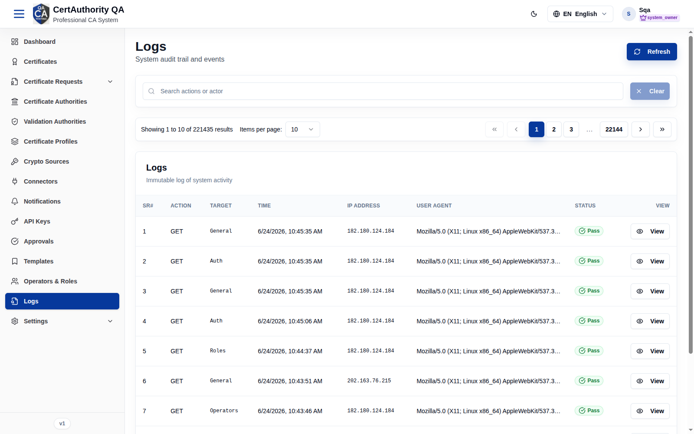
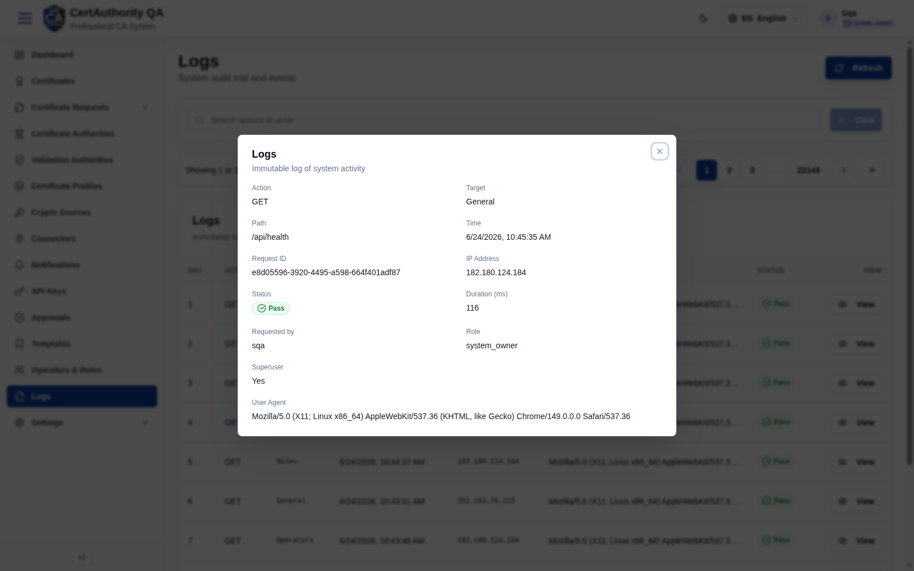

# Logs (Audit Trail)

## Purpose

The Logs module is the immutable record of system activity — every request and protected action
with actor, target, source IP, and outcome — for security review and compliance.

## Navigation

`Logs` (`/audit`)

## Overview

- **Refresh** button, **Search** (actions or actor), **Clear**.
- **Table** — columns: **Sr#**, **Action**, **Target**, **Time**, **IP Address**,
  **User Agent**, **Status** (Pass/Fail), **View**. Heavily paginated.

## Detail (View)

A row's **View** opens the full entry — request/response detail, payload, and error trace when
the status is a failure.

## Fields (table columns)

| Field | Description |
| ----- | ----------- |
| Sr# | Sequence number |
| Action | HTTP method / operation (GET, POST …) |
| Target | Subsystem (Auth, Roles, Operators, General …) |
| Time | Timestamp |
| IP Address | Client IP |
| User Agent | Client browser/agent |
| Status | Pass / Fail |
| View | Open full detail |

## Actions

- **Refresh** — reload entries.
- **Search** — filter by action or actor.
- **View** — open a single entry's full detail.

## Step-by-Step — Investigate an event

1. Open **Logs**.
2. Search for the action or actor of interest.
3. Click **View** on the row to see full request/response and any error trace.

## Expected Result

You see a chronological, immutable trail scoped to this tenant; failures expose diagnostic
detail.

## Notes

- Logs are immutable; retention/rotation is governed by [Log Rotation](settings_logging.md).
- Programmatic SIEM export and access-log retrieval are separate (SIEM connector + access-log
  permissions).
