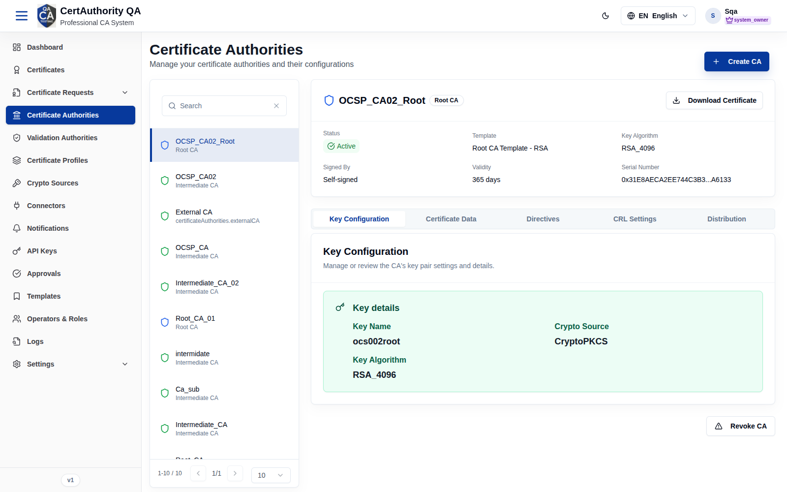
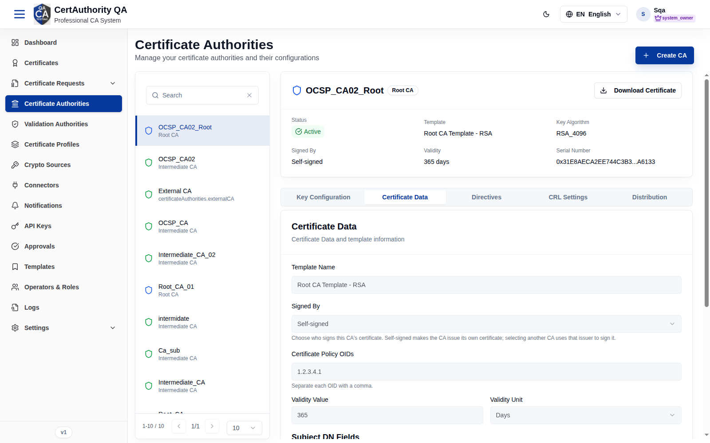
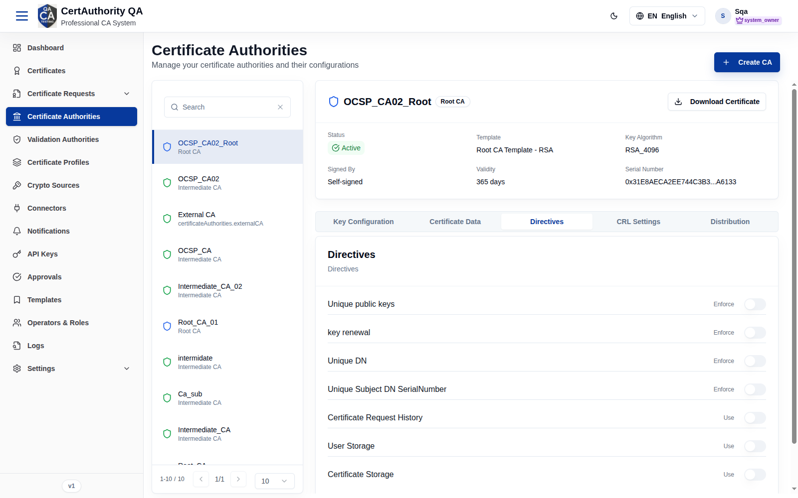
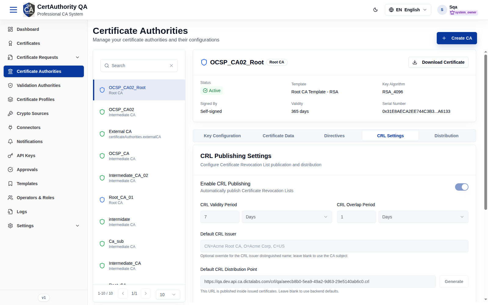
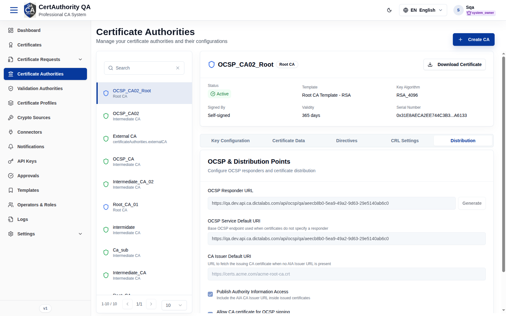
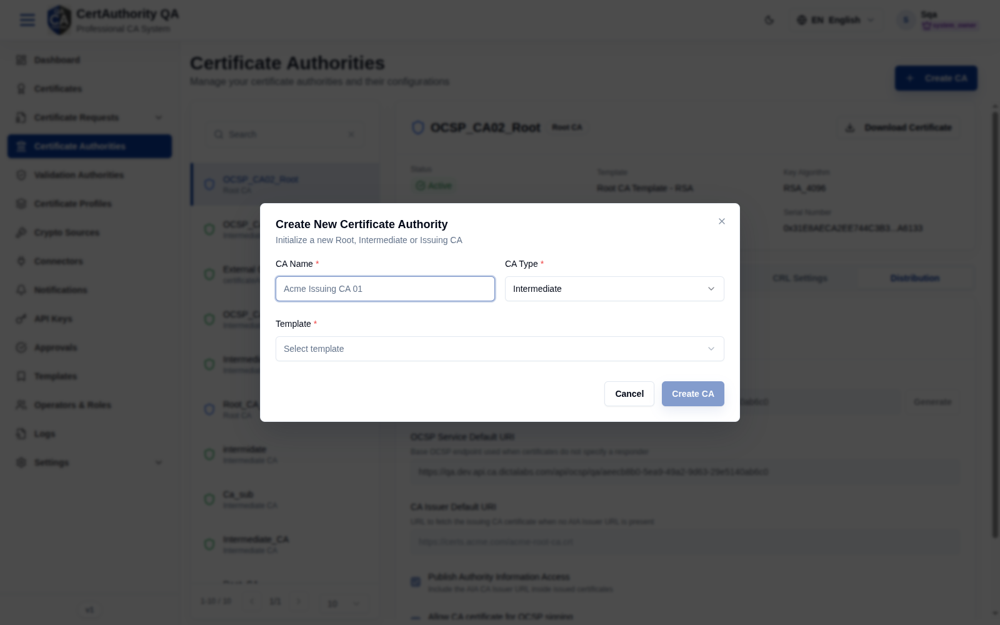

# Certificate Authorities

## Purpose

Create and operate the tenant's CA hierarchy — Root, Intermediate, and External CAs — and
configure how each CA signs, publishes, and validates certificates.

## Navigation

`Certificate Authorities` (`/certificate-authorities`)

## Overview

- **Create CA** button (top right).
- **Left panel:** searchable CA list; each entry shows the CA name and **type** (Root CA /
  Intermediate CA / External CA). Paginated.
- **Right panel:** selected CA summary — **Status**, **Template**, **Key Algorithm**, **Signed
  By**, **Validity**, **Serial Number** — with **Download Certificate** and (at the bottom)
  **Revoke CA**.

### Configuration tabs

| Tab | Contents |
| --- | -------- |
| **Key Configuration** | Key pair details (Key Name, Crypto Source, Key Algorithm); key operations |
| **Certificate Data** | Subject DN and certificate content |
| **Directives** | CA policy directives |
| **CRL Settings** | Certificate Revocation List configuration |
| **Distribution** | OCSP responder URL, OCSP service default URI, CA Issuer default URI, **Publish AIA**, **Allow CA certificate for OCSP signing** |

**Key Configuration**

**Certificate Data**

**Directives**

**CRL Settings**

**Distribution**

## Fields — Create CA dialog

| Field | Description | Required | Notes |
| ----- | ----------- | -------- | ----- |
| CA Name | Display name (e.g. *Acme Issuing CA 01*) | Yes | — |
| CA Type | Root / Intermediate (Issuing) | Yes | Defaults to Intermediate |
| Template | CA template seeding extensions/constraints | Yes | From [Templates](templates.md); **Create CA** stays disabled until set |

## Actions

- **Create CA** — initialize a new CA.
- **Download Certificate** — export the CA certificate.
- **Revoke CA** — revoke the CA (invalidates certificates it issued; irreversible).
- Per-tab **Save** — persist configuration changes.
- Key operations (in Key Configuration) — generate/rotate keys via a **Key Ceremony**.

## Step-by-Step — Create a CA

1. Open **Certificate Authorities**.
2. Click **Create CA**.
3. Enter **CA Name**, choose **CA Type**, and select a **Template**.
4. Click **Create CA** and complete the key generation / signing steps.

## Expected Result

The new CA appears in the left list; once its key pair is generated and certificate signed, its
status becomes **Active**.

## Notes

- A CA needs a [Crypto Source](crypto_sources.md) for its key and a CA [Template](templates.md).
- **Warning:** Revoke CA cascades to everything that CA issued — use with extreme care.
- Sensitive key operations may require Two-Person Control / approval.
