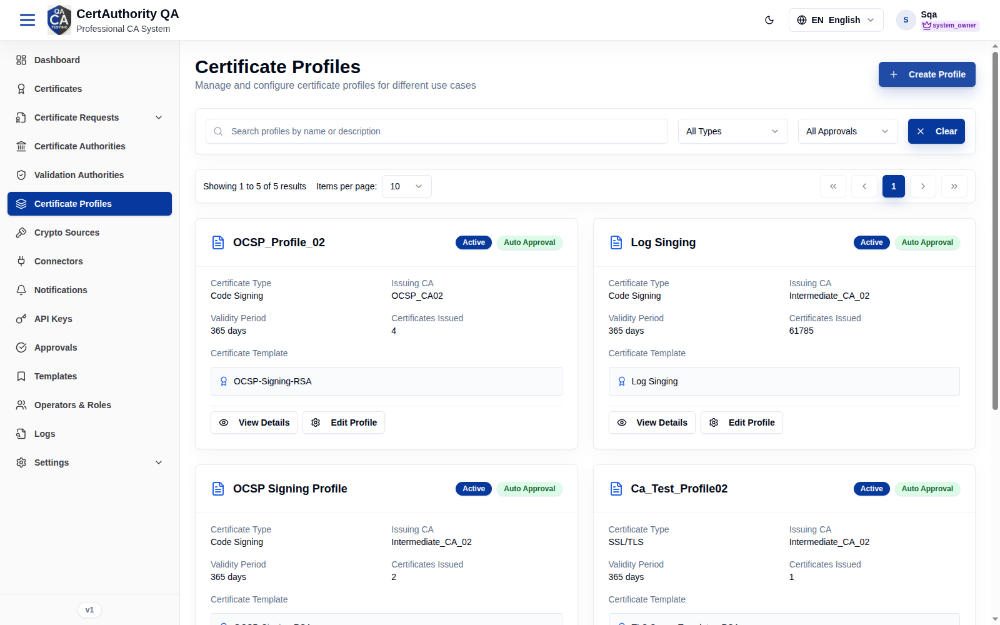
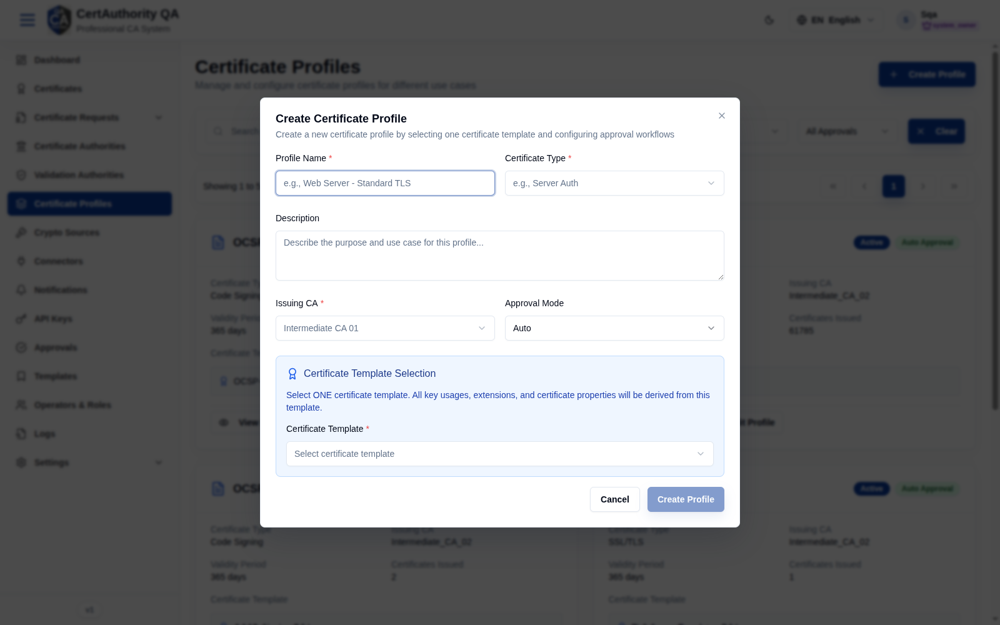

# Certificate Profiles

## Purpose

Profiles combine a certificate **template** with an **issuing CA** and an **approval workflow**.
They are what requesters choose when [requesting a certificate](certificate_request_create.md),
and they govern issuance policy and permissions.

## Navigation

`Certificate Profiles` (`/certificate-profiles`)

## Overview

- **Create Profile** button.
- **Search**, **type** filter (All Types), **approval** filter (All Approvals), **Clear**.
- **Card grid** — each profile shows: name, status, approval mode, **Certificate Type**,
  **Issuing CA**, **Validity Period**, **Certificates Issued**, **Certificate Template**, plus
  **View Details** and **Edit Profile**.

## Fields — Create Profile dialog

| Field | Description | Required | Notes |
| ----- | ----------- | -------- | ----- |
| Profile Name | Display name | Yes | — |
| Certificate Type | e.g. Server Auth / Code Signing | Yes | — |
| Description | Purpose/use case | No | — |
| Issuing CA | CA that signs certificates from this profile | Yes | From [Certificate Authorities](certificate_authorities.md) |
| Approval Mode | Auto / Manual | No | Defaults to Auto |
| Certificate Template | The single template that defines key usages, extensions, and properties | Yes | From [Templates](templates.md) |

## Actions

- **Create Profile** — add a profile.
- **View Details** — inspect a profile.
- **Edit Profile** — modify a profile.

## Step-by-Step — Create a profile

1. Open **Certificate Profiles**.
2. Click **Create Profile**.
3. Enter **Profile Name** and **Certificate Type**, choose **Issuing CA**, **Approval Mode**,
   and one **Certificate Template**.
4. Click **Create Profile**.

## Expected Result

The profile appears as a card and becomes selectable in the
[Request Certificate](certificate_request_create.md) wizard.

## Notes

- All key usages/extensions derive from the chosen **template** — pick the template that matches
  the intended certificate use.
- Setting **Approval Mode = Manual** sends requests to [Approvals](approvals.md).
- Profile create/edit may itself require approval depending on your role.
