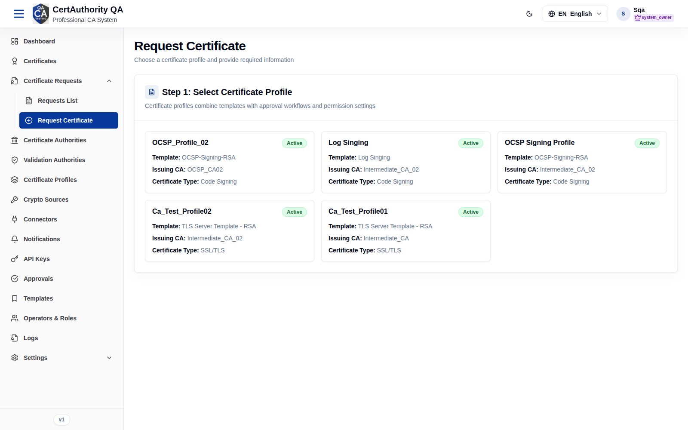
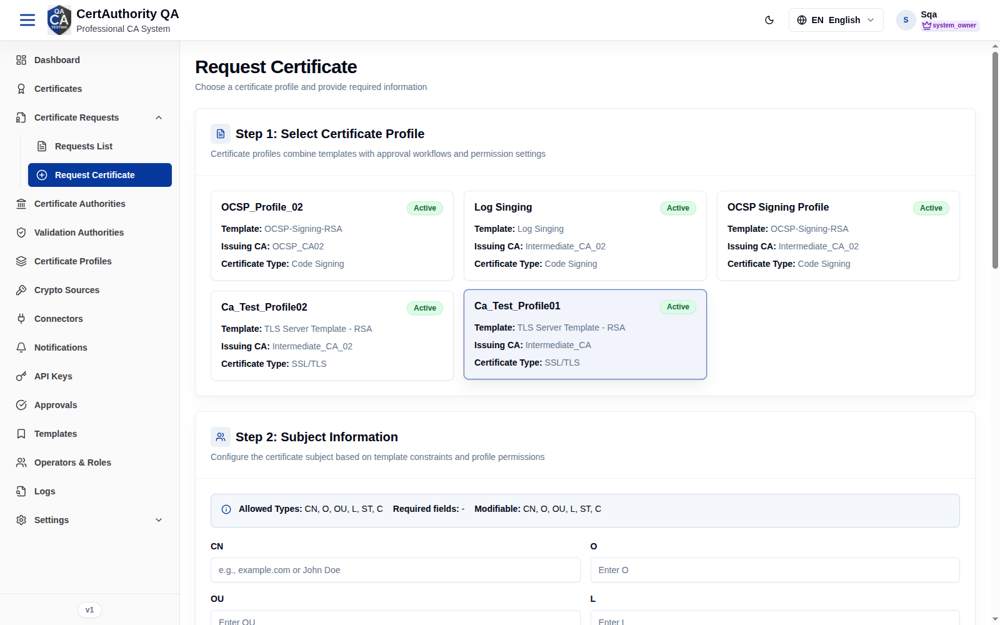
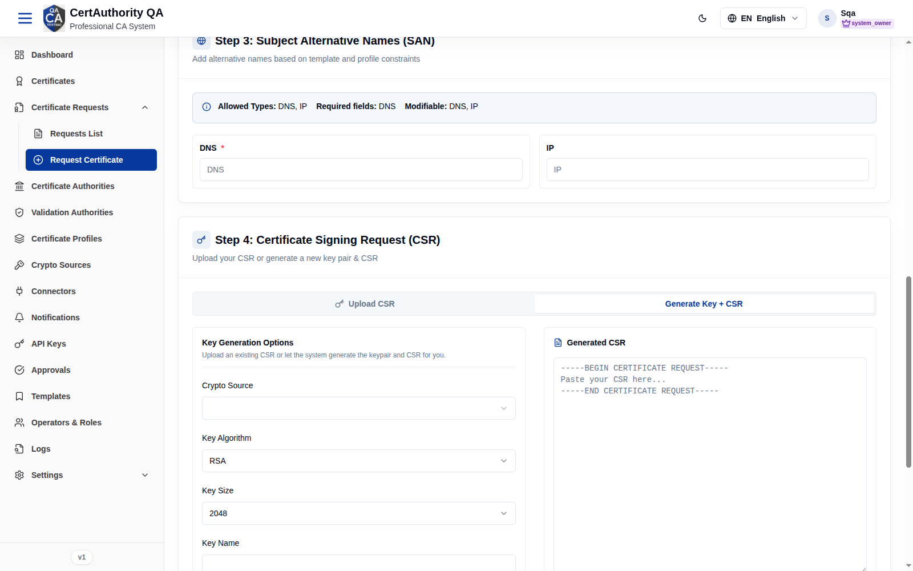

# Request a Certificate

## Purpose

Guided workflow to request (and, when auto-approved, issue) a certificate. It enforces the
selected profile's template constraints on subject fields, SAN types, and key options.

## Navigation

`Certificate Requests → Request Certificate` (`/certificate-request`)

## Overview

A single-page wizard with four steps plus a submit panel.

### Step 1 — Select Certificate Profile
Choose one profile card. Each card shows **Template**, **Issuing CA**, **Certificate Type**,
and status.

### Step 2 — Subject Information
An info banner shows the profile's **Allowed Types**, **Required fields**, and **Modifiable**
fields. Inputs appear for allowed DN components (e.g. CN, O, OU, L, ST, C).

### Step 3 — Subject Alternative Names (SAN)
Banner shows allowed/required/modifiable SAN types (e.g. DNS, IP). Required SAN types are
marked `*`.

### Step 4 — Certificate Signing Request (CSR)
Two tabs:

- **Upload CSR** — paste PEM or upload `.csr/.pem/.der/.txt`.
- **Generate Key + CSR** — system generates the keypair and CSR.

### Submit panel
**Submit & Generate Certificate** stays disabled until all required data is present (e.g. it
shows *"Missing required SAN: DNS"*).

## Fields — Generate Key + CSR

| Field | Description | Required | Notes |
| ----- | ----------- | -------- | ----- |
| Crypto Source | Where the key is generated/stored | Yes | From [Crypto Sources](crypto_sources.md) |
| Key Algorithm | RSA / ECDSA | Yes | Defaults to RSA |
| Key Size | e.g. 2048 | Yes | Algorithm-dependent |
| Key Name | Identifier for the key | Yes | — |
| Key Password | Protects the generated key | Optional | — |

## Actions

- **Select a profile card** — advance the wizard.
- **Generate Key Pair & CSR** — produce a keypair and populate the CSR.
- **Submit & Generate Certificate** — submit the request.

## Step-by-Step

1. Open **Request Certificate**.
2. Pick a **profile** (Step 1).
3. Fill the allowed **Subject** fields (Step 2).
4. Add required **SAN** entries (Step 3).
5. In Step 4, **Upload CSR** or **Generate Key + CSR**.
6. Click **Submit & Generate Certificate**.

## Expected Result

- **Auto** approval mode → the certificate is issued immediately and appears in
  [Certificates](certificates.md).
- **Manual** mode → a pending request is created and routed to [Approvals](approvals.md).

## Notes

- The profile/template controls which subject and SAN fields you may set — disallowed fields
  do not appear.
- **Read-only audit note:** this guide documents the form without submitting; the post-submit
  success screen was not captured.
