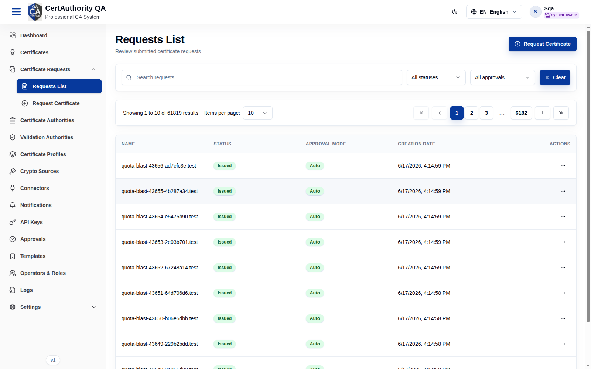
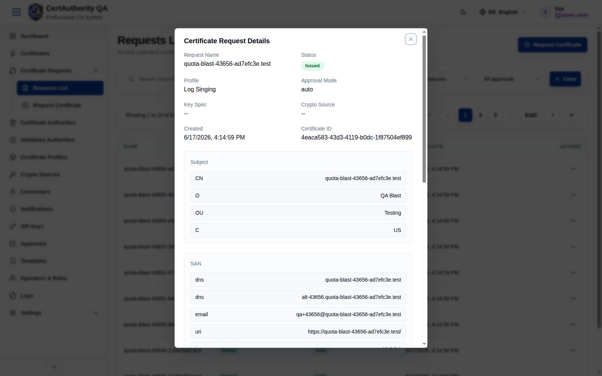

# Certificate Requests — Requests List

## Purpose

Lists every certificate request submitted in the tenant, with its issuance and approval state,
so operators can review requests and download CSRs or issued certificates.

## Navigation

`Certificate Requests → Requests List` (`/certificate-requests`)

## Overview

- **Search**, a **status** filter (All statuses / …), an **approval** filter (All approvals /
  Auto / Manual …), and **Clear**.
- **Request Certificate** button (opens the [request wizard](certificate_request_create.md)).
- **Table** — columns: **Name**, **Status**, **Approval Mode**, **Creation Date**, **Actions**.
  Paginated (large environments show tens of thousands of rows).

## Request Details (View)

The row **Actions → View** opens **Certificate Request Details**:

| Field | Description |
| ----- | ----------- |
| Request Name | Request identifier (often the CN) |
| Status | pending / approved / rejected / issued |
| Profile | Certificate profile used |
| Approval Mode | auto / manual |
| Key Spec, Crypto Source | Key details (— if external CSR) |
| Created | Timestamp |
| Certificate ID | Issued certificate reference |
| Subject | CN, O, OU, C … |
| SAN | DNS, email, URI, IP entries |
| Subject Directory Attributes | If present |
| CSR | PEM, with **Download** |

## Actions

- **Request Certificate** — start a new request.
- **View** — open full request details.
- **Download** — export the CSR (and issued certificate where available).

## Step-by-Step — Review a request

1. Open **Requests List**.
2. Filter by **status** or **approval** as needed.
3. Click a row's **Actions → View** to inspect subject, SAN, and CSR.

## Expected Result

The details dialog shows the full request, including the PEM CSR and issuance status.

## Notes

- **Approval Mode = Auto** issues immediately; **Manual** routes to [Approvals](approvals.md).
- Manual approve/reject is performed in the [Approvals](approvals.md) module.
