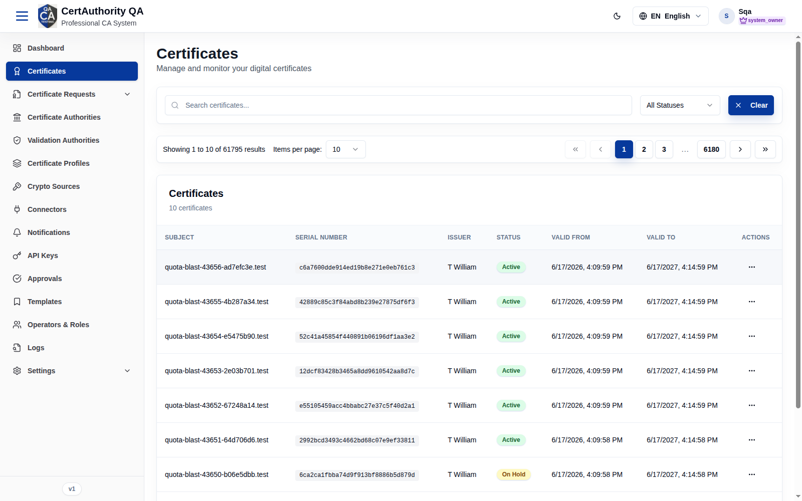

# Certificates

## Purpose

The Certificates module is the inventory of issued certificates. Operators use it to search,
inspect, download, and revoke certificates across the tenant's CAs.

## Navigation

`Certificates` (`/certificates`)

## Overview

- **Search** by subject/serial, a **status** filter (All Statuses / Active / Revoked / Expired
  …), and **Clear**.
- **Certificates table** — columns: **Subject**, **Serial Number**, **Issuer**, **Status**,
  **Valid From**, **Valid To**, **Actions**.

## Fields (table columns)

| Field | Description |
| ----- | ----------- |
| Subject | Certificate subject DN |
| Serial Number | Issued serial |
| Issuer | Issuing CA |
| Status | Active / Revoked / Expired |
| Valid From / Valid To | Validity window |
| Actions | View, Download, Revoke (per permissions) |

## Actions

- **View** — open full certificate details (chain, extensions, key usage).
- **Download** — export the certificate.
- **Revoke** — revoke an active certificate (requires `cert.revoke`; may route through
  [Approvals](approvals.md)).

## Step-by-Step — Revoke a certificate

1. Open **Certificates**.
2. Search for the certificate and open its row **Actions**.
3. Choose **Revoke**, select a reason, and confirm.

## Expected Result

The certificate's status becomes **Revoked** and it is included in the next CRL / OCSP update.

## Notes

- New certificates are created via [Request Certificate](certificate_request_create.md), not
  from this page.
- **Read-only audit note:** in the QA tenant this list rendered empty even though issuance
  exists; verify filters and CA scope if a list appears empty.
- Revocation is irreversible for trust purposes — confirm the correct certificate first.
