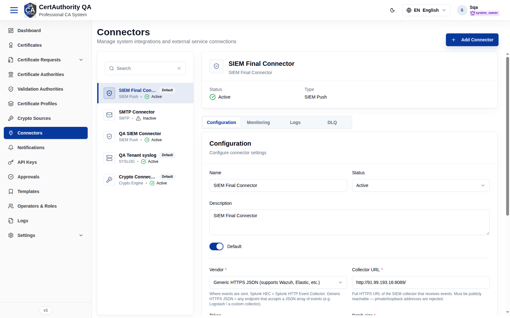
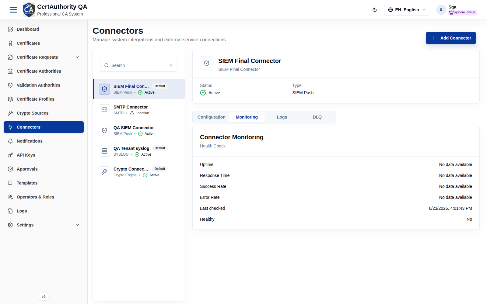
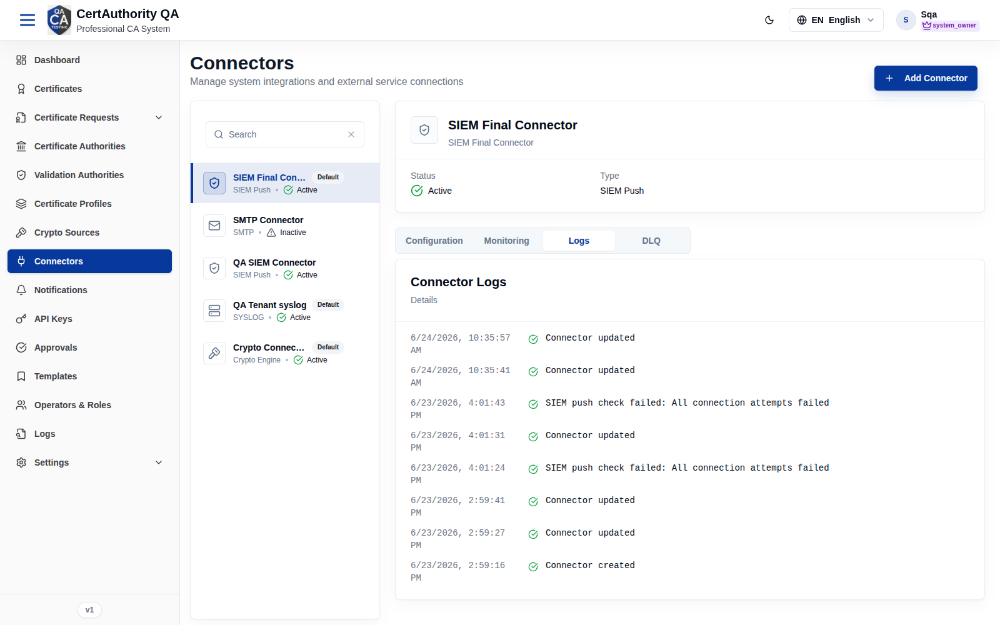
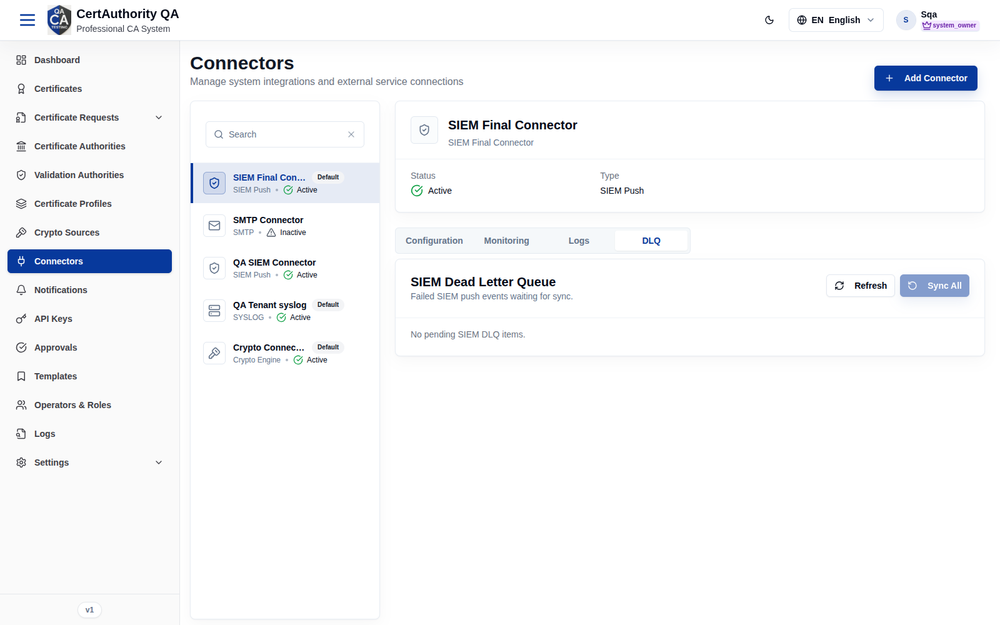
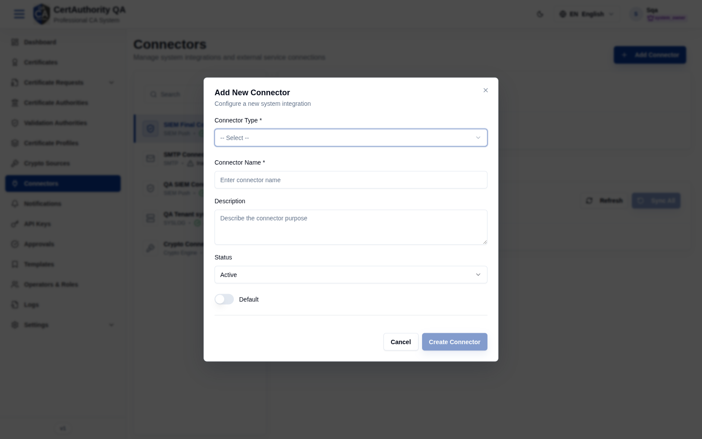

# Connectors

## Purpose

Connectors are integrations to external services — **SIEM Push**, **SMTP** (email), **SYSLOG**,
and **Crypto Engine** — used by notifications, log export, and crypto sources.

## Navigation

`Connectors` (`/connectors`)

## Overview

- **Add Connector** button.
- **Left panel:** searchable connector list; each entry shows name, type badge (SIEM Push /
  SMTP / SYSLOG / Crypto Engine), a **Default** marker, and **Active/Inactive** status, with a
  **Delete connector** control.
- **Right panel:** selected connector with tabs.

### Detail tabs

| Tab | Contents |
| --- | -------- |
| **Configuration** | Type-specific connection settings |
| **Monitoring** | Health/status of the connector |
| **Logs** | Connector activity log |
| **DLQ** | Dead-letter queue (e.g. failed SIEM pushes) with **Refresh** / **Sync All** |

**Monitoring**

**Logs**

**DLQ**

## Fields — Add New Connector dialog

| Field | Description | Required | Notes |
| ----- | ----------- | -------- | ----- |
| Connector Type | SIEM / SMTP / SYSLOG / Crypto Engine | Yes | Selecting a type reveals its specific config fields |
| Connector Name | Display name | Yes | — |
| Description | Purpose | No | — |
| Status | Active / Inactive | No | Defaults to Active |
| Default | Mark as the default for its type | No | Toggle |

## Actions

- **Add Connector** — create an integration.
- **Delete connector** — remove one (per-row).
- **Refresh / Sync All** (DLQ) — manage failed events.

## Step-by-Step — Add a connector

1. Open **Connectors**.
2. Click **Add Connector**.
3. Choose **Connector Type**, enter **Name**, (Description), set **Status** / **Default**, and
   fill the type-specific configuration.
4. Click **Create Connector**.

## Expected Result

The connector appears in the left list and can be referenced by
[Crypto Sources](crypto_sources.md), [Notifications](notifications.md), and SIEM/log export.

## Notes

- The **Configuration** fields differ per type (SMTP host/port, syslog target, SIEM endpoint,
  crypto engine settings).
- Use the **DLQ** tab to replay failed SIEM/event pushes.
