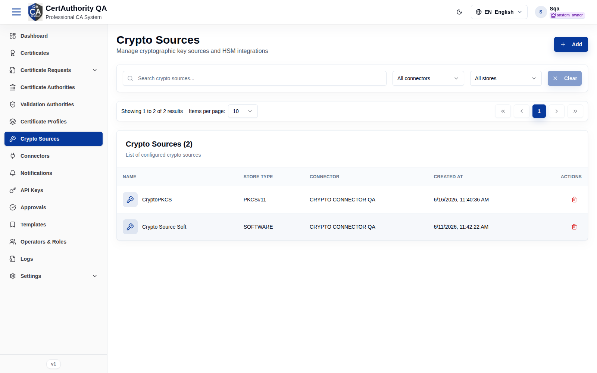
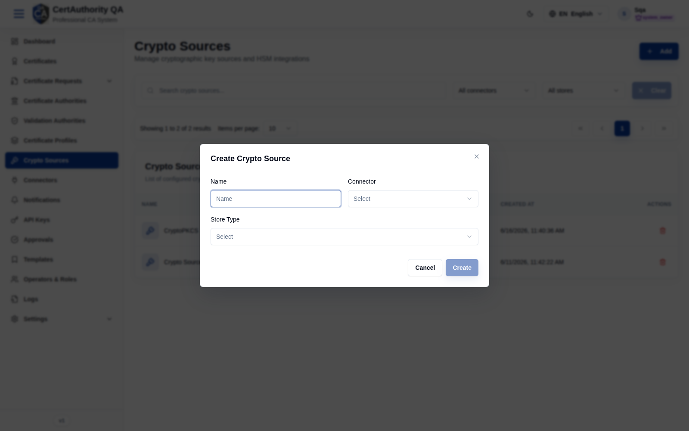

# Crypto Sources

## Purpose

Crypto Sources define where cryptographic keys live — HSM via PKCS#11, or software key stores —
backed by a crypto **connector**. CAs and certificate requests reference a crypto source when
generating or using keys.

## Navigation

`Crypto Sources` (`/crypto-sources`)

## Overview

- **Add** button.
- **Search**, **All connectors** filter, **All stores** filter, **Clear**.
- **Table** — columns: **Name**, **Store Type** (e.g. PKCS#11, SOFTWARE), **Connector**,
  **Created at**, **Actions**.

## Fields — Create Crypto Source dialog

| Field | Description | Required | Notes |
| ----- | ----------- | -------- | ----- |
| Name | Display name | Yes | — |
| Connector | Backing crypto connector | Yes | From [Connectors](connectors.md) (Crypto Engine type) |
| Store Type | PKCS#11 / SOFTWARE | Yes | Determines key storage backend |

## Actions

- **Add** — create a crypto source.
- Row actions — view/delete (per permissions).

## Step-by-Step — Add a crypto source

1. Open **Crypto Sources**.
2. Click **Add**.
3. Enter **Name**, select a **Connector** and **Store Type**.
4. Click **Create**.

## Expected Result

The crypto source appears in the table and becomes selectable when generating CA keys or
request keypairs.

## Notes

- A crypto source requires a configured crypto **connector** (Crypto Engine).
- Choose **PKCS#11** for HSM-backed keys; **SOFTWARE** keeps keys in the software store.
