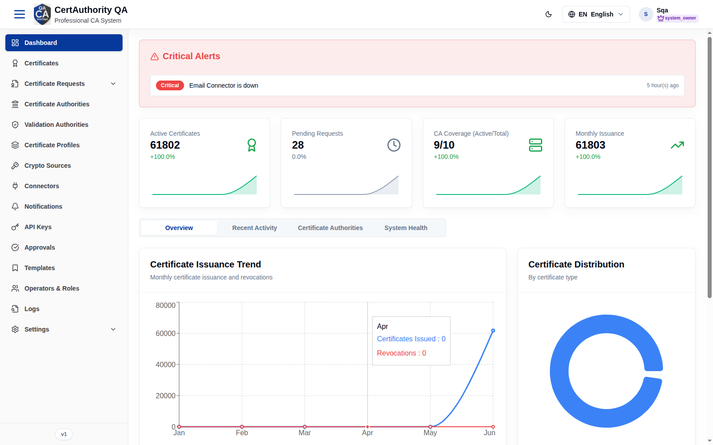
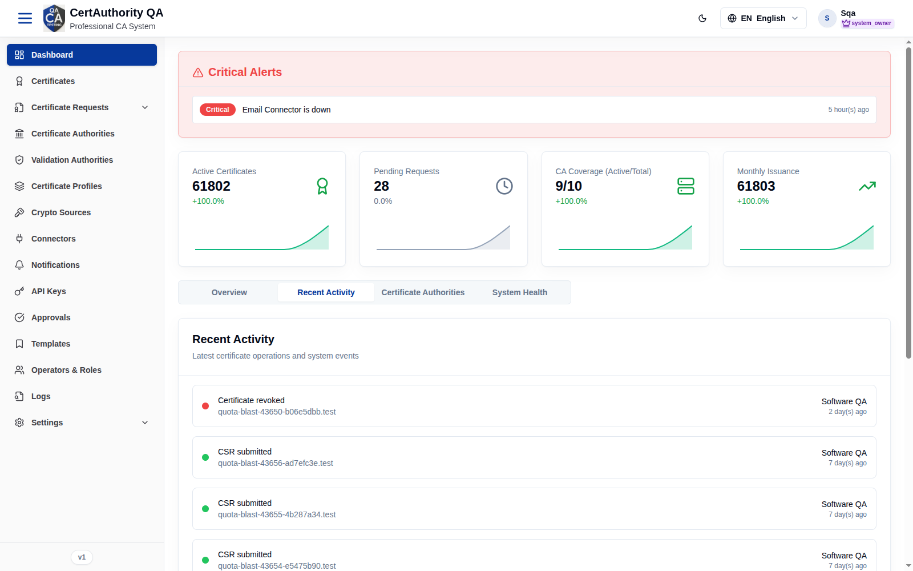
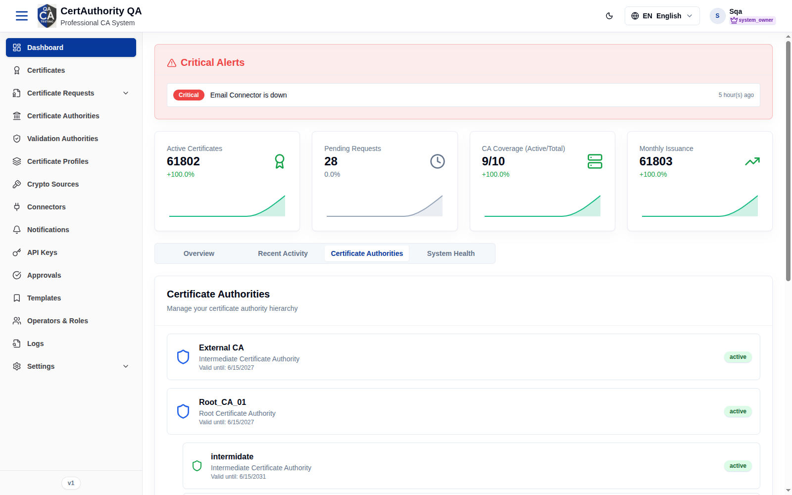
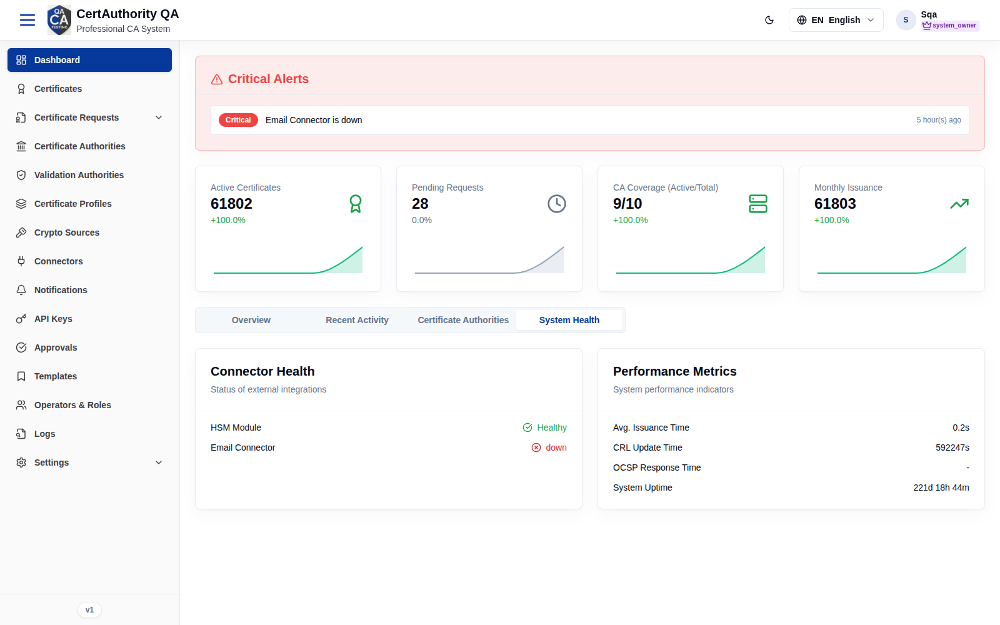

# Dashboard

## Purpose

The Dashboard is the tenant landing page. It summarizes certificate operations, surfaces
critical alerts, and gives quick links to common actions so operators can assess PKI health at
a glance.

**Who should use it:** all tenant operators after sign-in.

## Navigation

`Dashboard` (`/`) — the default page after login.

## Overview

**Critical Alerts** banner at the top lists severity-tagged issues (e.g. *Email Connector is
down*) with relative timestamps.

**Stat cards** show key metrics with trend deltas:

- **Active Certificates**
- **Pending Requests**
- **CA Coverage (Active/Total)**
- **Monthly Issuance**

Below the stats are four **tabs**:

| Tab | Contents |
| --- | -------- |
| **Overview** | Certificate Issuance Trend chart, Certificate Distribution (by type), System Performance (CPU/Memory/HSM), and **Quick Actions** |
| **Recent Activity** | Recent system actions feed |
| **Certificate Authorities** | CA hierarchy / status summary |
| **System Health** | Connector health and performance indicators |

**Quick Actions** (Overview tab) link to: Issue New Certificate, Create Template, Configure
Certificate Authority, Review Requests.

## Actions

- Switch tabs to change the displayed view.
- Use **Quick Actions** to jump into common workflows.
- Click an alert to investigate the related subsystem.

## Step-by-Step — Check system health

1. Open **Dashboard**.
2. Review the **Critical Alerts** banner.
3. Open the **System Health** tab to inspect connector status and performance.

## Expected Result

You see current metrics and any active alerts; the data reflects this tenant only.

## Notes

- Metrics are tenant-scoped; numbers differ per tenant.
- Charts/figures depend on available data — sparse environments show empty or zero series.

## Screenshots

**Recent Activity**

**Certificate Authorities**

**System Health**

