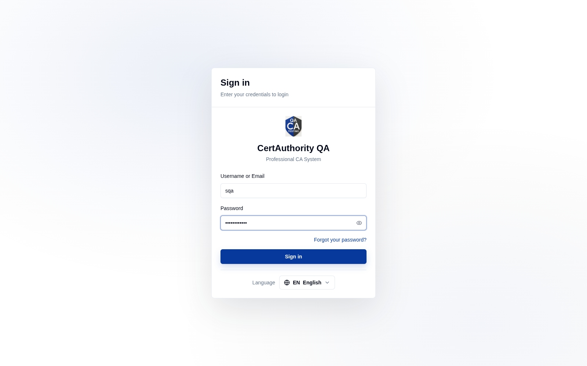

# CA Admin Guide

## Overview

The **Certificate Authority (CA)** platform is a multi-tenant system for operating a private
Public Key Infrastructure (PKI). It lets administrators build CA hierarchies, issue and revoke
certificates, run OCSP validation, enforce issuance policy through templates and profiles, and
govern access with role-based permissions and approval workflows.

The platform has **two portals**:

| Portal | Audience | URL pattern | Covered in |
| ------ | -------- | ----------- | ---------- |
| **Tenant Super Admin** | Platform operators who provision and govern tenants | `https://admin.<domain>` | [Tenant Super Admin & Multi-Tenancy](super_admin_overview.md) |
| **Tenant portal** | PKI operators within one tenant | `https://<subdomain>.<domain>` | this guide's tenant chapters |

Each tenant is fully isolated (separate data, CAs, operators, branding) and is reached at its
own subdomain. See [Tenant Super Admin & Multi-Tenancy](super_admin_overview.md) for the
isolation model.

## Accessing the Tenant Portal

- **URL:** your tenant subdomain, e.g. `https://qa.<domain>`.
- **Supported browsers:** latest Chrome, Edge, Firefox, Safari.
- Each tenant shows its own **branding** (logo, name, theme) on the sign-in screen.

## Login

1. Enter your **Username or Email** and **Password**.
2. If your operator account has **SSO** or **Mutual TLS** enabled, complete that method instead.
3. Click **Sign in**. On success you land on the [Dashboard](dashboard.md).
4. A **Forgot your password?** link starts an email-based reset.

The top bar offers a **theme toggle**, **language** selector, and the **account menu**
(Profile, Logout). Your current **role** is shown next to your name (e.g. `system_owner`).

## Navigation

The tenant sidebar groups all modules:

| Section | Pages |
| ------- | ----- |
| [Dashboard](dashboard.md) | Metrics, trends, system health |
| [Certificates](certificates.md) | Issued certificate inventory |
| Certificate Requests | [Requests List](certificate_request_list.md), [Request Certificate](certificate_request_create.md) |
| [Certificate Authorities](certificate_authorities.md) | CA hierarchy & configuration |
| [Validation Authorities](validation_authorities.md) | OCSP responders, external CAs, sync |
| [Certificate Profiles](certificate_profiles.md) | Issuance policy profiles |
| [Crypto Sources](crypto_sources.md) | Key storage (HSM/PKCS#11/software) |
| [Connectors](connectors.md) | Integrations (SIEM, SMTP, syslog, crypto engine) |
| [Notifications](notifications.md) | Alert schedules |
| [API Keys](key_management.md) | Programmatic access keys |
| [Approvals](approvals.md) | Approval workflow queue |
| [Templates](templates.md) | Certificate templates |
| [Operators & Roles](users_roles.md) | Users, roles, permissions |
| [Logs](audit.md) | Audit trail |
| Settings | [General](settings_general.md), [Log Rotation](settings_logging.md), [Branding](settings_branding.md) |
| [User Profile](profile.md) | Your account, MFA, permissions |

> Menu items are gated by your **permissions** and by the tenant's **license** (CA and/or VA
> modules). Items you lack rights to, or that the license does not enable, are hidden.
