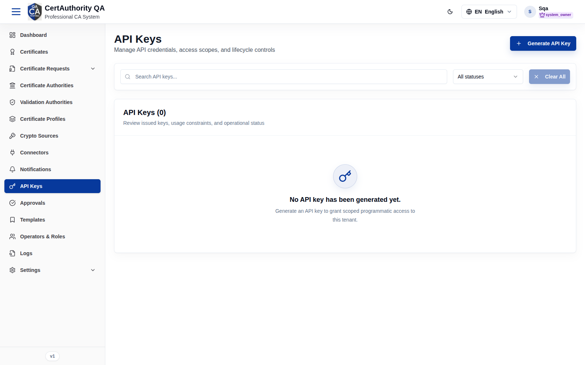
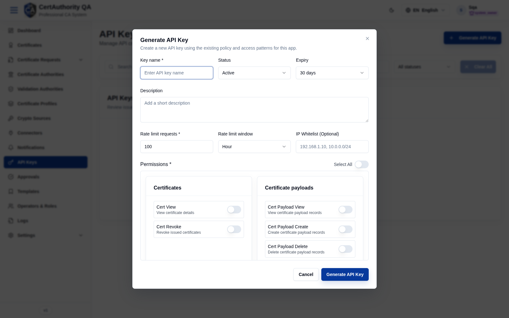

# API Keys

## Purpose

API Keys grant scoped, programmatic access to the tenant's API. Each key has fine-grained
permissions, rate limits, optional IP allow-listing, and an expiry, supporting automation and
integrations without operator credentials.

## Navigation

`API Keys` (`/key-management`)

## Overview

- **Generate API Key** button.
- **Search**, **All statuses** filter, **Clear All**.
- **List** of issued keys with usage constraints and status (empty state prompts you to
  generate one).

## Fields — Generate API Key dialog

| Field | Description | Required | Notes |
| ----- | ----------- | -------- | ----- |
| Key name | Display name | Yes | — |
| Status | Active / Inactive | No | Defaults to Active |
| Expiry | Lifetime (e.g. 30 days) | No | — |
| Description | Optional note | No | — |
| Rate limit requests | Max requests per window | Yes | Defaults to 100 |
| Rate limit window | Minute / Hour / … | No | Defaults to Hour |
| IP Whitelist | Allowed IPs/CIDRs | No | e.g. `192.168.1.10, 10.0.0.0/24` |
| Permissions | Per-permission switches grouped by resource (+ **Select All**) | Yes | See catalog below |

### Permission catalog (assignable scopes)

Grouped exactly as shown in the dialog:

- **Certificates:** Cert View, Cert Revoke
- **Certificate payloads:** View, Create, Delete
- **Certificate authorities:** Ca View, Ca Configure, Ca Key Ceremony, Ca Crl Manage
- **Validation authorities:** Va View, Va Configure
- **Crypto tokens:** Token View, Token Manage, Token Delete
- **Crypto sources:** View, Create, Delete
- **Templates:** View, Create, Edit, Delete
- **Profiles:** View, Create, Edit, Delete
- **Certificate requests:** View, Create, Issue, Keypair
- **Connectors:** View, Create, Edit, Delete
- **Notifications:** View, Create, Edit, Delete
- **Approvals:** View, Approve, Reject
- **Audit:** View, Create, Delete
- **Access logs:** View
- **SIEM:** Read, Manage
- **General settings:** View, Edit
- **Roles:** Role View, Role Manage, Role Member View, Role Member Manage
- **Operators:** View, Create, Edit, Delete

## Actions

- **Generate API Key** — create a key (secret shown once).
- **Reveal / Rotate / Revoke / Delete** — lifecycle actions on existing keys (per permissions).

## Step-by-Step — Generate an API key

1. Open **API Keys**.
2. Click **Generate API Key**.
3. Enter **Key name**, set **Expiry**, **Rate limit**, optional **IP Whitelist**.
4. Toggle the required **Permissions** (or **Select All**).
5. Click **Generate API Key** and copy the secret immediately.

## Expected Result

The key is created and listed; the secret is displayed once at creation and cannot be retrieved
later (rotate to get a new secret).

## Notes

- **Warning:** the secret is shown only once — store it securely.
- Grant the minimum permissions needed; use **IP Whitelist** and short **Expiry** for tighter
  control.
- Every key is bound to this tenant only.
