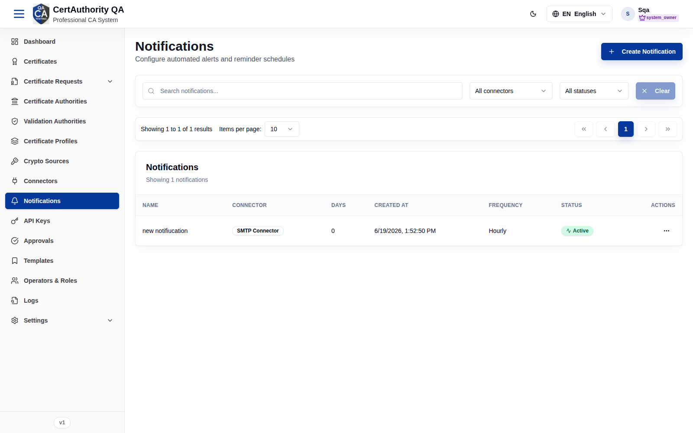
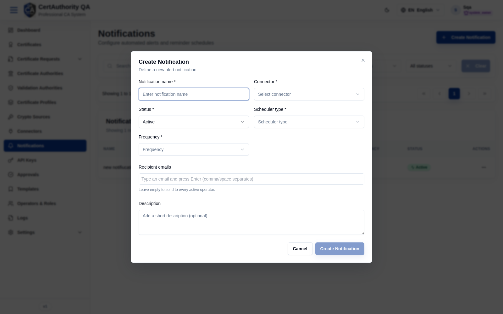

# Notifications

## Purpose

Configure automated alerts and reminder schedules (e.g. expiry reminders) delivered through a
connector to chosen recipients.

## Navigation

`Notifications` (`/notifications`)

## Overview

- **Create Notification** button.
- **Search**, **All connectors** filter, **All statuses** filter, **Clear**.
- **Table** — columns: **Name**, **Connector**, **Days**, **Created at**, **Frequency**,
  **Status**, **Actions**.

## Fields — Create Notification dialog

| Field | Description | Required | Notes |
| ----- | ----------- | -------- | ----- |
| Notification name | Display name | Yes | — |
| Connector | Delivery channel | Yes | From [Connectors](connectors.md) (e.g. SMTP) |
| Status | Active / Inactive | Yes | — |
| Scheduler type | Schedule basis | Yes | — |
| Frequency | e.g. hourly / daily | Yes | — |
| Recipient emails | Explicit recipients | No | Leave empty to send to every active operator |
| Description | Optional note | No | — |

## Actions

- **Create Notification** — add a schedule.
- Row actions — view/edit/delete (per permissions).

## Step-by-Step — Create a notification

1. Open **Notifications**.
2. Click **Create Notification**.
3. Enter **Name**, choose **Connector**, **Status**, **Scheduler type**, **Frequency**.
4. Optionally add **Recipient emails** and **Description**.
5. Click **Create Notification**.

## Expected Result

The notification appears in the table and dispatches on its schedule via the chosen connector.

## Notes

- Empty **Recipient emails** broadcasts to all active operators.
- Delivery depends on a healthy connector — check [Connectors](connectors.md) → Monitoring if
  alerts are missing.
