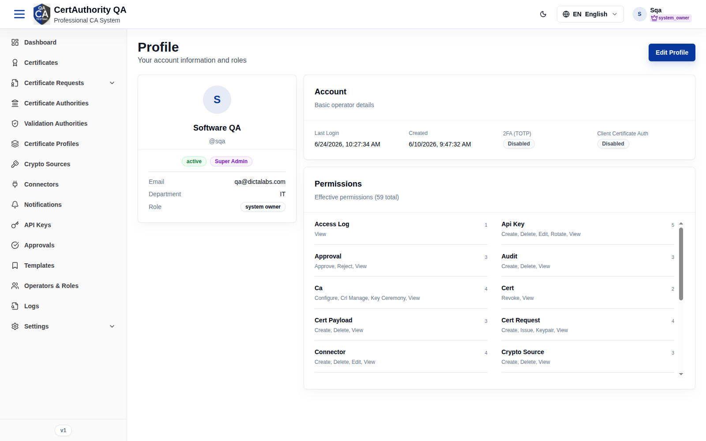
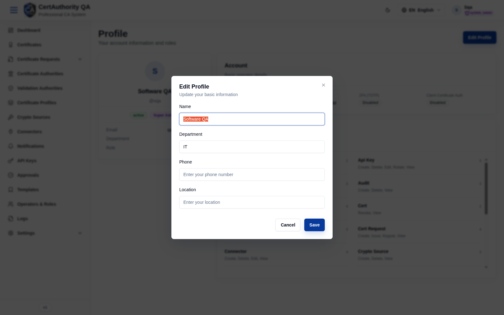

# User Profile

## Purpose

Your personal account page — review your identity and role, see your effective permissions, and
manage security settings (MFA, client-certificate auth) and basic profile details.

## Navigation

`Profile` (`/profile`), or the account menu → **Profile**.

## Overview

- **Identity card** — avatar, name, `@username`, status, role badge, Email, Department, Role.
- **Account** — Last Login, Created, **2FA (TOTP)** state, **Client Certificate Auth** state.
- **Permissions** — your effective permissions (total count) grouped by resource with counts.
- **Edit Profile** button.

## Fields — Edit Profile dialog

Editable personal details (e.g. full name, department, phone, location). Role and permissions
are managed by an administrator in [Operators & Roles](users_roles.md), not here.

## Actions

- **Edit Profile** — update your personal details.
- Enable/disable **2FA (TOTP)** and **Client Certificate Auth** (security settings).

## Step-by-Step — Review your access

1. Open **Profile**.
2. Check the **Account** card for MFA / client-cert status.
3. Review the **Permissions** section to confirm your effective rights.

## Expected Result

You see your current account state and exactly which permissions your role grants.

## Notes

- 2FA (TOTP) and Client Certificate Auth are **Disabled** by default — enabling MFA is
  recommended.
- To change your role or permissions, contact a tenant administrator.
