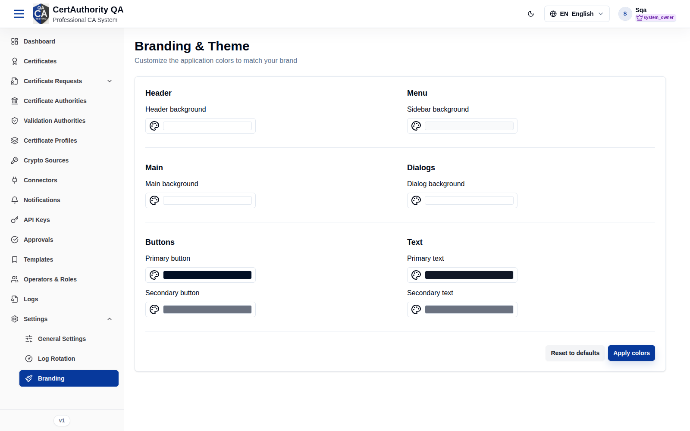

# Branding

## Purpose

Customize the tenant's visual identity — theme colors and appearance — so the portal matches the
organization. Branding is per-tenant and shows on the sign-in screen and throughout the app.

## Navigation

`Settings → Branding` (`/settings/branding`)

## Overview

A theme customizer for the tenant's colors (primary/secondary/accents/text) and related
appearance options.

## Actions

- Adjust theme colors and **Save** to apply.
- Preview changes before saving where supported.

## Step-by-Step

1. Open **Settings → Branding**.
2. Set the theme colors.
3. Save to apply across the tenant.

## Expected Result

The tenant UI (including the login page) reflects the new branding. Each tenant brands
independently — e.g. the QA tenant shows "CertAuthority QA".

## Notes

- Branding is isolated per tenant; it never affects other tenants or the Tenant Super Admin
  portal.
- Logo and application name are set on [General Settings](settings_general.md).
- Editing typically requires the `general_settings.edit` permission.
