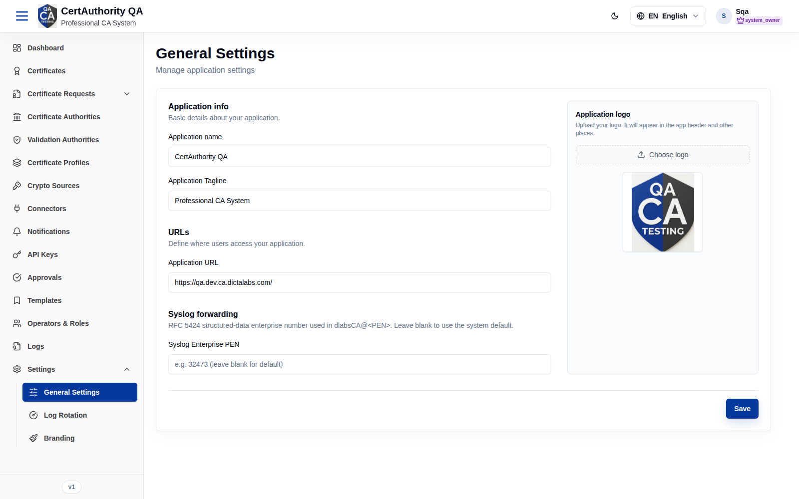

# General Settings

## Purpose

Tenant-level application settings — identity, URLs, logo, and syslog enterprise number — that
shape how the tenant presents itself and integrates with logging.

## Navigation

`Settings → General Settings` (`/settings/general`)

## Overview

Typical settings include application name, company name, application/admin URLs, logo upload,
and the syslog Enterprise PEN (RFC 5424 Private Enterprise Number).

## Actions

- Update fields and **Save** the configuration.
- Upload a logo where supported.

## Step-by-Step

1. Open **Settings → General Settings**.
2. Update the desired fields.
3. Save.

## Expected Result

Settings are stored for this tenant and applied across its UI/integrations.

## Notes

- These settings are tenant-scoped; they do not affect other tenants.
- Visual branding (theme/colors) is on the [Branding](settings_branding.md) page; log file
  behavior is on [Log Rotation](settings_logging.md).
- Editing may require the `general_settings.edit` permission and can be approval-gated.
