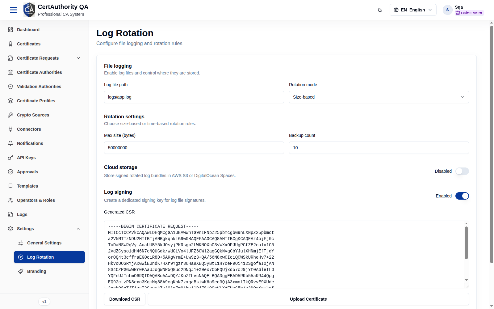

# Log Rotation

## Purpose

Configure how audit/system logs are written, rotated, signed, and (optionally) archived to cloud
storage — supporting retention policy and log integrity.

## Navigation

`Settings → Log Rotation` (`/settings/logging`)

## Overview

Typical sections:

- **File logging** — enable, log file path, rotation mode (size or time based), max size /
  backup count / interval.
- **Log signing** — enable signing, algorithm, signing crypto source + key alias, verification
  certificate.
- **Cloud storage** (where available) — provider, bucket/region/prefix, credentials.

## Actions

- Update logging configuration and **Save**.
- Upload a signing/verification certificate where applicable.
- Test cloud-storage connectivity where offered.

## Step-by-Step

1. Open **Settings → Log Rotation**.
2. Set the file-logging rotation policy.
3. Optionally enable **Log signing** and select a crypto source/key.
4. Optionally configure **Cloud storage**.
5. Save.

## Expected Result

Logs rotate per the configured policy; if signing is enabled, log integrity can be verified;
cloud archival runs if configured.

## Notes

- Log signing relies on a [Crypto Source](crypto_sources.md) for the signing key.
- Changes here govern the retention of the [Logs](audit.md) trail.
