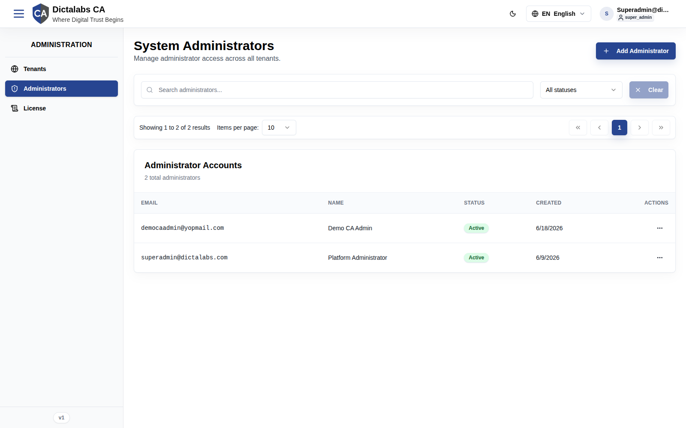
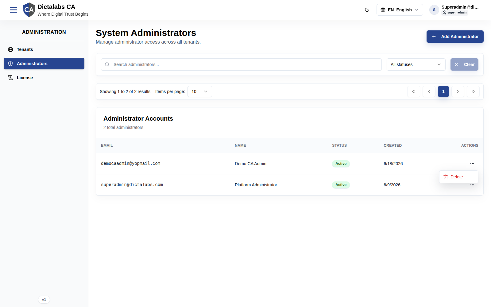
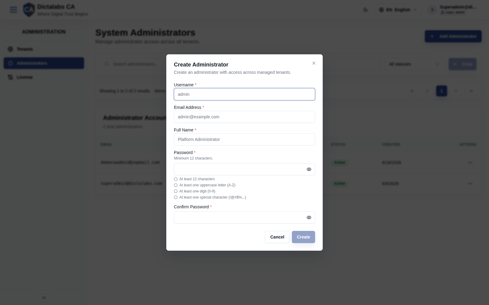

# Super Admins

## Purpose

Super Admins are system-level accounts that can administer the CA service across **all**
tenants. This module manages those accounts — who can log into the Tenant Super Admin portal,
provision tenants, and manage the license. It exists to control privileged access to the
multi-tenant control plane.

**Who should use it:** existing Super Admins managing their peers' access.

## Navigation

`Administration → Administrators` (`/platform/super-admins`)

## Overview

- **Header** — title *"System Administrators"*, subtitle *"Manage administrator access across all
  tenants."*, and an **Add Administrator** button.
- **Filter bar** — search administrators, **status** filter (All statuses / Active / Inactive),
  **Clear**.
- **Pagination** — results count, items-per-page (default 10), page controls.
- **Administrator Accounts table** — columns: **Email**, **Name**, **Status**, **Created**, **Actions**.

### Row Actions menu

The per-row actions menu offers **Delete**.

## Fields — Create Administrator dialog

Opened with **Add Administrator**. *"Create an administrator with access across managed tenants."*

| Field | Description | Required | Notes |
| ----- | ----------- | -------- | ----- |
| Username | Login username | Yes | — |
| Email Address | Administrator email | Yes | — |
| Full Name | Display name | Yes | — |
| Password | Account password | Yes | Minimum 12 characters; must include ≥1 uppercase, ≥1 digit, ≥1 special character. |
| Confirm Password | Re-enter password | Yes | Must match Password. |

The **Create** button is disabled until all fields are valid.

## Actions

- **Add Administrator** — open the Create Administrator dialog.
- **Delete** (row menu) — remove an administrator account.

## Step-by-Step — Add an administrator

1. Open **Administration → Administrators**.
2. Click **Add Administrator**.
3. Enter **Username**, **Email Address**, **Full Name**.
4. Set a compliant **Password** and **Confirm Password**.
5. Click **Create**.

## Expected Result

The new administrator appears in the table with status **Active** and can sign in to the
Tenant Super Admin portal.

## Notes

- **Warning:** Super Admins have system-wide privileges across every tenant. Grant
  sparingly and prefer per-tenant operators for day-to-day PKI work.
- **Best practice:** keep at least two active administrators to avoid lockout, and use strong,
  unique passwords (the 12-char policy is a floor, not a target).
- The audit ran read-only; per-row edit/reset-password behaviour beyond **Delete** was not
  exercised. Confirm during a follow-up if additional row actions are expected.
