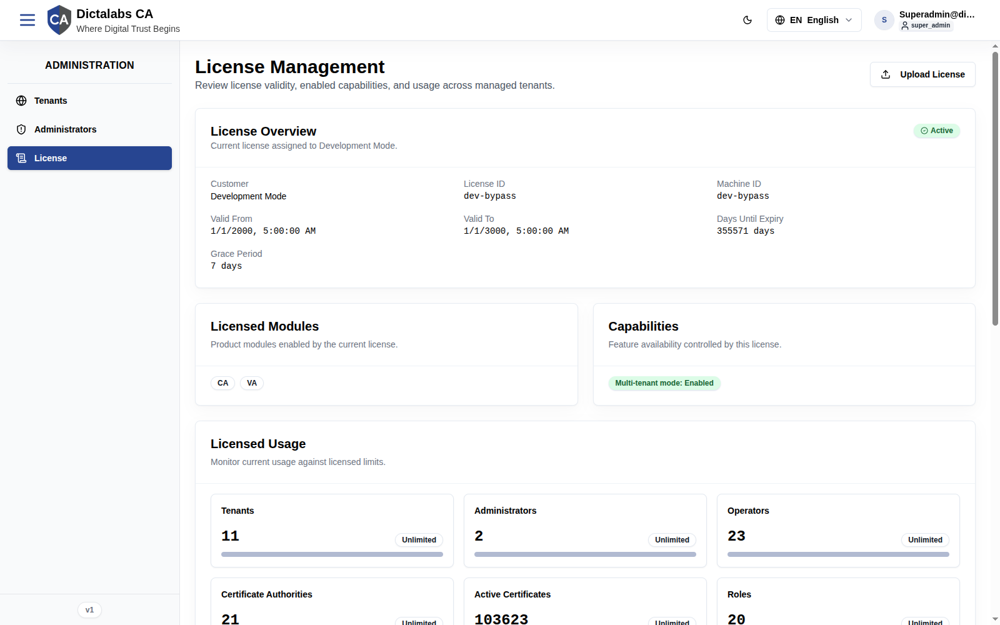

# License Management

## Purpose

The license controls which product **modules** (CA, VA) and **capabilities** (e.g. multi-tenant
mode) are enabled, and the **limits** on system resources. This page lets a System
Administrator review the installed license, monitor usage against limits, and upload a new
license file. It exists so the system can be sold/operated under defined entitlements.

**Who should use it:** System Administrators responsible for licensing and capacity.

## Navigation

`Administration → License` (`/platform/license`)

## Overview

**License Overview** — status badge (Active) plus:

| Field | Meaning |
| ----- | ------- |
| Customer | Licensed customer (e.g. *Development Mode*). |
| License ID | License identifier (dev shows `dev-bypass`). |
| Machine ID | Bound machine identifier. |
| Valid From / Valid To | License validity window. |
| Days Until Expiry | Remaining days. |
| Grace Period | Days the system keeps working after expiry. |

**Licensed Modules** — product modules enabled (e.g. **CA**, **VA**).

**Capabilities** — feature flags, e.g. *Multi-tenant mode: Enabled*.

**Licensed Usage** — current usage vs limit for: Tenants, Administrators, Operators,
Certificate Authorities, Active Certificates, Roles, API Keys ("Unlimited" when no cap).

**Tenant Usage** — per-tenant breakdown table: **Subdomain**, **Operators**, **CAs**,
**Certificates**, **API Keys**.

## Actions

- **Upload License** — open a file picker to install a new license file. *(In this build the
  control opens the operating-system file chooser directly rather than an in-app modal.)*

## Step-by-Step — Upload a license

1. Open **Administration → License**.
2. Click **Upload License**.
3. Select the license file provided by your vendor.
4. Confirm; the page refreshes with the new validity, modules, capabilities, and limits.

## Expected Result

After a successful upload, **License Overview**, **Licensed Modules**, **Capabilities**, and
**Licensed Usage** reflect the new entitlements. If a module is disabled by the new license,
its features become unavailable to tenants.

## Notes

- **Capability gating:** the tenant portal hides modules the license does not enable (for
  example a VA-only license hides CA features, and vice-versa). Absence of a menu item may mean
  "not licensed", not "removed".
- **Warning:** uploading an invalid or expired license can disable modules system-wide. Verify
  the file and validity window before uploading in production.
- **Dev note:** the development deployment uses a `dev-bypass` license with everything Unlimited
  and a validity window of 2000–3000; production values will differ.
