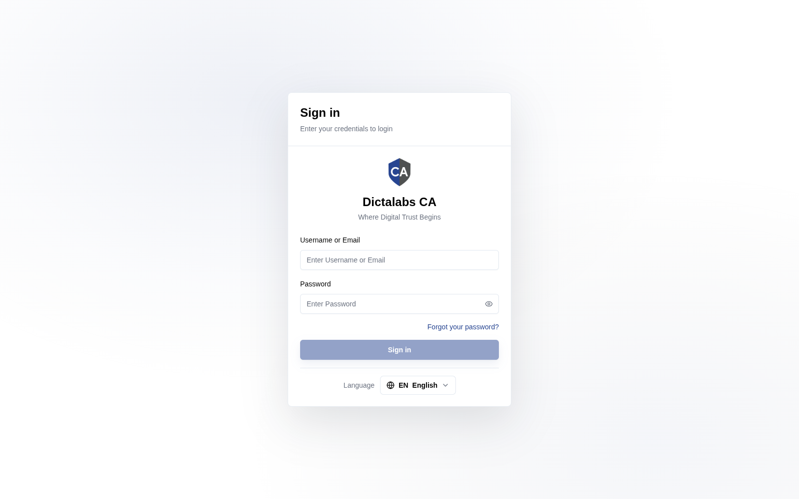

# Tenant Super Admin & Multi-Tenancy

## Purpose

The CA system is **multi-tenant**: a single deployment hosts many isolated customer
workspaces ("tenants"), each with its own certificate authorities, operators, roles,
certificates, and settings. The **Tenant Super Admin portal** is the control plane that
provisions and governs those tenants. It is separate from the day-to-day tenant portal where
PKI operators actually issue and manage certificates.

Use the Tenant Super Admin portal when you need to:

- Onboard a new customer/business unit as a tenant.
- Set per-tenant resource limits (quotas) and request rate limits.
- Suspend, reactivate, or delete a tenant.
- Manage the **Super Admin** accounts that can administer the system.
- Review the installed **license**, enabled modules/capabilities, and system-wide usage.

**Who should use it:** Super Admins / managed-service administrators who run the CA service for
multiple tenants. Tenant PKI officers do **not** use this portal.

## Accessing the Tenant Super Admin Portal

- **URL:** `https://admin.<your-domain>` (dev: `https://admin.dev.ca.dictalabs.com/`).
- Sign in with a **Super Admin** account. On success you land on **Administration → Tenants**
  (there is no per-tenant dashboard for super-admins).

## Tenant Isolation Model

| Aspect | Behaviour |
| ------ | --------- |
| Data isolation | Each tenant's data lives in its own database schema (`t_<subdomain>`). Tenants cannot see each other's CAs, certificates, operators, or audit trail. |
| Routing | Tenants are reached by **subdomain** — `https://<subdomain>.<your-domain>`. The subdomain equals the tenant's immutable slug. |
| Identity | Super Admins authenticate against a global account store and carry a `super_admin` role with **no tenant binding**. Tenant operators are scoped to one tenant. |
| Provisioning | Creating a tenant provisions its schema, seeds an admin role + permissions, and creates the initial tenant administrator in one transaction. |
| Deletion | **Soft delete** (default) archives the tenant and frees the subdomain for reuse; data is retained. **Hard delete** permanently removes the schema. |

## Navigation

The Tenant Super Admin portal sidebar (**Administration**) has three items:

| Item | Route | Page |
| ---- | ----- | ---- |
| Tenants | `/platform/tenants` | [Tenant Management](super_admin_tenants.md) |
| Administrators | `/platform/super-admins` | [Super Admins](super_admin_administrators.md) |
| License | `/platform/license` | [License Management](super_admin_license.md) |

> The route paths above (`/platform/...`) are the actual browser URLs used by this build and are
> kept verbatim for accuracy.

The top bar provides a theme toggle, language selector, and the account menu
(**Profile**, **Logout**).

## Notes

- The Tenant Super Admin portal and the tenant portal share the same login screen styling but
  are different hosts (`admin.` vs the tenant subdomain).
- Module availability (CA, VA) and the multi-tenant capability itself are controlled by the
  installed license — see [License Management](super_admin_license.md).
